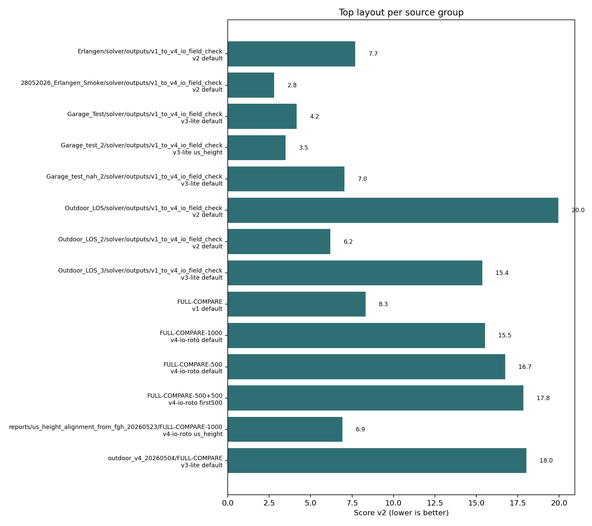
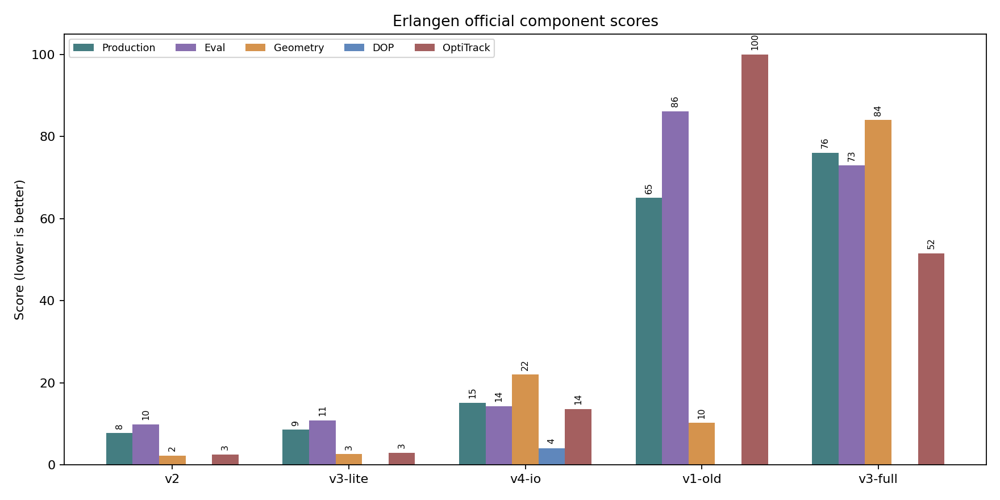
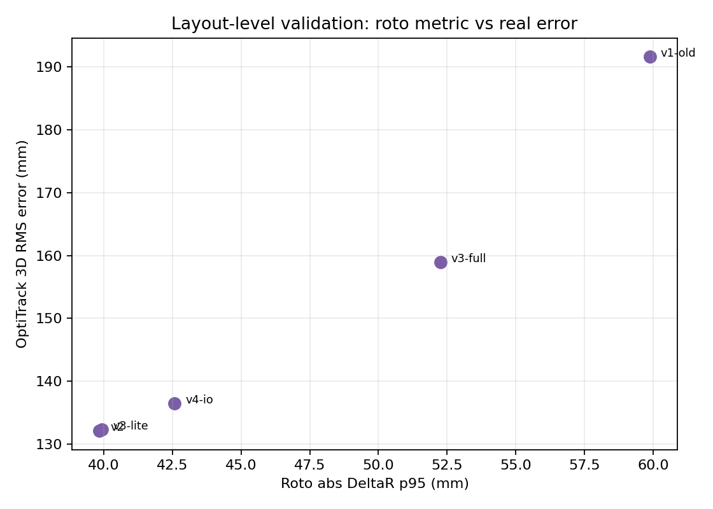
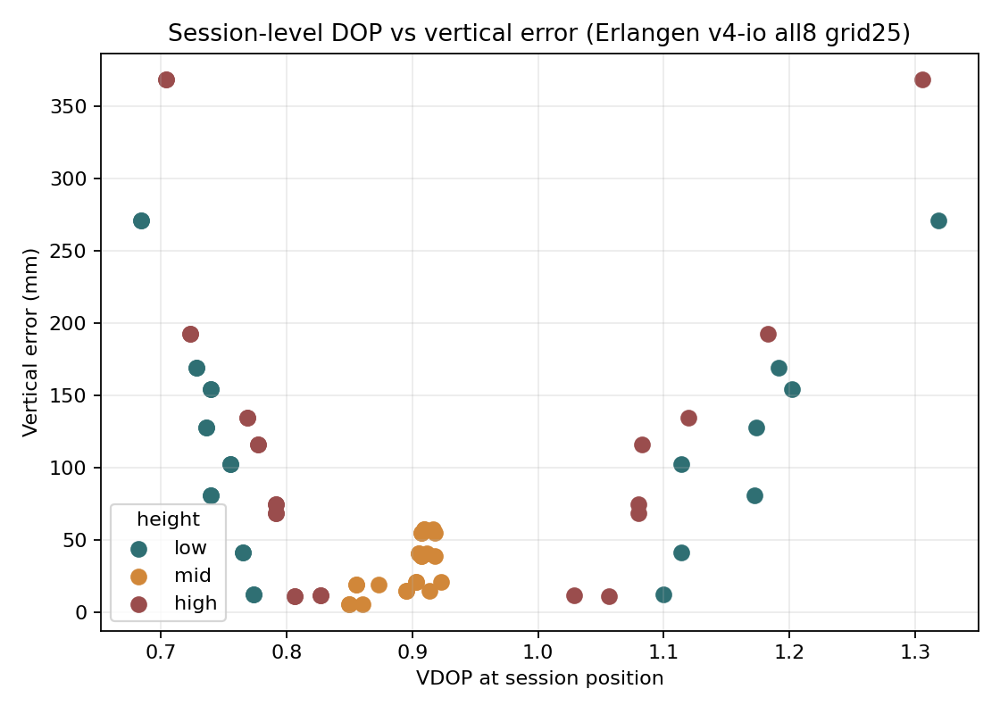
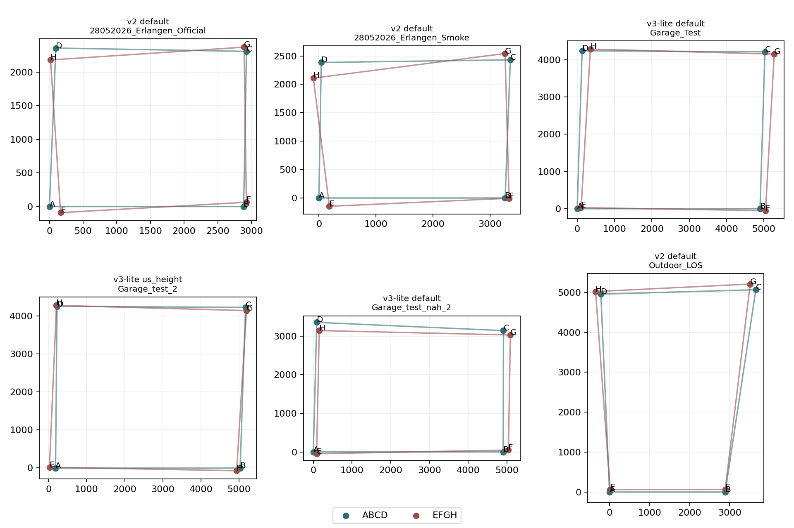

# Bewertung Report

Generated: `2026-05-31T22:22:05.831742+00:00`

## Figures

- 
- 
- 
- 
- 

## Erlangen Official Bewertung

| Rank | Version | Score v2 | Validation rank | Opti 3D RMS | Opti 3D p95 | Comment |
|---:|---|---:|---:|---:|---:|---|
| 1 | `v2` | 7.700 | 1 | 132.08905070793008 | 233.1077736825216 | Best current production and validation balance. |
| 2 | `v3-lite` | 8.529 | 2 | 132.28845672708738 | 233.52603084957047 | Very close to v2; strong fallback. |
| 3 | `v4-io` | 15.157 | 3 | 136.5028285215412 | 270.2552828594085 | Best DOP-backed candidate; median/vertical behavior is good, p95/RMS weaker. |
| 4 | `v1-old` | 65.038 | 5 | 191.64129425669003 | 314.7898277297456 | Legacy baseline; useful for comparison only. |
| 5 | `v3-full` | 76.005 | 4 | 158.98876953960595 | 280.0735010456271 | Not recommended in current evidence. |

## Current Decision

For the Erlangen official dataset, keep `v2` as the current best scored layout, with `v3-lite` as near-tie backup.
For outdoor 20260513 evaluated runs, `v4-io-roto` is the most consistent top candidate.
Do not start ML training yet; Score v2 and OptiTrack validation should be reviewed first.

No GPU was used.
