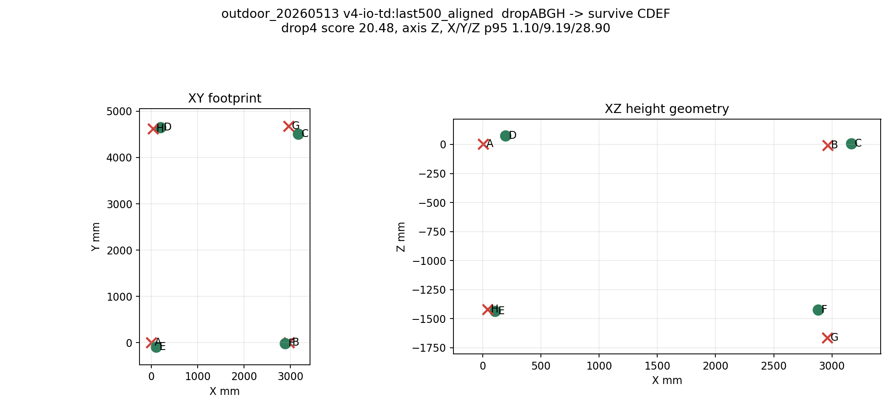
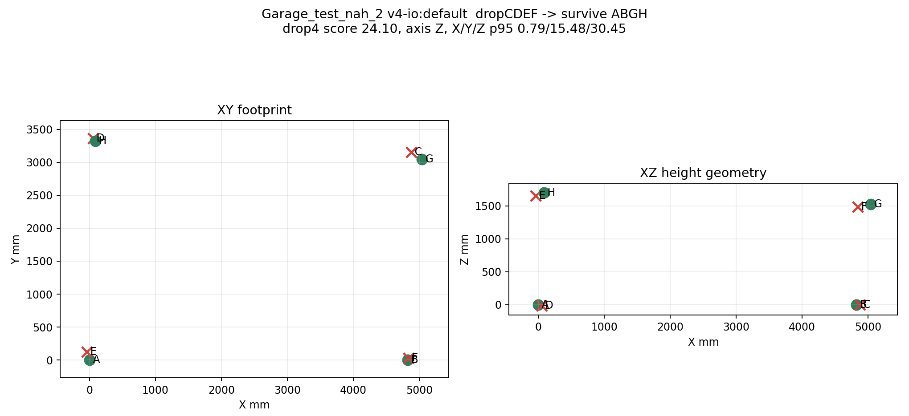
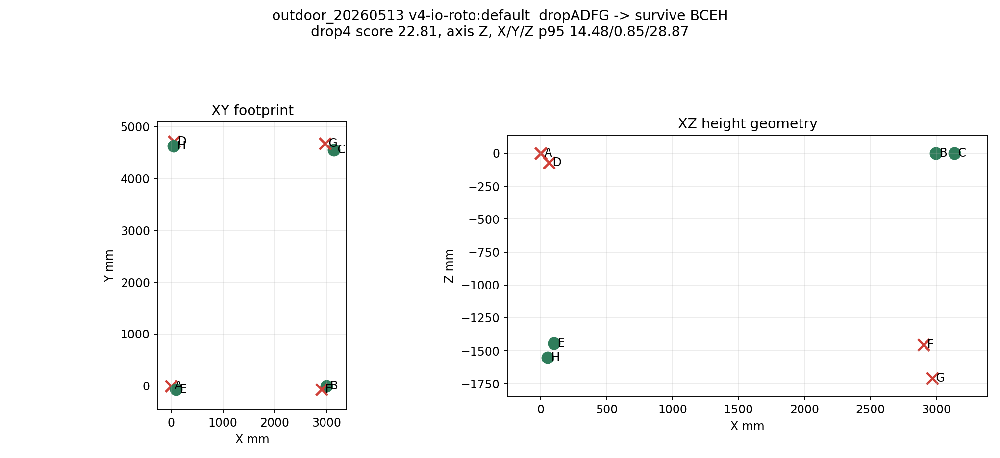
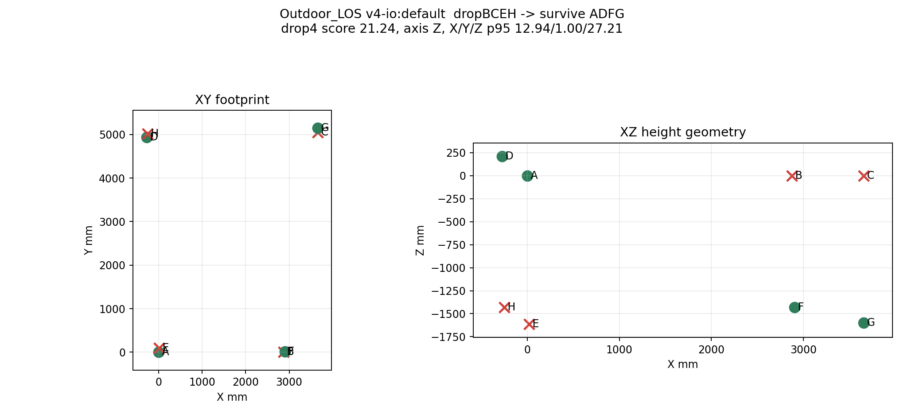

# 部署推荐矩阵 + 高风险几何图

生成时间: `2026-06-07T20:55:03.893225+00:00`

## 怎么读

- A: 可部署候选，drop4 最坏情况相对可控。
- B: 可用但要降级策略，只剩高风险组合时要降低置信度。
- C: 不建议高可靠部署，适合分析或临时验证。
- D: 淘汰或需要重布点。

## 总体分布

- A: 8
- B: 20
- C: 55
- D: 34

## 每组推荐

| Group | 决策 | Class | Version | Variant | Worst Drop4 | Survive | Score | Ratio | Axis | 说明 |
|---|---|---|---|---|---|---|---:|---:|---|---|
| `28052026_Erlangen_Official/solver/outputs/v1_to_v4_io_field_check` | `组内最好但仍需优化` | `C` | `v3-full` | `default` | `dropCDEF` | `ABGH` | 16.22 | 17.73x | `Z` | 不建议高可靠部署 |
| `28052026_Erlangen_Smoke/solver/outputs/v1_to_v4_io_field_check` | `推荐` | `B` | `v3-full` | `default` | `dropBCEH` | `ADFG` | 14.47 | 15.05x | `Z` | 可用但要降级策略 |
| `Garage_Test/solver/outputs/v1_to_v4_io_field_check` | `推荐` | `A` | `v3-lite` | `default` | `dropABGH` | `CDEF` | 11.57 | 9.83x | `Z` | 可部署候选 |
| `Garage_test_2/solver/outputs/v1_to_v4_io_field_check` | `推荐` | `A` | `v1-old` | `default` | `dropABGH` | `CDEF` | 11.22 | 10.19x | `Z` | 可部署候选 |
| `Garage_test_nah_2/solver/outputs/v1_to_v4_io_field_check` | `推荐` | `B` | `v3-full` | `default` | `dropBDFH` | `ACEG` | 12.36 | 10.80x | `Y` | 可用但要降级策略 |
| `Outdoor_LOS/solver/outputs/v1_to_v4_io_field_check` | `推荐` | `B` | `v1-old` | `us_height` | `dropCDEF` | `ABGH` | 13.17 | 11.38x | `Z` | 可用但要降级策略 |
| `Outdoor_LOS_2/solver/outputs/v1_to_v4_io_field_check` | `推荐` | `B` | `v2` | `us_height` | `dropCDEF` | `ABGH` | 15.91 | 15.79x | `Z` | 可用但要降级策略 |
| `Outdoor_LOS_3/solver/outputs/v1_to_v4_io_field_check` | `组内最好但仍需优化` | `C` | `v3-lite` | `default` | `dropCDEF` | `ABGH` | 16.77 | 16.66x | `Z` | 不建议高可靠部署 |
| `outdoor_20260513/FULL-COMPARE` | `组内最好但仍需优化` | `C` | `v1` | `default` | `dropCDEF` | `ABGH` | 17.88 | 15.65x | `Z` | 不建议高可靠部署 |
| `outdoor_20260513/FULL-COMPARE-1000` | `组内最好但仍需优化` | `C` | `v1-old` | `default` | `dropCDEF` | `ABGH` | 17.88 | 15.65x | `Z` | 不建议高可靠部署 |
| `outdoor_20260513/FULL-COMPARE-500` | `组内最好但仍需优化` | `C` | `v1-old` | `default` | `dropCDEF` | `ABGH` | 17.13 | 14.98x | `Z` | 不建议高可靠部署 |
| `outdoor_20260513/FULL-COMPARE-500+500` | `组内最好但仍需优化` | `C` | `v1-old` | `first500` | `dropCDEF` | `ABGH` | 17.13 | 14.98x | `Z` | 不建议高可靠部署 |
| `outdoor_20260513/reports/us_height_alignment_from_fgh_20260523/FULL-COMPARE-1000` | `组内最好但仍需优化` | `C` | `v1-old` | `us_height` | `dropCDEF` | `ABGH` | 17.21 | 15.08x | `Z` | 不建议高可靠部署 |
| `outdoor_v4_20260504/FULL-COMPARE` | `组内最好但仍需优化` | `C` | `v1` | `default` | `dropABGH` | `CDEF` | 17.83 | 16.13x | `Z` | 不建议高可靠部署 |

## 明确不优先/淘汰 Top 20

| Capture | Version | Variant | Class | Drop | Survive | Score | Ratio | X/Y/Z p95 |
|---|---|---|---|---|---|---:|---:|---:|
| `Garage_test_nah_2` | `v4-io` | `default` | `D` | `dropCDEF` | `ABGH` | 24.10 | 21.06x | 0.79/15.48/30.45 |
| `Outdoor_LOS` | `v3-full` | `default` | `D` | `dropCDEF` | `ABGH` | 23.17 | 19.60x | 1.10/10.92/32.52 |
| `outdoor_20260513` | `v4-io-roto` | `default` | `D` | `dropADFG` | `BCEH` | 22.81 | 19.87x | 14.48/0.85/28.87 |
| `outdoor_20260513` | `v4-io-roto` | `first500` | `D` | `dropADFG` | `BCEH` | 22.81 | 19.87x | 14.48/0.85/28.87 |
| `outdoor_20260513` | `v4-io-roto` | `consensus` | `D` | `dropADFG` | `BCEH` | 22.72 | 19.78x | 14.38/0.85/28.79 |
| `outdoor_20260513` | `v4-io-roto` | `default` | `D` | `dropADFG` | `BCEH` | 22.65 | 19.71x | 14.41/0.89/28.62 |
| `outdoor_20260513` | `v4-io-roto` | `last500_aligned` | `D` | `dropADFG` | `BCEH` | 22.53 | 19.60x | 14.28/0.84/28.51 |
| `outdoor_20260513` | `v4-io-roto` | `us_height` | `D` | `dropADFG` | `BCEH` | 22.35 | 19.44x | 15.20/1.11/27.34 |
| `Outdoor_LOS` | `v4-io` | `default` | `D` | `dropBCEH` | `ADFG` | 21.24 | 17.90x | 12.94/1.00/27.21 |
| `outdoor_20260513` | `v3-full` | `last500_aligned` | `D` | `dropADFG` | `BCEH` | 21.18 | 18.60x | 13.99/1.15/26.18 |
| `Outdoor_LOS` | `v3-full` | `us_height` | `D` | `dropCDEF` | `ABGH` | 20.98 | 17.77x | 1.07/8.46/30.40 |
| `Outdoor_LOS` | `v4-io` | `us_height` | `D` | `dropBCEH` | `ADFG` | 20.81 | 17.54x | 11.68/1.59/27.45 |
| `outdoor_v4_20260504` | `v3-lite` | `default` | `D` | `dropCDEF` | `ABGH` | 20.50 | 18.79x | 0.79/12.83/25.92 |
| `outdoor_20260513` | `v4-io-td` | `last500_aligned` | `D` | `dropABGH` | `CDEF` | 20.48 | 17.83x | 1.10/9.19/28.90 |
| `outdoor_20260513` | `v4-io` | `last500_aligned` | `D` | `dropABGH` | `CDEF` | 20.48 | 17.83x | 1.10/9.19/28.90 |
| `outdoor_20260513` | `v5` | `last500_aligned` | `D` | `dropABGH` | `CDEF` | 20.48 | 17.83x | 1.10/9.19/28.90 |
| `outdoor_v4_20260504` | `v2` | `default` | `D` | `dropCDEF` | `ABGH` | 20.43 | 18.70x | 0.79/12.75/25.85 |
| `outdoor_20260513` | `v4` | `default` | `D` | `dropABGH` | `CDEF` | 20.41 | 17.76x | 1.10/9.13/28.81 |
| `outdoor_20260513` | `v4-io` | `default` | `D` | `dropABGH` | `CDEF` | 20.41 | 17.76x | 1.10/9.13/28.81 |
| `outdoor_20260513` | `v4-io-td` | `default` | `D` | `dropABGH` | `CDEF` | 20.41 | 17.76x | 1.10/9.13/28.81 |

## 高风险几何图

### dropABGH -> survive `CDEF`

- 代表 layout: `outdoor_20260513 v4-io-td:last500_aligned`
- drop4 score: `20.48`, worst axis: `Z`
- X/Y/Z p95: `1.10` / `9.19` / `28.90`

### dropCDEF -> survive `ABGH`

- 代表 layout: `Garage_test_nah_2 v4-io:default`
- drop4 score: `24.10`, worst axis: `Z`
- X/Y/Z p95: `0.79` / `15.48` / `30.45`

### dropADFG -> survive `BCEH`

- 代表 layout: `outdoor_20260513 v4-io-roto:default`
- drop4 score: `22.81`, worst axis: `Z`
- X/Y/Z p95: `14.48` / `0.85` / `28.87`

### dropBCEH -> survive `ADFG`

- 代表 layout: `Outdoor_LOS v4-io:default`
- drop4 score: `21.24`, worst axis: `Z`
- X/Y/Z p95: `12.94` / `1.00` / `27.21`

## 下一步执行建议

1. 部署候选只从 A/B 类里选；如果某个 group 最好也只是 C/D，说明这个 group 没有合格冗余 layout。
2. 运行时监控 surviving anchor set；一旦落入 `ABGH`, `CDEF`, `BCEH`, `ADFG` 这几类，降低 Z/3D 输出置信度。
3. 能改硬件时，优先重布这些 surviving set 的高度结构，让任意 4 个幸存 anchor 都保留足够立体角。
4. 不能改硬件时，至少做 anchor 编号交错和故障策略，避免某一类失效直接暴露最弱 4-anchor 子系统。
