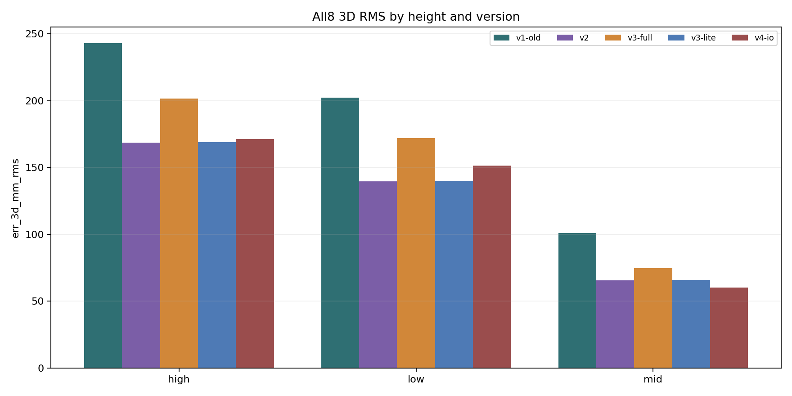
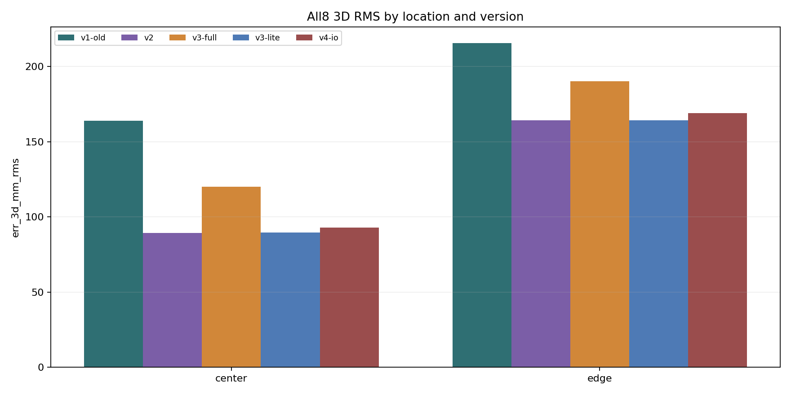
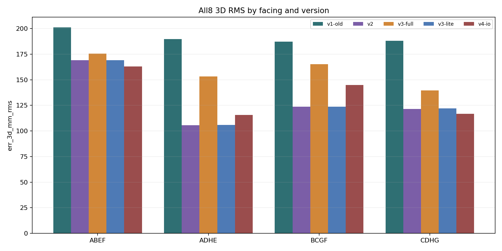
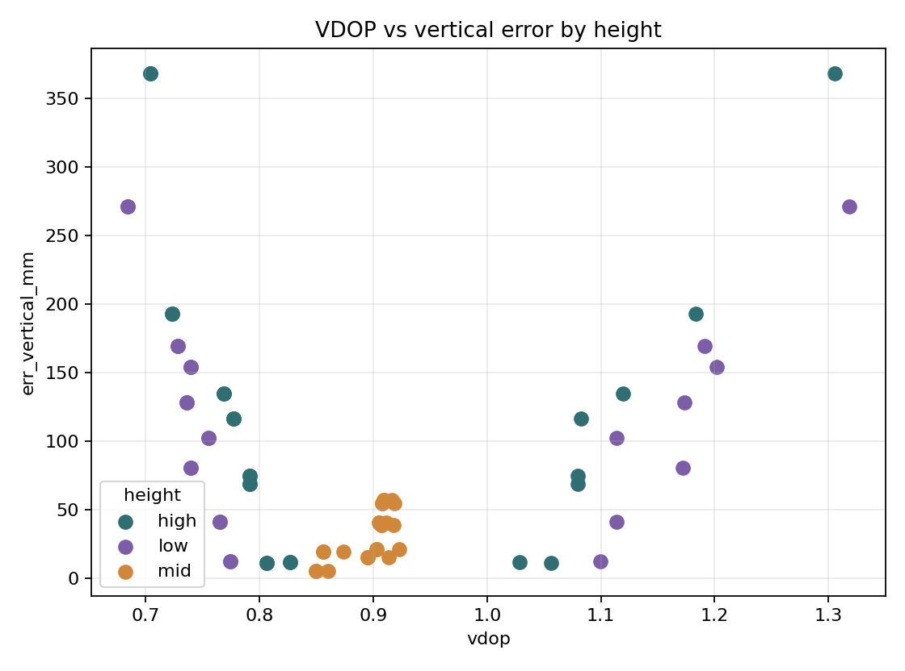
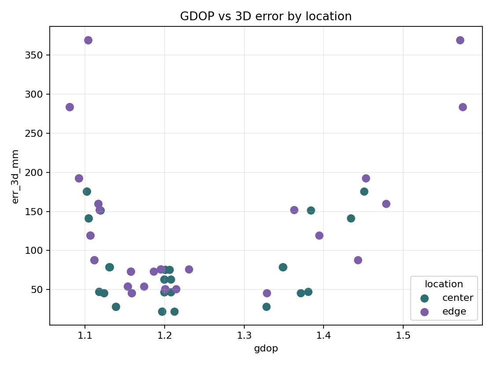

# Stratified OptiTrack Bewertung

Generated: `2026-05-31T22:22:03.207679+00:00`

## Scope

This report uses OptiTrack validation data to inspect error structure by height, location, and facing.
It does not train any model and uses no GPU.

## Figures

- 
- 
- 
- 
- 

## Overall All8 Version Ranking By 3D RMS

| Rank | Version | N | 3D RMS | 3D Median | 3D p95 | Vertical Median |
|---:|---|---:|---:|---:|---:|---:|
| 1 | `v2` | 24 | 132.089051 | 81.493503 | 233.107774 | 68.198655 |
| 2 | `v3-lite` | 24 | 132.288457 | 81.6919576 | 233.526031 | 68.779573 |
| 3 | `v4-io` | 24 | 136.502829 | 77.3810381 | 270.255283 | 63.1214149 |
| 4 | `v3-full` | 24 | 158.98877 | 121.056234 | 280.073501 | 103.997361 |
| 5 | `v1-old` | 24 | 191.641294 | 160.011252 | 314.789828 | 141.472944 |

## Strongest DOP/Error Correlations By Stratum

### overall
| Stratum | X feature | Y error | N | Pearson r | Spearman r |
|---|---|---|---:|---:|---:|
| `all` | `hdop` | `err_vertical_mm` | 72 | 0.727892 | 0.636056 |
| `all` | `hdop` | `err_3d_mm` | 72 | 0.719640 | 0.615296 |
| `all` | `dop_radial_p95_mm` | `err_3d_mm` | 72 | 0.366634 | 0.600000 |
| `all` | `distance_to_array_centroid_mm` | `err_3d_mm` | 72 | 0.509860 | 0.557391 |
| `all` | `dop_radial_p95_mm` | `err_vertical_mm` | 72 | 0.376874 | 0.548696 |
| `all` | `distance_to_array_centroid_mm` | `err_vertical_mm` | 72 | 0.457046 | 0.459130 |
| `all` | `distance_to_array_centroid_mm` | `err_horizontal_mm` | 72 | 0.365626 | 0.326087 |
| `all` | `gdop` | `err_3d_mm` | 72 | 0.117566 | -0.255408 |

### height
| Stratum | X feature | Y error | N | Pearson r | Spearman r |
|---|---|---|---:|---:|---:|
| `mid` | `distance_to_array_centroid_mm` | `err_horizontal_mm` | 24 | 0.738255 | 0.833333 |
| `mid` | `vdop` | `err_vertical_mm` | 24 | 0.679760 | 0.689483 |
| `high` | `hdop` | `err_vertical_mm` | 24 | 0.786556 | 0.663167 |
| `mid` | `gdop` | `err_vertical_mm` | 24 | 0.527519 | 0.647377 |
| `mid` | `pct_ge8` | `err_vertical_mm` | 24 | 0.626248 | 0.619048 |
| `high` | `hdop` | `err_3d_mm` | 24 | 0.793413 | 0.602640 |
| `low` | `hdop` | `err_3d_mm` | 24 | 0.616608 | 0.597377 |
| `low` | `hdop` | `err_vertical_mm` | 24 | 0.634686 | 0.597377 |

### location
| Stratum | X feature | Y error | N | Pearson r | Spearman r |
|---|---|---|---:|---:|---:|
| `center` | `dop_radial_p95_mm` | `err_vertical_mm` | 36 | 0.846387 | 0.825175 |
| `center` | `dop_radial_p95_mm` | `err_3d_mm` | 36 | 0.834081 | 0.818182 |
| `edge` | `hdop` | `err_vertical_mm` | 36 | 0.744708 | 0.699227 |
| `edge` | `hdop` | `err_3d_mm` | 36 | 0.703813 | 0.679072 |
| `edge` | `distance_to_array_centroid_mm` | `err_3d_mm` | 36 | 0.462042 | 0.636364 |
| `edge` | `distance_to_array_centroid_mm` | `err_vertical_mm` | 36 | 0.486234 | 0.629371 |
| `center` | `dop_radial_p95_mm` | `err_horizontal_mm` | 36 | 0.587165 | 0.552448 |
| `edge` | `dop_radial_p95_mm` | `err_horizontal_mm` | 36 | -0.473180 | -0.461538 |

### facing
| Stratum | X feature | Y error | N | Pearson r | Spearman r |
|---|---|---|---:|---:|---:|
| `BCGF` | `dop_radial_p95_mm` | `err_3d_mm` | 18 | 0.733486 | 0.885714 |
| `ADHE` | `distance_to_array_centroid_mm` | `err_horizontal_mm` | 18 | 0.867531 | 0.828571 |
| `ADHE` | `hdop` | `err_vertical_mm` | 18 | 0.835407 | 0.814502 |
| `ADHE` | `hdop` | `err_3d_mm` | 18 | 0.769046 | 0.795633 |
| `BCGF` | `hdop` | `err_vertical_mm` | 18 | 0.793996 | 0.751606 |
| `BCGF` | `pct_ge8` | `err_vertical_mm` | 18 | 0.739854 | 0.714286 |
| `BCGF` | `distance_to_array_centroid_mm` | `err_3d_mm` | 18 | 0.732100 | 0.714286 |
| `ABEF` | `hdop` | `err_vertical_mm` | 18 | 0.789536 | 0.707579 |

## Bewertung

- By all8 OptiTrack 3D RMS, `v2` is currently best.
- v2 and v3-lite remain very close; treat them as a pair until additional validation separates them.
- DOP/error correlations are not uniformly positive; they are confounded by location and height in this dataset.
- Score v3 should be calibrated with stratified objectives, especially vertical p95/RMS and edge/high cases.
- Still no reason to start GPU training.
