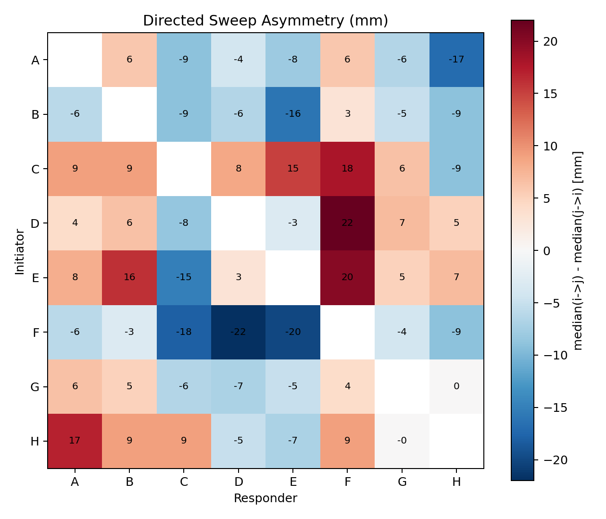
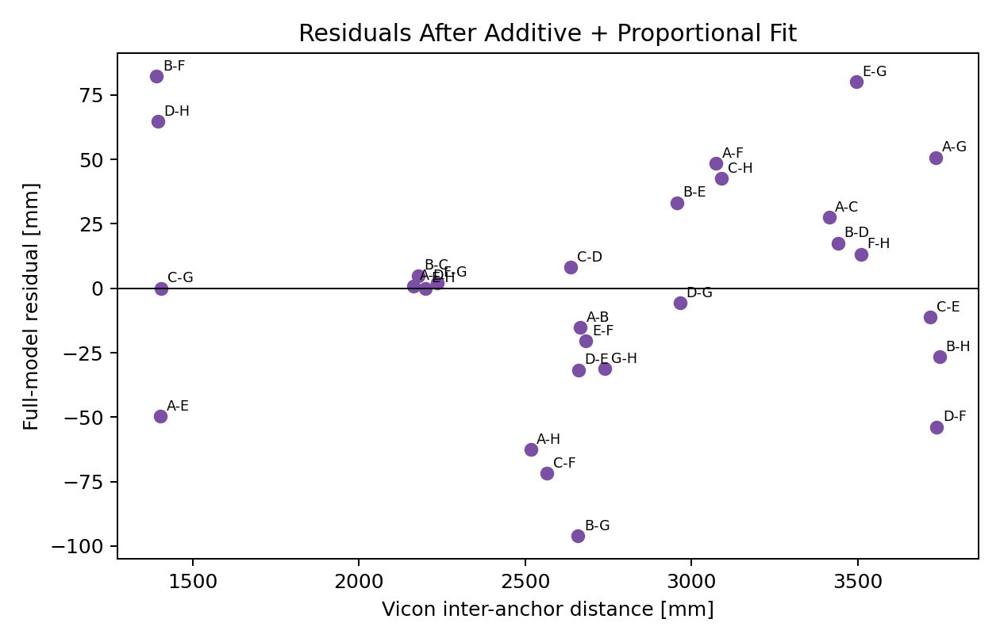
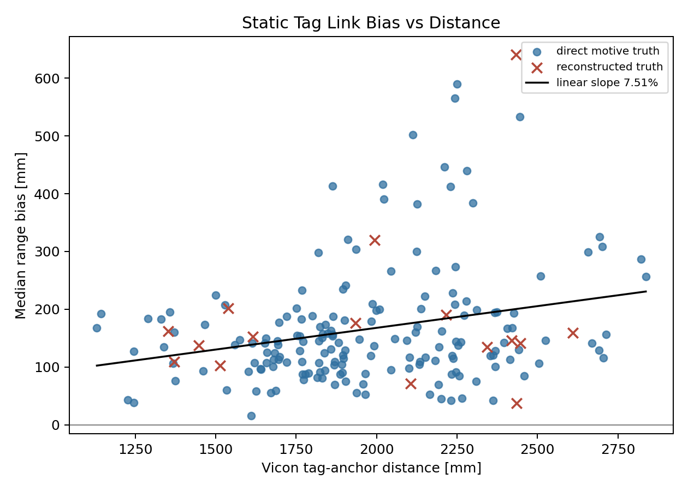
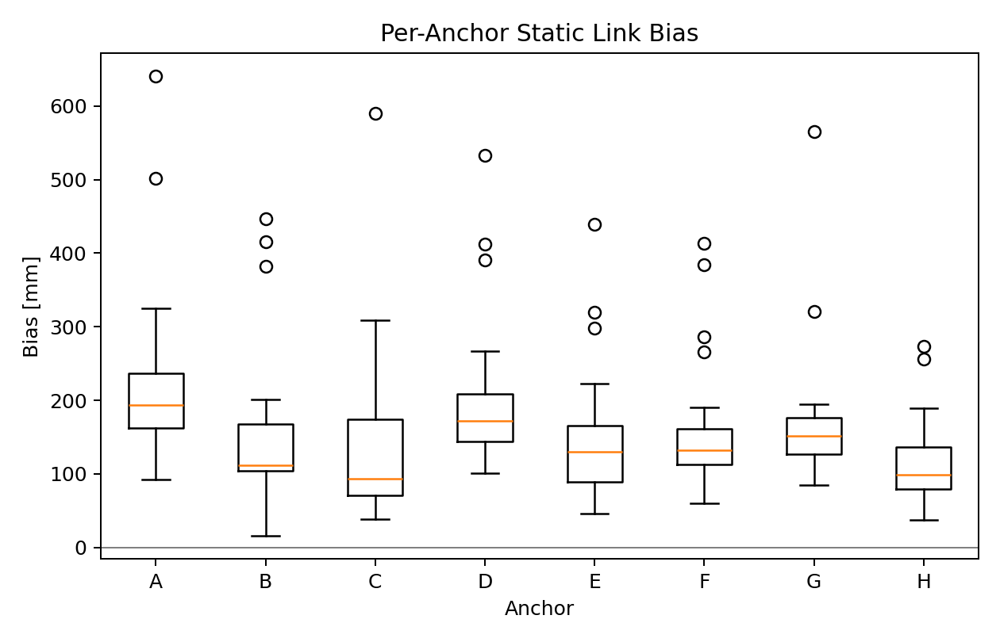
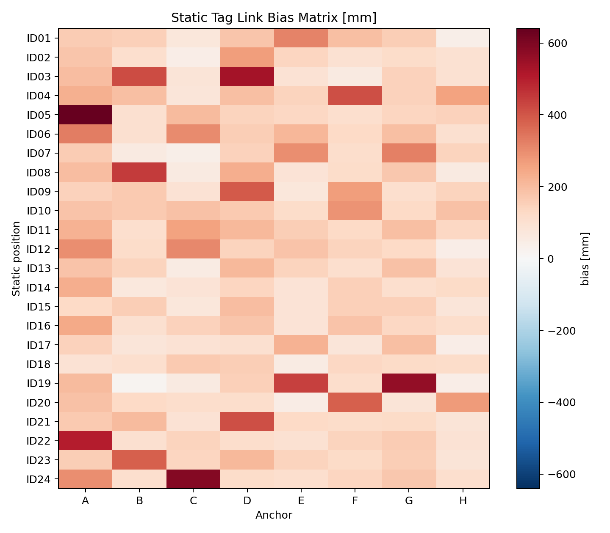

# Phase 1 Range-Level Diagnostics

- Generated: `2026-06-09T22:52:52`
- Data dir: `/home/zekaixiao/Documents/nRF_dev/BioSpur_UWB_before_start/autopos_pipeline/28052026_Erlangen_Official`
- Ground-truth terminology: `Vicon`
- Scope: diagnostics only; no solver changes were made.

## Phase 1 Prerequisites

Ground-truth system terminology: **Vicon**. The local `opti_captures` name is a storage convention, not the report terminology.

Anchor ID mapping was verified from static tag ranges against Vicon link distances before any tag-link bias calculation.

| best_mapping | best_rms_mm | second_best_mapping | second_best_rms_mm | second_over_best_cost_ratio | data_config |
| --- | --- | --- | --- | --- | --- |
| 0->A, 1->B, 2->C, 3->D, 4->E, 5->F, 6->G, 7->H | 196.101 | 0->A, 1->B, 2->C, 3->D, 4->H, 5->F, 6->G, 7->E | 238.529 | 1.480 | data_config.py |

Direction columns were asserted before use:

| pair_columns_consistent | master_equals_initiator | self_links | direction_definition |
| --- | --- | --- | --- |
| True | True | 0 | initiator->responder |

Quality fields were audited for saturation; fields marked `no` are excluded from weighting decisions.

| dataset | field | rows | non_null | top_value | top_percent | informative |
| --- | --- | --- | --- | --- | --- | --- |
| sweep | quality_percent | 56000 | 56000 | 100 | 99.400 | no |
| sweep | quality_flag_percent | 56000 | 0 |  |  | missing |
| static | quality_percent | 230544 | 230544 | 100 | 93.948 | yes |
| static | quality_flag_percent | 230544 | 230544 | 0 | 100.000 | no |
| roto | quality_percent | 345696 | 345696 | 100 | 93.055 | yes |
| roto | quality_flag_percent | 345696 | 345696 | 0 | 100.000 | no |

Full quality distributions:

| dataset | field | value | count | percent |
| --- | --- | --- | --- | --- |
| sweep | quality_percent | 91 | 2 | 0.004 |
| sweep | quality_percent | 92 | 6 | 0.011 |
| sweep | quality_percent | 93 | 6 | 0.011 |
| sweep | quality_percent | 94 | 14 | 0.025 |
| sweep | quality_percent | 95 | 76 | 0.136 |
| sweep | quality_percent | 96 | 232 | 0.414 |
| sweep | quality_percent | 100 | 55664 | 99.400 |
| static | quality_percent | 62 | 2 | 0.001 |
| static | quality_percent | 63 | 2 | 0.001 |
| static | quality_percent | 64 | 10 | 0.004 |
| static | quality_percent | 65 | 28 | 0.012 |
| static | quality_percent | 66 | 79 | 0.034 |
| static | quality_percent | 67 | 42 | 0.018 |
| static | quality_percent | 68 | 157 | 0.068 |
| static | quality_percent | 69 | 93 | 0.040 |
| static | quality_percent | 70 | 369 | 0.160 |
| static | quality_percent | 71 | 208 | 0.090 |
| static | quality_percent | 72 | 345 | 0.150 |
| static | quality_percent | 73 | 359 | 0.156 |
| static | quality_percent | 74 | 142 | 0.062 |
| static | quality_percent | 75 | 455 | 0.197 |
| static | quality_percent | 76 | 495 | 0.215 |
| static | quality_percent | 77 | 375 | 0.163 |
| static | quality_percent | 78 | 327 | 0.142 |
| static | quality_percent | 79 | 140 | 0.061 |
| static | quality_percent | 80 | 443 | 0.192 |
| static | quality_percent | 81 | 213 | 0.092 |
| static | quality_percent | 82 | 328 | 0.142 |
| static | quality_percent | 83 | 295 | 0.128 |
| static | quality_percent | 84 | 300 | 0.130 |
| static | quality_percent | 85 | 319 | 0.138 |
| static | quality_percent | 86 | 318 | 0.138 |
| static | quality_percent | 87 | 222 | 0.096 |
| static | quality_percent | 88 | 480 | 0.208 |
| static | quality_percent | 89 | 273 | 0.118 |
| static | quality_percent | 90 | 562 | 0.244 |
| static | quality_percent | 91 | 232 | 0.101 |
| static | quality_percent | 92 | 469 | 0.203 |
| static | quality_percent | 93 | 501 | 0.217 |
| static | quality_percent | 94 | 697 | 0.302 |
| static | quality_percent | 95 | 1501 | 0.651 |
| static | quality_percent | 96 | 3171 | 1.375 |
| static | quality_percent | 100 | 216592 | 93.948 |
| static | quality_flag_percent | 0 | 230544 | 100.000 |
| roto | quality_percent | 75 | 3 | 0.001 |
| roto | quality_percent | 77 | 4 | 0.001 |
| roto | quality_percent | 78 | 1 | 0.000 |
| roto | quality_percent | 80 | 13 | 0.004 |
| roto | quality_percent | 81 | 18 | 0.005 |
| roto | quality_percent | 82 | 74 | 0.021 |
| roto | quality_percent | 83 | 125 | 0.036 |
| roto | quality_percent | 84 | 226 | 0.065 |
| roto | quality_percent | 85 | 377 | 0.109 |
| roto | quality_percent | 86 | 476 | 0.138 |
| roto | quality_percent | 87 | 396 | 0.115 |
| roto | quality_percent | 88 | 905 | 0.262 |
| roto | quality_percent | 89 | 568 | 0.164 |
| roto | quality_percent | 90 | 1322 | 0.382 |
| roto | quality_percent | 91 | 543 | 0.157 |
| roto | quality_percent | 92 | 1114 | 0.322 |
| roto | quality_percent | 93 | 1124 | 0.325 |
| roto | quality_percent | 94 | 1805 | 0.522 |
| roto | quality_percent | 95 | 4461 | 1.290 |
| roto | quality_percent | 96 | 10454 | 3.024 |
| roto | quality_percent | 100 | 321687 | 93.055 |
| roto | quality_flag_percent | 0 | 345696 | 100.000 |

Sweep rows do not have per-sample timestamps, so time-drift analysis is out of Phase 1 scope.

## 1.1 Asymmetry

Computed robust directed asymmetry on 28 anchor pairs using median(i->j) - median(j->i), with 2000 bootstrap resamples per pair.

| pairs | significant_ci_excludes_zero | max_abs_asymmetry_mm | median_abs_asymmetry_mm |
| --- | --- | --- | --- |
| 28 | 26 | 22.000 | 7.000 |

| pair | n_ab | n_ba | median_ab_mm | median_ba_mm | asymmetry_ab_minus_ba_mm | ci95_low_mm | ci95_high_mm | ci_excludes_zero |
| --- | --- | --- | --- | --- | --- | --- | --- | --- |
| A-B | 1000 | 1000 | 2898.0 | 2892.0 | 6.000 | 5.000 | 9.000 | True |
| A-C | 1000 | 1000 | 3713.0 | 3722.0 | -9.000 | -12.000 | -6.000 | True |
| A-D | 1000 | 1000 | 2427.0 | 2431.0 | -4.000 | -5.000 | -2.000 | True |
| A-E | 1000 | 1000 | 1546.0 | 1554.0 | -8.000 | -13.000 | -4.500 | True |
| A-F | 1000 | 1000 | 3325.0 | 3319.0 | 6.000 | 3.000 | 8.500 | True |
| A-G | 1000 | 1000 | 4017.0 | 4023.5 | -6.500 | -10.000 | -3.000 | True |
| A-H | 1000 | 1000 | 2679.0 | 2696.0 | -17.000 | -20.000 | -14.000 | True |
| B-C | 1000 | 1000 | 2402.0 | 2411.0 | -9.000 | -12.000 | -7.000 | True |
| B-D | 1000 | 1000 | 3666.5 | 3673.0 | -6.500 | -10.000 | -4.000 | True |
| B-E | 1000 | 1000 | 3127.0 | 3143.0 | -16.000 | -18.000 | -13.000 | True |
| B-F | 1000 | 1000 | 1621.0 | 1618.0 | 3.000 | 1.000 | 5.000 | True |
| B-G | 1000 | 1000 | 2743.0 | 2748.0 | -5.000 | -7.012 | -3.000 | True |
| B-H | 1000 | 1000 | 3896.0 | 3905.0 | -9.000 | -12.000 | -5.000 | True |
| C-D | 1000 | 1000 | 2892.0 | 2883.5 | 8.500 | 6.000 | 11.000 | True |
| C-E | 1000 | 1000 | 3893.0 | 3878.0 | 15.000 | 11.000 | 18.000 | True |
| C-F | 1000 | 1000 | 2681.0 | 2663.0 | 18.000 | 16.000 | 20.000 | True |
| C-G | 1000 | 1000 | 1621.5 | 1615.0 | 6.500 | 2.000 | 10.000 | True |
| C-H | 1000 | 1000 | 3342.0 | 3351.0 | -9.000 | -12.000 | -7.000 | True |
| D-E | 1000 | 1000 | 2791.0 | 2794.0 | -3.000 | -6.500 | 1.000 | False |
| D-F | 1000 | 1000 | 3862.0 | 3840.0 | 22.000 | 20.000 | 25.000 | True |
| D-G | 1000 | 1000 | 3164.0 | 3157.0 | 7.000 | 5.000 | 9.500 | True |
| D-H | 1000 | 1000 | 1662.0 | 1657.0 | 5.000 | 2.000 | 8.500 | True |
| E-F | 1000 | 1000 | 2772.0 | 2752.0 | 20.000 | 17.000 | 22.000 | True |
| E-G | 1000 | 1000 | 3714.0 | 3709.0 | 5.000 | 3.000 | 7.500 | True |
| E-H | 1000 | 1000 | 2337.0 | 2330.0 | 7.000 | 5.000 | 10.000 | True |
| F-G | 1000 | 1000 | 2372.0 | 2376.0 | -4.000 | -5.500 | -2.000 | True |
| F-H | 1000 | 1000 | 3654.0 | 3663.0 | -9.000 | -12.000 | -6.000 | True |
| G-H | 1000 | 1000 | 2880.0 | 2880.0 | 0.000 | -3.000 | 2.000 | False |

No time-drift analysis was run because sweep rows have no per-sample timestamps.

## 1.2 Pair Bias vs Distance

Phase-0 raw ratio was `1.0663`. It conflates additive per-device delay with proportional distance bias, so it is not used directly as rho.
The degenerate global intercept was not included; the additive component is represented by the 8 per-anchor delay terms.

| model | rms_residual_mm | r2 | rho_percent | rho_ci95_low_percent | rho_ci95_high_percent |
| --- | --- | --- | --- | --- | --- |
| additive_plus_proportional | 43.775 | 0.489 | 0.119 | -3.025 | 3.974 |
| additive_only_rho0 | 43.784 | 0.489 |  |  |  |
| proportional_only_delta0 | 78.457 | -0.640 | 6.488 |  |  |

| anchor | delta_full_mm | delta_additive_only_mm |
| --- | --- | --- |
| A | 294.249 | 297.458 |
| B | 189.791 | 193.025 |
| C | 251.423 | 254.648 |
| D | 226.355 | 229.576 |
| E | 95.170 | 98.436 |
| F | 97.885 | 101.184 |
| G | 168.438 | 171.752 |
| H | 167.874 | 171.173 |

| pair | measured_median_mm | vicon_distance_mm | bias_mm | full_pred_mm | full_residual_mm |
| --- | --- | --- | --- | --- | --- |
| A-B | 2895.0 | 2665.0 | 229.978 | 245.203 | -15.225 |
| A-C | 3718.0 | 3413.7 | 304.345 | 276.913 | 27.432 |
| A-D | 2429.0 | 2165.2 | 263.756 | 262.888 | 0.868 |
| A-E | 1550.0 | 1403.3 | 146.659 | 196.386 | -49.726 |
| A-F | 3322.0 | 3073.8 | 248.191 | 199.738 | 48.452 |
| A-G | 4020.5 | 3733.9 | 286.550 | 235.804 | 50.747 |
| A-H | 2688.0 | 2516.5 | 171.520 | 234.067 | -62.547 |
| B-C | 2407.0 | 2178.9 | 228.145 | 223.209 | 4.936 |
| B-D | 3670.0 | 3440.3 | 229.708 | 212.182 | 17.526 |
| B-E | 3135.0 | 2955.8 | 179.164 | 146.011 | 33.153 |
| B-F | 1620.0 | 1392.2 | 227.752 | 145.501 | 82.251 |
| B-G | 2745.0 | 2658.8 | 86.241 | 182.290 | -96.049 |
| B-H | 3902.0 | 3745.3 | 156.714 | 183.306 | -26.592 |
| C-D | 2887.0 | 2636.9 | 250.110 | 242.038 | 8.071 |
| C-E | 3885.0 | 3718.5 | 166.485 | 177.738 | -11.253 |
| C-F | 2672.0 | 2566.0 | 105.962 | 177.719 | -71.757 |
| C-G | 1618.0 | 1406.4 | 211.624 | 211.610 | 0.014 |
| C-H | 3347.0 | 3091.1 | 255.898 | 213.341 | 42.558 |
| D-E | 2793.0 | 2660.7 | 132.258 | 163.941 | -31.682 |
| D-F | 3850.0 | 3737.2 | 112.842 | 166.584 | -53.742 |
| D-G | 3160.0 | 2964.8 | 195.228 | 200.938 | -5.710 |
| D-H | 1659.0 | 1395.5 | 263.450 | 198.781 | 64.669 |
| E-F | 2762.0 | 2682.7 | 79.251 | 99.732 | -20.482 |
| E-G | 3711.0 | 3495.0 | 216.022 | 135.979 | 80.043 |
| E-H | 2333.0 | 2198.9 | 134.096 | 134.149 | -0.053 |
| F-G | 2374.0 | 2236.0 | 137.965 | 135.832 | 2.133 |
| F-H | 3660.0 | 3509.8 | 150.216 | 137.072 | 13.144 |
| G-H | 2880.0 | 2739.7 | 140.251 | 171.429 | -31.178 |

## 1.3 Tag Link Bias

Static tag link bias was computed over `192` position-anchor links using the verified anchor_id mapping from `data_config.py`.
Linear pooled bias-vs-distance fit: intercept `17.6` mm, slope `7.514%`, residual RMS `100.9` mm.
Reconstructed tag truth positions are flagged in all tables. Among the top 12 absolute-bias links, `1` use reconstructed truth.
`R01-Static-middle-test` is excluded from dynamic RotoArm analysis and listed only as an auxiliary static range check.

Per-anchor summary:

| anchor | links | bias_mean_mm | bias_median_mm | bias_p95_abs_mm | noise_median_std_mm |
| --- | --- | --- | --- | --- | --- |
| A | 24 | 228.946 | 193.362 | 475.399 | 22.219 |
| B | 24 | 155.663 | 112.355 | 410.924 | 24.610 |
| C | 24 | 145.019 | 93.182 | 307.841 | 22.293 |
| D | 24 | 202.621 | 171.984 | 408.800 | 24.571 |
| E | 24 | 150.130 | 130.170 | 316.331 | 24.547 |
| F | 24 | 161.832 | 132.221 | 369.309 | 85.886 |
| G | 24 | 171.768 | 151.461 | 301.930 | 95.511 |
| H | 24 | 111.858 | 99.344 | 246.303 | 40.959 |

Facing/truth-source stratification:

| facing | truth_reconstructed | links | bias_mean_mm | bias_median_mm | bias_p95_abs_mm |
| --- | --- | --- | --- | --- | --- |
| ABEF | False | 40 | 151.802 | 121.081 | 412.151 |
| ABEF | True | 8 | 158.741 | 160.996 | 274.485 |
| ADHE | False | 48 | 174.497 | 146.336 | 305.530 |
| BCGF | False | 40 | 162.407 | 139.196 | 329.964 |
| BCGF | True | 8 | 201.770 | 139.840 | 486.729 |
| CDHG | False | 48 | 167.496 | 145.005 | 422.345 |

Largest absolute link biases:

| position | anchor | bias_mm | vicon_distance_mm | median_range_mm | tag_truth_source | truth_reconstructed | facing |
| --- | --- | --- | --- | --- | --- | --- | --- |
| ID05 | A | 640.394 | 2433.6 | 3074.0 | reconstructed_from_relabelled_balls | True | BCGF |
| ID24 | C | 589.845 | 2249.2 | 2839.0 | motive_iantenna | False | ADHE |
| ID19 | G | 565.309 | 2242.7 | 2808.0 | motive_iantenna | False | CDHG |
| ID03 | D | 532.711 | 2445.3 | 2978.0 | motive_iantenna | False | ABEF |
| ID22 | A | 501.835 | 2112.2 | 2614.0 | motive_iantenna | False | BCGF |
| ID08 | B | 446.516 | 2210.5 | 2657.0 | motive_iantenna | False | CDHG |
| ID19 | E | 439.252 | 2279.7 | 2719.0 | motive_iantenna | False | CDHG |
| ID03 | B | 415.968 | 2019.0 | 2435.0 | motive_iantenna | False | ABEF |
| ID04 | F | 412.948 | 1863.1 | 2276.0 | motive_iantenna | False | BCGF |
| ID21 | D | 411.950 | 2230.0 | 2642.0 | motive_iantenna | False | ABEF |
| ID09 | D | 390.946 | 2023.1 | 2414.0 | motive_iantenna | False | CDHG |
| ID20 | F | 383.878 | 2299.1 | 2683.0 | motive_iantenna | False | ADHE |

STOP: Phase 1 diagnostics only. Do not proceed to solver work until this report is reviewed.
