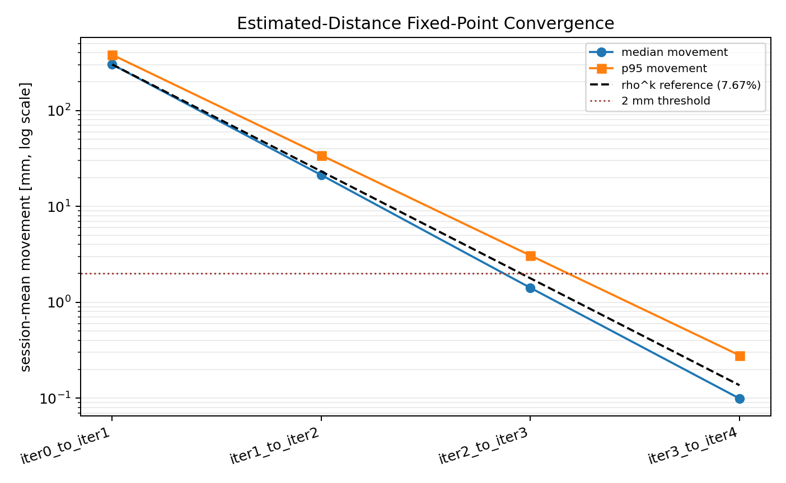

# Phase 2.10 Estimated-Distance Convergence

- Generated: `2026-06-10T02:15:14`
- Ground-truth terminology: `Vicon`
- Scope: standalone convergence trace; no previous reports were modified.

## Result
This extends the Phase 2.9 estimated-distance runtime candidate to iter4. Calibration remains supervised and leave-one-position-out, but runtime uses only measured ranges and solver-estimated link distances.

| mode | positions | median_3d_mm | p95_3d_mm | rmse_3d_mm | median_horizontal_mm | median_vertical_mm | runtime_uses_vicon_link_distance |
| --- | --- | --- | --- | --- | --- | --- | --- |
| production_baseline_T4_mean | 24 | 72.689 | 171.497 | 109.845 | 37.420 | 61.870 | False |
| vicon_distance_covariate | 24 | 60.744 | 112.370 | 73.152 | 29.743 | 38.884 | False |
| iter0_additive_only | 24 | 254.004 | 400.646 | 261.483 | 62.900 | 245.424 | False |
| iter1_estimated_distance | 24 | 77.874 | 117.802 | 82.515 | 33.219 | 44.412 | False |
| iter2_estimated_distance | 24 | 61.852 | 113.054 | 73.038 | 29.384 | 40.180 | False |
| iter3_estimated_distance | 24 | 63.000 | 113.051 | 73.635 | 30.062 | 39.343 | False |
| iter4_estimated_distance | 24 | 62.915 | 113.048 | 73.582 | 30.033 | 39.411 | False |

Iter2 already recovers the supervised row within `-0.113` mm RMSE. Iter4 remains at the same error level (`62.915` / `73.582` mm median/RMSE). Median movement falls below 2 mm by iter3-to-iter4; convergence check: **PASS**.

## Movement
| transition | median_mm | p95_mm | max_mm | median_ratio_to_previous |
| --- | --- | --- | --- | --- |
| iter0_to_iter1 | 301.992 | 381.217 | 445.990 |  |
| iter1_to_iter2 | 21.216 | 34.102 | 49.275 | 0.070 |
| iter2_to_iter3 | 1.414 | 3.073 | 5.206 | 0.067 |
| iter3_to_iter4 | 0.099 | 0.280 | 0.584 | 0.070 |

## Fit Coefficients
| rho_percent_median | rho_percent_min | rho_percent_max | delta_tag_median_mm | train_rms_median_mm |
| --- | --- | --- | --- | --- |
| 7.673 | 6.849 | 8.496 | -157.160 | 95.480 |

STOP: Phase 2.10 complete. Diagnostics are frozen here.
