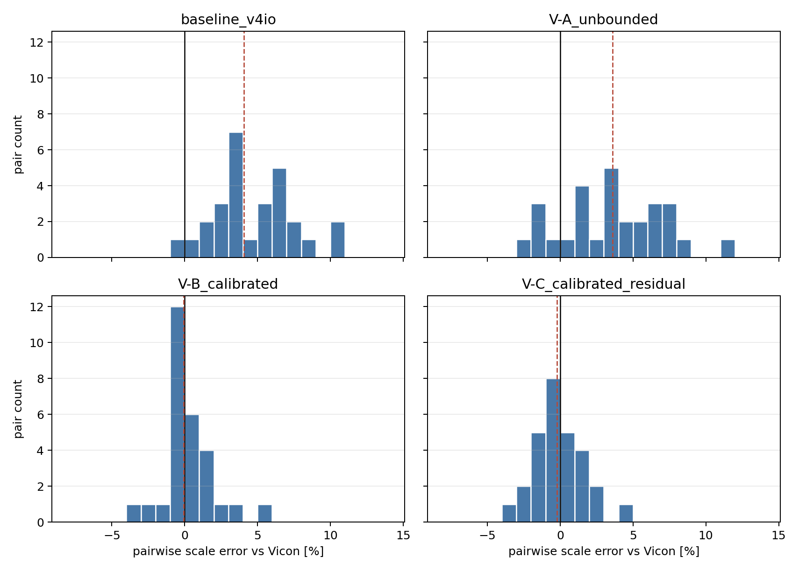
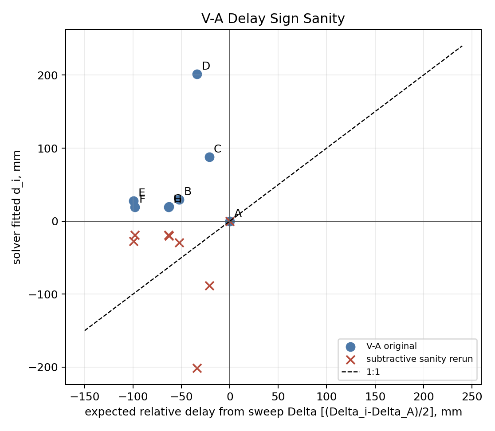
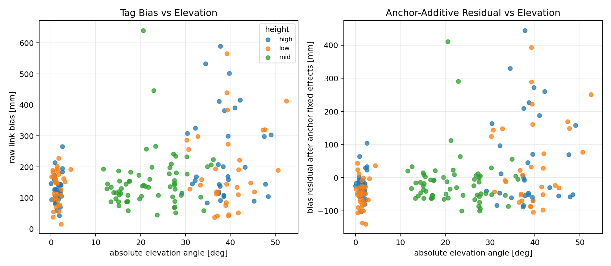
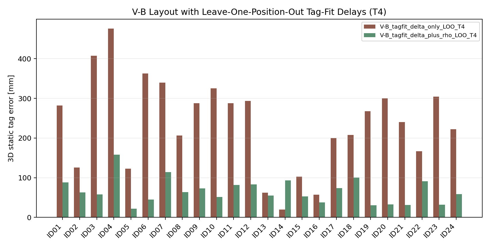

# Phase 2.6 Diagnostics Closure

- Generated: `2026-06-10T00:23:52`
- Ground-truth terminology: `Vicon`
- Scope: diagnostics closure only; no production solver files were modified.

## 2.6a Pairwise Scale Diagnostic
V-B changes the positive-scale count from `27/28` to `13/28`; success check: **YES**.

| variant | pairs | median_scale_error_percent | count_positive | count_negative | count_abs_lt_1_percent | rms_scale_error_percent |
| --- | --- | --- | --- | --- | --- | --- |
| baseline_v4io | 28 | 4.063 | 27 | 1 | 2 | 5.413 |
| V-A_unbounded | 28 | 3.608 | 23 | 5 | 2 | 5.020 |
| V-B_calibrated | 28 | -0.082 | 13 | 15 | 18 | 1.714 |
| V-C_calibrated_residual | 28 | -0.214 | 12 | 16 | 13 | 1.667 |

## 2.6b V-A Delay Sanity
The original V-A residual convention is `distance + d_i + d_j - measured`, with `d_A=0`. Against the sweep additive fit, the expected relative delay is `(Delta_i-Delta_A)/2`.

| convention_in_solver_residual | expected_relative_formula | non_A_sign_matches | non_A_sign_disagrees | rerun_triggered | sign_fixed_anchor_median_3d_mm | sign_fixed_anchor_rms_3d_mm | sign_fixed_shape_rms_mm | sign_fixed_pair_rms_mm |
| --- | --- | --- | --- | --- | --- | --- | --- | --- |
| range residual uses distance + d_i + d_j - measured for V-A | (Delta_i - Delta_A)/2 | 0 | 7 | True | 105.935 | 111.251 | 132.846 | 46.523 |

## 2.6c Tag Baseline Fidelity
The published static tag baseline is reproduced by the production-style C-core T4 mean path. The Phase 2 tag baseline was a simplified WLS diagnostic and is not citable as an absolute reproduction of the published T4 row.

| case | median_3d_mm | rms_3d_mm | point_estimator | registration | solver | source |
| --- | --- | --- | --- | --- | --- | --- |
| phase2_simplified_WLS_baseline | 82.410 | 144.176 | one median link set per position | Phase 2 3D rigid anchor registration | simplified WLS diagnostic | reports/tables/04_static_tag_transfer_summary.csv |
| production_T1_current | 73.963 | 139.551 | mean | official anchor-locked height-preserving | production C-core T4/T1 replay | production_static_method_probe_summary.csv |
| production_style_T1_mean | 73.963 | 139.551 | mean | official anchor-locked height-preserving | production C-core T4/T1 replay | production_static_method_probe_summary.csv |
| production_style_T1_median | 70.779 | 139.320 | median | official anchor-locked height-preserving | production C-core T4/T1 replay | production_static_method_probe_summary.csv |
| production_style_T4_mean | 72.689 | 109.845 | mean | official anchor-locked height-preserving | production C-core T4/T1 replay | production_static_method_probe_summary.csv |
| production_style_T4_median | 69.692 | 108.909 | median | official anchor-locked height-preserving | production C-core T4/T1 replay | production_static_method_probe_summary.csv |
| raw_replay_T1_median | 70.779 | 139.320 | median | official anchor-locked height-preserving | production C-core T4/T1 replay | production_static_method_probe_summary.csv |
| raw_replay_T4_median | 69.692 | 108.909 | median | official anchor-locked height-preserving | production C-core T4/T1 replay | production_static_method_probe_summary.csv |
| raw_replay_v4-io_T1_session_median_summary | 70.779 | 139.320 | session median summary | official anchor-locked height-preserving | C-core raw replay matrix | static_v4io_T1_T4_rerun/tables/tag_raw_replay_accuracy_summary.csv |
| raw_replay_v4-io_T4_session_median_summary | 69.692 | 108.909 | session median summary | official anchor-locked height-preserving | C-core raw replay matrix | static_v4io_T1_T4_rerun/tables/tag_raw_replay_accuracy_summary.csv |
| published_production_static_v4io_all8 | 72.691 | 109.843 | mean | official anchor-locked height-preserving | published production static run | production_static_method_real_run_eval/tables/tag_accuracy_summary.csv |

| candidate_difference | tested_evidence | effect |
| --- | --- | --- |
| tag solver | production C-core T4 mean reproduces 72.7/109.8; Phase 2 WLS gives 82.4/144.2 | primary cause; Phase 2 tag baseline is a relative diagnostic only |
| point estimator | T4 mean is 72.7/109.8 while T4 median is about 69.7/108.9 | changes median by a few mm, not the full Phase 2 mismatch |
| registration | published matrix uses anchor-locked height-preserving 2D horizontal alignment plus F/G/H vertical shift; Phase 2 WLS used its local rigid anchor fit | must be matched for citable tag numbers |
| valid-sample aggregation | published C-core T4 solves raw frames; Phase 2 WLS solves one median range vector per static position | contributes to RMS and p95 differences |

## 2.6d Tag Bias Geometry
Best single closure model here is `vicon_distance_mm+elevation_angle_deg` with RMS `91.9` mm. All models include an intercept plus per-anchor fixed effects, so the comparison is after tag/anchor additive terms.
Horizontal distance alone does not absorb the tag-side slope. Vertical separation/elevation is the stronger single covariate, and adding elevation to the distance model reduces the distance slope from `7.717%` to `4.635%`.

| model | links | rms_mm | r2 | distance_slope_percent | horizontal_slope_percent | vertical_slope_percent | elevation_slope_mm_per_deg | height_mid_effect_mm | height_high_effect_mm |
| --- | --- | --- | --- | --- | --- | --- | --- | --- | --- |
| anchor_fixed_effects_only | 192 | 98.848 | 0.104 |  |  |  |  |  |  |
| vicon_distance_mm | 192 | 94.930 | 0.174 | 7.717 |  |  |  |  |  |
| horizontal_distance_mm | 192 | 98.617 | 0.108 |  | 2.135 |  |  |  |  |
| vertical_abs_mm | 192 | 92.519 | 0.215 |  |  | 6.186 |  |  |  |
| elevation_angle_deg | 192 | 93.146 | 0.204 |  |  |  | 2.065 |  |  |
| height | 192 | 98.132 | 0.117 |  |  |  |  | -28.756 |  |
| horizontal_distance_mm+vertical_abs_mm | 192 | 92.275 | 0.219 |  | 2.123 | 6.185 |  |  |  |
| horizontal_distance_mm+elevation_angle_deg | 192 | 92.240 | 0.220 |  | 4.165 |  | 2.214 |  |  |
| vicon_distance_mm+elevation_angle_deg | 192 | 91.929 | 0.225 | 4.635 |  |  | 1.630 |  |  |
| horizontal_distance_mm+height | 192 | 97.901 | 0.121 |  | 2.130 |  |  | -28.731 |  |
| elevation_angle_deg+height | 192 | 92.164 | 0.221 |  |  |  | 2.107 | -32.946 |  |

## 2.6e V-B Tag-Fit Upper Bound
This run uses the V-B anchor layout, production C-core T4, the same anchor-only 3D rigid/reflection registration used by the Phase 2 solver diagnostics, and leave-one-position-out tag-fitted calibration. `delta_only` applies only the additive terms as layout delays; `delta_plus_rho` also applies the fitted proportional term by range correction.

| variant | positions | static_tag_median_3d_mm | static_tag_rmse_3d_mm | static_tag_p95_3d_mm | static_tag_max_3d_mm | point_estimator | registration | solver |
| --- | --- | --- | --- | --- | --- | --- | --- | --- |
| V-B_tagfit_delta_only_LOO_T4 | 24 | 254.004 | 261.483 | 400.646 | 475.882 | mean | anchor-only 3D rigid/reflection | C-core T4, V-B layout, LOO tag-fit calibration |
| V-B_tagfit_delta_plus_rho_LOO_T4 | 24 | 60.744 | 73.152 | 112.370 | 157.956 | mean | anchor-only 3D rigid/reflection | C-core T4, V-B layout, LOO tag-fit calibration |

STOP: Phase 2.6 diagnostics closure only. Do not proceed to solver integration or production changes until this report is reviewed.
