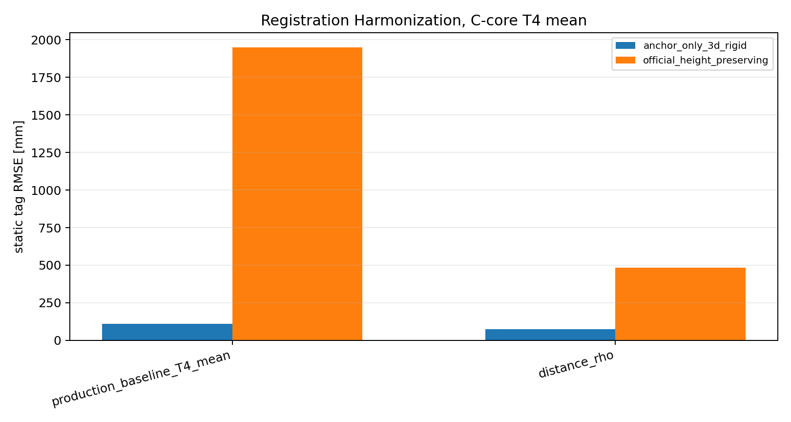

# Phase 2.7 Final Closure

- Generated: `2026-06-10T00:42:06`
- Ground-truth terminology: `Vicon`
- Scope: final diagnostics closure only; no production solver files were modified.

## 2.7a Registration Harmonization
Published Table 4 static tag numbers were produced by `static_tag_absolute_accuracy.py`, which uses anchor-only 3D rigid/reflection registration (`fit_similarity`, no scale). The height-preserving registration belongs to the raw replay matrix path and is not the published Table 4 path.
For the real production and V-B diagnostic layouts evaluated below, the height-preserving rows are compatibility checks only: their anchor-fit RMS is large because these layouts are in arbitrary 3D gauges, not in the pre-normalised deployment gauge assumed by the height-preserving raw-replay script.

| evidence | value | path_or_line |
| --- | --- | --- |
| real_run_meta_script | static_tag_absolute_accuracy.py | /home/zekaixiao/Documents/nRF_dev/BioSpur_UWB_before_start/autopos_pipeline/28052026_Erlangen_Official/Analysis/official_extra_analysis/FULL_4way_comparison/production_method_probe/production_static_method_real_run_eval/run_meta.json |
| real_run_meta_layout_dir | autopos_pipeline/28052026_Erlangen_Official/solver/work/field_dataset_staged/FULL-COMPARE-1000-production-T4-real | /home/zekaixiao/Documents/nRF_dev/BioSpur_UWB_before_start/autopos_pipeline/28052026_Erlangen_Official/Analysis/official_extra_analysis/FULL_4way_comparison/production_method_probe/production_static_method_real_run_eval/run_meta.json |
| real_run_meta_static_csv | autopos_pipeline/28052026_Erlangen_Official/solver/work/field_dataset_staged/FULL-COMPARE-1000-production-T4-real/tables/static_all_captures.csv | /home/zekaixiao/Documents/nRF_dev/BioSpur_UWB_before_start/autopos_pipeline/28052026_Erlangen_Official/Analysis/official_extra_analysis/FULL_4way_comparison/production_method_probe/production_static_method_real_run_eval/run_meta.json |
| static_tag_absolute_accuracy_code | r, t, scale, det = fit_similarity(src, dst, allow_reflection=True, allow_scale=False) | /home/zekaixiao/Documents/nRF_dev/BioSpur_UWB_before_start/autopos_pipeline/28052026_Erlangen_Official/Analysis/official_extra_analysis/FULL/scripts/static_tag_absolute_accuracy.py:349 |
| static_tag_absolute_accuracy_code | aligned = apply_transform(p, r, t, scale)[0] | /home/zekaixiao/Documents/nRF_dev/BioSpur_UWB_before_start/autopos_pipeline/28052026_Erlangen_Official/Analysis/official_extra_analysis/FULL/scripts/static_tag_absolute_accuracy.py:359 |
| static_tag_absolute_accuracy_code | note": "production tag solver; official tag errors use corrected ground truth and anchor-locked method C" | /home/zekaixiao/Documents/nRF_dev/BioSpur_UWB_before_start/autopos_pipeline/28052026_Erlangen_Official/Analysis/official_extra_analysis/FULL/scripts/static_tag_absolute_accuracy.py:515 |
| definitive_registration_for_published_table4 | anchor-only 3D rigid/reflection, no scale | static_tag_absolute_accuracy.py uses fit_similarity/apply_transform; not fit_height_preserving |

| method | registration | positions | median_3d_mm | p95_3d_mm | rmse_3d_mm | median_horizontal_mm | median_vertical_mm | anchor_fit_rms_mm |
| --- | --- | --- | --- | --- | --- | --- | --- | --- |
| production_baseline_T4_mean | anchor_only_3d_rigid | 24 | 72.689 | 171.497 | 109.845 | 37.420 | 61.870 | 105.420 |
| production_baseline_T4_mean | official_height_preserving | 24 | 1154.0 | 3221.7 | 1948.4 | 184.765 | 1137.4 | 3035.9 |
| distance_rho | anchor_only_3d_rigid | 24 | 60.744 | 112.370 | 73.152 | 29.743 | 38.884 | 47.945 |
| distance_rho | official_height_preserving | 24 | 209.480 | 968.005 | 483.146 | 204.286 | 55.839 | 2190.9 |

## 2.7b Rho Parameterization
All rows use V-B layout, C-core T4, mean session estimator, leave-one-position-out fit, and anchor-only 3D rigid/reflection registration. The covariate values for the held-out correction use Vicon geometry, so this is a supervised mechanism diagnostic, not a deployable calibration recipe.

| method | positions | median_3d_mm | p95_3d_mm | rmse_3d_mm | median_horizontal_mm | median_vertical_mm |
| --- | --- | --- | --- | --- | --- | --- |
| distance_rho | 24 | 60.744 | 112.370 | 73.152 | 29.743 | 38.884 |
| elevation_beta | 24 | 67.650 | 146.146 | 85.990 | 31.554 | 62.645 |
| distance_plus_elevation | 24 | 70.861 | 147.691 | 85.383 | 27.279 | 64.046 |

## 2.7c Facing Stratification
Facing-specific `rho_tag` fits are exploratory: each group has six static positions and 48 links.

| facing | positions | links | rho_distance_percent | delta_tag_mm | rms_mm |
| --- | --- | --- | --- | --- | --- |
| ABEF | 6 | 48 | 14.372 | -445.061 | 65.049 |
| ADHE | 6 | 48 | 5.091 | -39.075 | 73.919 |
| BCGF | 6 | 48 | 7.249 | -136.280 | 82.446 |
| CDHG | 6 | 48 | 15.641 | -467.043 | 91.302 |

## 2.7d V-A Rerun Verification
| original_delay_sign | sign_fixed_delay_sign | initial_position_source | initial_delay_vector | delay_bound_mm | parameterization_changed | max_abs_delay_sum_mm | max_layout_coord_delta_mm | conclusion |
| --- | --- | --- | --- | --- | --- | --- | --- | --- |
| +1 in residual distance + d_i + d_j - measured | -1 in residual distance - d_i - d_j - measured | same solve_autopos_v1(fused) initialization | zeros for both runs | 400.000 | True | 0.000 | 0.001 | solutions are sign-mirrored in delay with the same geometry/objective value; V-A failure is degeneracy, not implementation sign bug |

STOP: Phase 2.7 final closure complete. Freeze diagnostics here; solver integration/report writing is the next phase.
