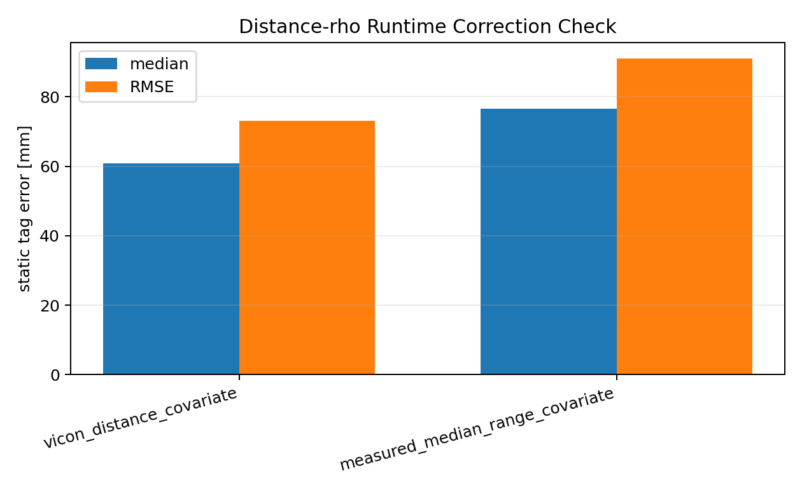

# Phase 2.8 Runtime Range Correction Check

- Generated: `2026-06-10T00:59:53`
- Ground-truth terminology: `Vicon`
- Scope: single runtime-covariate check; diagnostics hard-freeze after this report.

## Result
Both rows use V-B layout, C-core T4, mean session estimator, leave-one-position-out calibration, and anchor-only 3D rigid/reflection registration. The first row fits `rho` against Vicon link distance, then applies `r_corr = (r - Delta_i/2 - Delta_tag/2) / (1 + rho)`. The second row fits the proportional term against measured session-median range and applies the exact measured-covariate runtime correction `r_corr = (1 - gamma) * r - Delta_i/2 - Delta_tag/2`.

| mode | positions | median_3d_mm | p95_3d_mm | rmse_3d_mm | median_horizontal_mm | median_vertical_mm | fit_uses_vicon_link_distance | runtime_uses_vicon_link_distance |
| --- | --- | --- | --- | --- | --- | --- | --- | --- |
| vicon_distance_covariate | 24 | 60.744 | 112.370 | 73.152 | 29.743 | 38.884 | True | False |
| measured_median_range_covariate | 24 | 76.610 | 120.272 | 91.019 | 41.693 | 41.173 | False | False |

Measured-range correction delta vs Vicon-distance row: median `15.866` mm, RMSE `17.867` mm, P95 `7.902` mm. Runtime implementability check: **FAIL**.

## LOO Fit Coefficients
| mode | covariate | coefficient_percent_median | coefficient_percent_min | coefficient_percent_max | delta_tag_median_mm | train_rms_median_mm |
| --- | --- | --- | --- | --- | --- | --- |
| vicon_distance_covariate | vicon_distance_mm | 7.673 | 6.849 | 8.496 | -157.160 | 95.480 |
| measured_median_range_covariate | median_range_mm | 12.463 | 11.229 | 13.457 | -385.887 | 85.773 |

STOP: Phase 2.8 complete. Hard freeze diagnostics here.
