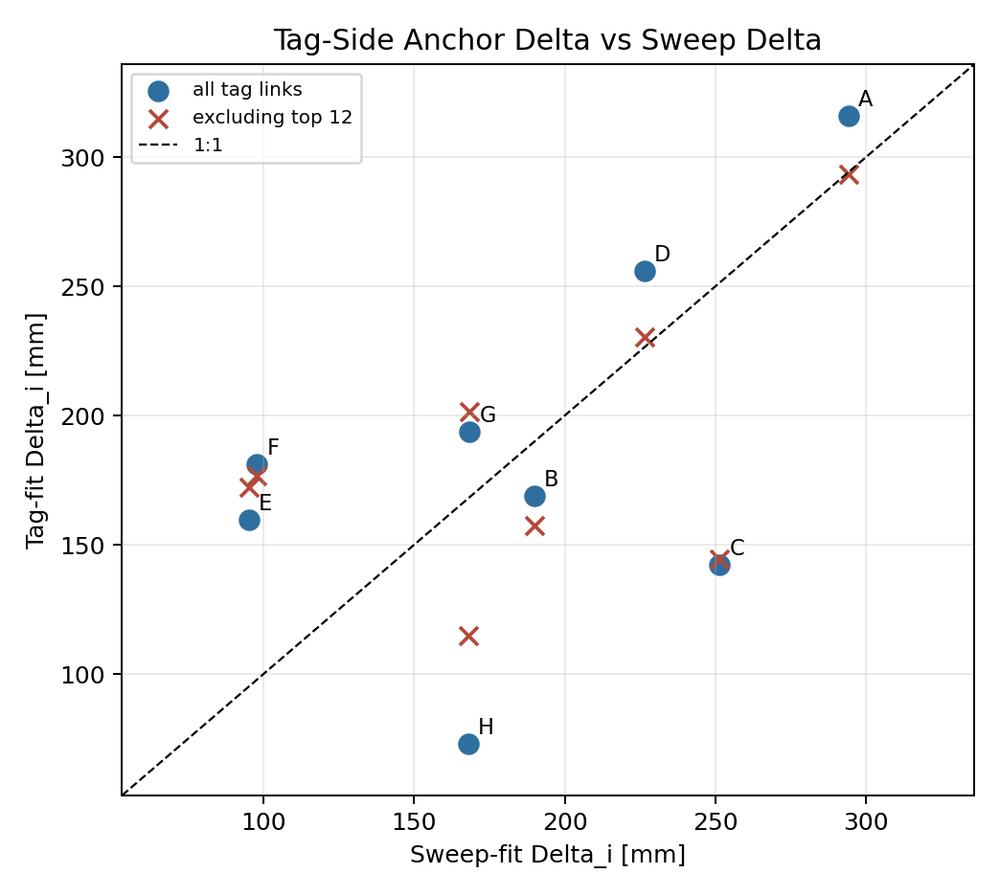
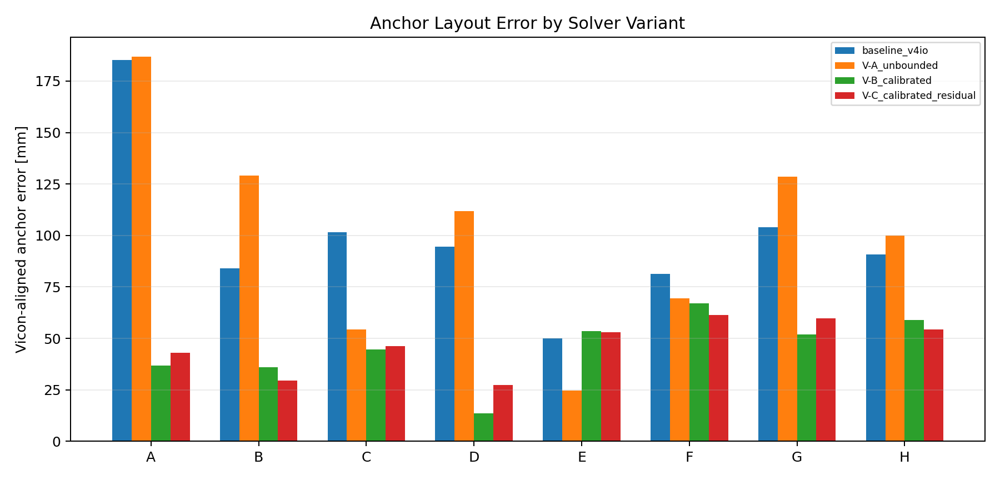
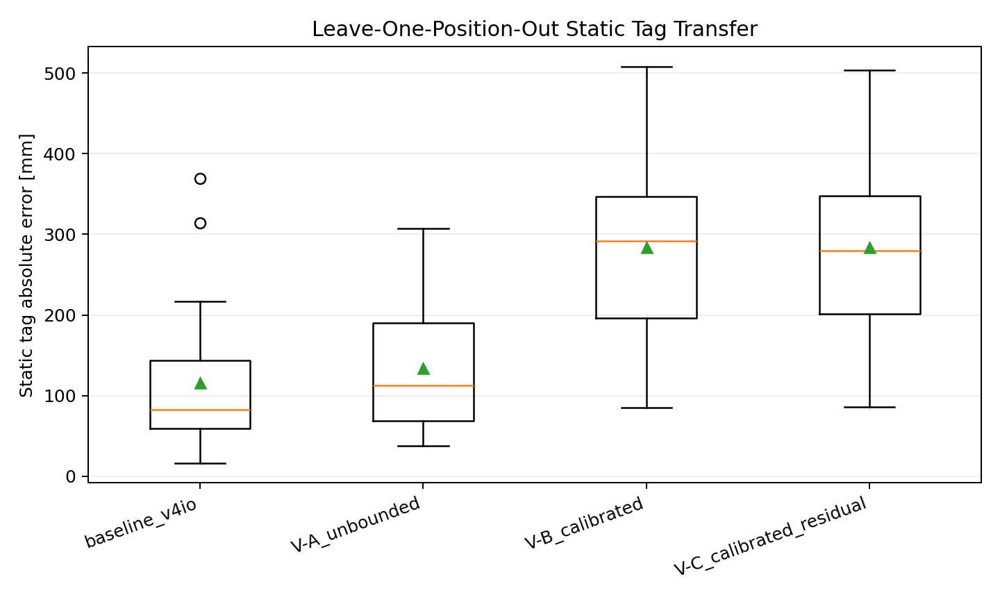

# Phase 2 Solver Ablation

- Generated: `2026-06-09T23:25:00`
- Ground-truth terminology: `Vicon`
- Scope: Phase 2 diagnostics and solver ablation only; no production solver files were modified.

## 2.0 Tag-Side Additive Refit
The model is `bias_{p,i} = Delta_tag/2 + Delta_i/2 + rho_tag*d`. Its additive gauge is fixed by forcing the tag-fit anchor Delta mean to match the sweep-fit Delta mean.

| fit | links | delta_tag_mm | rho_tag_percent | rms_mm | corr_delta_i_vs_sweep |
| --- | --- | --- | --- | --- | --- |
| all_links | 192 | -159.203 | 7.717 | 94.930 | 0.521 |
| excluding_top12_abs_bias | 180 | -48.382 | 3.921 | 58.568 | 0.502 |

Bootstrap 95% intervals from the all-link tag model:

| parameter | median | ci95_low | ci95_high |
| --- | --- | --- | --- |
| Delta_tag | -159.670 | -295.589 | -33.131 |
| rho_percent | 7.748 | 4.036 | 11.586 |
| Delta_A | 316.711 | 243.517 | 401.904 |
| Delta_B | 168.965 | 98.109 | 255.583 |
| Delta_C | 139.902 | 62.512 | 235.724 |
| Delta_D | 254.575 | 187.565 | 335.254 |
| Delta_E | 156.801 | 93.469 | 224.275 |
| Delta_F | 182.444 | 122.587 | 249.713 |
| Delta_G | 190.271 | 128.737 | 273.801 |
| Delta_H | 71.019 | 22.547 | 118.996 |

Largest 12 absolute-bias tag links excluded in the sensitivity fit:

| position | anchor | bias_mm | vicon_distance_mm | tag_truth_source | truth_reconstructed | facing |
| --- | --- | --- | --- | --- | --- | --- |
| ID05 | A | 640.394 | 2433.6 | reconstructed_from_relabelled_balls | True | BCGF |
| ID24 | C | 589.845 | 2249.2 | motive_iantenna | False | ADHE |
| ID19 | G | 565.309 | 2242.7 | motive_iantenna | False | CDHG |
| ID03 | D | 532.711 | 2445.3 | motive_iantenna | False | ABEF |
| ID22 | A | 501.835 | 2112.2 | motive_iantenna | False | BCGF |
| ID08 | B | 446.516 | 2210.5 | motive_iantenna | False | CDHG |
| ID19 | E | 439.252 | 2279.7 | motive_iantenna | False | CDHG |
| ID03 | B | 415.968 | 2019.0 | motive_iantenna | False | ABEF |
| ID04 | F | 412.948 | 1863.1 | motive_iantenna | False | BCGF |
| ID21 | D | 411.950 | 2230.0 | motive_iantenna | False | ABEF |
| ID09 | D | 390.946 | 2023.1 | motive_iantenna | False | CDHG |
| ID20 | F | 383.878 | 2299.1 | motive_iantenna | False | ADHE |

## 2.1 Baseline Reproduction
Baseline v4-io reproduction gate: **PASS**. Expected Vicon-registered anchor median/RMSE are about `92.8`/`105.4` mm.

| variant | anchor_median_3d_mm | anchor_rms_3d_mm | shape_rms_mm | solve_pair_rms_mm | delay_min_mm | delay_max_mm | delay_near_bound_count |
| --- | --- | --- | --- | --- | --- | --- | --- |
| baseline_v4io | 92.771 | 105.420 | 136.307 | 48.169 | 0.000 | 60.000 | 2 |

## 2.2 Solver Variants
| variant | delay_policy | anchor_median_3d_mm | anchor_rms_3d_mm | anchor_p95_3d_mm | shape_rms_mm | solve_pair_rms_mm | raw_pair_rms_mm | delay_min_mm | delay_max_mm | delay_near_bound_count |
| --- | --- | --- | --- | --- | --- | --- | --- | --- | --- | --- |
| baseline_v4io | production bound abs(d_i)<=60, d_A=0 | 92.771 | 105.420 | 156.886 | 136.307 | 48.169 | 48.169 | 0.000 | 60.000 | 2 |
| V-A_unbounded | same objective, widened abs(d_i)<=400, d_A=0 | 105.935 | 111.251 | 166.674 | 132.846 | 46.523 | 46.523 | 0.000 | 201.603 | 0 |
| V-B_calibrated | subtract sweep (Delta_i+Delta_j)/2, solve geometry only | 48.315 | 47.945 | 64.287 | 35.995 | 40.297 | 192.605 | 0.000 | 0.000 | 0 |
| V-C_calibrated_residual | V-B plus residual abs(d_i)<=30 | 49.662 | 48.359 | 60.813 | 38.338 | 39.157 | 191.857 | -9.786 | 15.165 | 0 |

## 2.3 Circularity Guards
| trials | in_sample_rms_mm | heldout_rms_mean_mm | heldout_rms_median_mm | heldout_rms_p95_mm | heldout_rms_max_mm |
| --- | --- | --- | --- | --- | --- |
| 200 | 43.775 | 66.875 | 66.908 | 94.987 | 117.368 |

Tag-side transfer uses sweep-fitted Delta_i and a Delta_tag refit with the evaluated static position left out.

| variant | positions | static_tag_median_3d_mm | static_tag_rmse_3d_mm | static_tag_p95_3d_mm | static_tag_max_3d_mm |
| --- | --- | --- | --- | --- | --- |
| V-B_calibrated | 24 | 291.957 | 303.900 | 470.732 | 508.005 |

## 2.4 Static Tag And RotoArm
Static tag absolute errors are after applying each variant's anchor-layout rigid registration to Vicon. V-B and V-C use the leave-one-position-out tag-delay transfer policy.

| variant | positions | static_tag_median_3d_mm | static_tag_rmse_3d_mm | static_tag_p95_3d_mm | static_tag_max_3d_mm | worst_position | reconstructed_truth_positions |
| --- | --- | --- | --- | --- | --- | --- | --- |
| V-A_unbounded | 24 | 112.871 | 152.982 | 256.320 | 307.030 | ID03 | 2 |
| V-B_calibrated | 24 | 291.957 | 303.900 | 470.732 | 508.005 | ID03 | 2 |
| V-C_calibrated_residual | 24 | 279.505 | 303.461 | 473.591 | 503.640 | ID03 | 2 |
| baseline_v4io | 24 | 82.410 | 144.176 | 299.451 | 369.165 | ID03 | 2 |

RotoArm replay excludes `R01-Static-middle-test`; current capture replay has 17 dynamic captures.
Roto replay backend: `torch_cuda_batched` on `cuda:0,cuda:1`; elapsed `4.60` s for `136` layout/capture-peer tasks.

| variant | capture_pairs | deltaR_error_mean_mm | deltaR_error_rms_mm | abs_deltaR_error_median_mm | abs_deltaR_error_p95_mm | turn_center_rms_median_mm | turn_center_rms_p95_mm |
| --- | --- | --- | --- | --- | --- | --- | --- |
| V-A_unbounded | 17 | -30.644 | 32.793 | 29.055 | 45.851 | 15.915 | 25.443 |
| V-B_calibrated | 17 | -38.623 | 40.315 | 42.014 | 53.260 | 15.767 | 27.884 |
| V-C_calibrated_residual | 17 | -38.958 | 40.684 | 42.119 | 54.049 | 15.801 | 27.955 |
| baseline_v4io | 17 | -30.085 | 31.984 | 32.184 | 42.720 | 14.372 | 26.050 |

## 2.5 Side Diagnostics
Per-anchor static link noise confirms the Phase 1 F/G anomaly:

| anchor | links | noise_median_std_mm | noise_p95_std_mm | flag |
| --- | --- | --- | --- | --- |
| A | 24 | 22.219 | 34.903 |  |
| B | 24 | 24.610 | 31.509 |  |
| C | 24 | 22.293 | 29.881 |  |
| D | 24 | 24.571 | 30.733 |  |
| E | 24 | 24.547 | 34.796 |  |
| F | 24 | 85.886 | 106.682 | F/G high-noise anomaly |
| G | 24 | 95.511 | 120.437 | F/G high-noise anomaly |
| H | 24 | 40.959 | 113.525 |  |

Pair residuals cross-referenced with the directed multipath watchlist `{C-G, G-C, F-G, G-F, E-H, H-E}`:

| pair | full_residual_mm | abs_full_residual_mm | multipath_watchlist |
| --- | --- | --- | --- |
| B-G | -96.049 | 96.049 | False |
| B-F | 82.251 | 82.251 | False |
| E-G | 80.043 | 80.043 | False |
| C-F | -71.757 | 71.757 | False |
| D-H | 64.669 | 64.669 | False |
| A-H | -62.547 | 62.547 | False |
| D-F | -53.742 | 53.742 | False |
| A-G | 50.747 | 50.747 | False |
| F-G | 2.133 | 2.133 | True |
| E-H | -0.053 | 0.053 | True |
| C-G | 0.014 | 0.014 | True |
| A-E | -49.726 | 49.726 | False |
| A-F | 48.452 | 48.452 | False |
| C-H | 42.558 | 42.558 | False |

STOP: Phase 2 ablation only. Do not proceed to solver integration or production changes until this report is reviewed.
