# 2026-05-28 Erlangen Official AutoPos Analysis

Generated: 2026-05-30

Analysis root:

`autopos_pipeline/28052026_Erlangen_Official/Analysis/official_extra_analysis`

This report is a detailed, report-grade consolidation of the current official analysis
outputs. It intentionally references the generated tables and figures instead of
duplicating every CSV row. The numerical claims below come from the files under
`../tables/`; all plots are embedded from the local `fig/` folder copied next to this
report so the report can be zipped and reviewed standalone.

## Executive Summary

The official Erlangen dataset now has a complete analysis pass covering anchor-layout
absolute accuracy, static-tag absolute accuracy, range-only VDOP geometry, MC5000
keep-k robustness, stratified fixed-drop keep-k, pair residual diagnostics, temporal
drift, bootstrap confidence intervals, and additional error-structure / delay /
anchor-health diagnostics.

The main system-level conclusion is:

- The production-output `v4-io / all8` static-tag headline is median 3D error
  77.4 mm, p95 270.3 mm.
- The best-case raw replay solver combination is `v4-io / T3 / all8`: median
  3D error 62.3 mm, p95 158.2 mm. This is useful as a solver comparison, not
  the representative production-output accuracy.
- The current deployment-oriented `v4-io / T4 / all8` raw replay result is close:
  median 3D error 69.1 mm, p95 182.3 mm.
- A new OptiTrack-surveyed anchor baseline isolates the self-calibration cost. With
  OptiTrack anchors and inter-anchor delay calibration, the all8 T4 lower-bound median
  is 58.4 mm; production AutoPos is 18.9 mm higher in median but 135.4 mm higher in p95.
- The hybrid `OptiTrack anchors + AutoPos v4-io delay vector` row remains poor
  at 241.9 mm median all8, showing that the AutoPos delay vector is not directly
  portable to a surveyed layout; it is coupled to the self-calibrated geometry.
- Additional diagnostics support the same reading: AutoPos effective common delay is
  34.4 mm versus 90.6 mm for the OptiTrack inter-anchor delay fit, the differential
  delay patterns have weak agreement (Pearson r=-0.03), and the tag tail has a
  radial/scale component plus anchor-specific residual fingerprints.
- Static tag truth now includes the ID01/ID05 I-marker relabel correction and
  consensus ball-local `Iantenna` rebuild. The correction fixes the OptiTrack
  ground-truth construction path but does not explain the 270 mm-class tail.
- Internal repeatability around 50-70 mm is compatible with the absolute result,
  because absolute error also includes the anchor frame shape/scale error.
- The official `v4-io` anchor layout absolute RMS is about 105 mm after
  reflection-allowed rigid alignment with no scale fit.
- The MC5000 robustness run is complete and clean: 40/40 blocks PASS.
- Forced anchor dropout degrades monotonically: for `v4-io / T4`, static D3 std
  median rises from 61.7 mm at keep8 to 196.4 mm at keep4.
- Roto absolute OptiTrack validation is still pending. Current roto results are
  UWB-only consistency diagnostics.
- OptiTrack anchor G remains suspect and must be treated carefully until Motive
  labels are re-exported or otherwise confirmed.

The most important caution is that V4-io is not a large anchor-layout accuracy win over
V1 in this dataset. The reflection-allowed rigid RMS is 104.9 mm for V4-io and 106.9 mm
for V1-old. The solver ranking should be reported honestly.

## Coordinate And Validation Conventions

The analysis uses two coordinate frames. They must not be mixed directly.

AutoPos solver frame:

```text
x_mm, y_mm = horizontal plane
z_mm       = vertical axis
upper layer is negative z
display height = -z_mm
```

OptiTrack TRC frame:

```text
Y is vertical
X and Z are horizontal
```

Consequences:

- Layout comparison must use a full rigid alignment between AutoPos and OptiTrack.
- The alignment must allow reflection. Inter-anchor distance calibration cannot
  determine handedness, and the AutoPos layout is mirrored relative to OptiTrack.
- Rigid, no-scale RMS is the official absolute-accuracy number.
- Similarity scale is diagnostic only. It must not be used to make the accuracy look
  better.
- Static tag absolute accuracy must use an anchor-locked transform. The tag truth must
  never be used to fit the transform that is later used to measure tag error.

## Dataset And Solver Matrix

Dataset root:

`autopos_pipeline/28052026_Erlangen_Official`

Official extra analysis root:

`autopos_pipeline/28052026_Erlangen_Official/Analysis/official_extra_analysis`

Anchor layout solver versions included:

```text
v1-old
v2
v3-lite
v3-full
v4-io
```

Tag solver family included:

```text
T1
T2
T3
T4
```

Major generated tables:

- [layout_alignment_summary.md](../tables/layout_alignment_summary.md)
- [tag_accuracy_summary.md](../tables/tag_accuracy_summary.md)
- [tag_raw_replay_accuracy_summary.md](../tables/tag_raw_replay_accuracy_summary.md)
- [dop_summary_grid25.md](../tables/dop_summary_grid25.md)
- [mc_integrity_summary.md](../tables/mc_integrity_summary.md)
- [metric_confidence_intervals.md](../tables/metric_confidence_intervals.md)
- [pair_residual_diagnostics.md](../tables/pair_residual_diagnostics.md)
- [temporal_drift_summary.md](../tables/temporal_drift_summary.md)
- [stratified_keepk_summary.md](../tables/stratified_keepk_summary.md)

## 1. Anchor Layout Absolute Accuracy

Source:

- [layout_alignment_summary.md](../tables/layout_alignment_summary.md)
- [layout_abs_errors_all8.csv](../tables/layout_abs_errors_all8.csv)
- [layout_abs_errors_noG.csv](../tables/layout_abs_errors_noG.csv)
- [opti_anchor_consistency.csv](../tables/opti_anchor_consistency.csv)
- [opti_anchor_marker_fingerprint.csv](../tables/opti_anchor_marker_fingerprint.csv)

The anchor layout comparison aligns AutoPos anchor positions to OptiTrack antenna
marker positions. Because the AutoPos layout is a mirror image of the OptiTrack truth,
proper-rotation-only Kabsch gives nonsense-scale RMS values near 1.4-1.5 m. The correct
analysis uses reflection-allowed Kabsch.

Headline values for `v4-io`:

| eval set | rigid RMS 3D mm | horizontal RMS mm | vertical RMS mm | shape RMS mm | similarity scale | similarity RMS mm |
| --- | ---: | ---: | ---: | ---: | ---: | ---: |
| all8 | 104.9 | 86.1 | 59.9 | 130.5 | 0.960 | 71.2 |
| noG | 104.4 | 84.4 | 61.4 | 133.4 | 0.960 | 70.1 |

The similarity RMS is lower because the fit is allowed to use OptiTrack truth to remove
scale. This is useful diagnostically, but it is not a valid accuracy claim.

Solver ranking by reflection-allowed all8 rigid RMS:

| solver | rigid RMS 3D mm | shape RMS mm | note |
| --- | ---: | ---: | --- |
| v4-io | 104.9 | 130.5 | best, but only slightly |
| v1-old | 106.9 | 137.6 | nearly tied with v4-io |
| v2 | 135.4 | 185.8 | worse |
| v3-lite | 135.4 | 185.7 | similar to v2 |
| v3-full | 144.4 | 149.2 | did not become the best despite extra model freedom |

Interpretation:

- The absolute layout error is around 105 mm after correcting handedness.
- The remaining error is not just a global pose problem; the distance-matrix shape RMS
  is still about 130 mm for V4-io.
- V4-io is directionally best, but not enough better than V1-old to claim a large
  algorithmic improvement from this dataset alone.
- Anchor G remains suspect in the OptiTrack data, but the final layout number changes
  by only about 0.5 mm RMS between all8 and noG. The dual report is retained for
  rigor and traceability, not because G changes the layout conclusion.

Figure:


## 2. Static Tag Absolute Accuracy

Source:

- [tag_accuracy_summary.md](../tables/tag_accuracy_summary.md)
- [tag_abs_errors_per_session.csv](../tables/tag_abs_errors_per_session.csv)
- [tag_alignment_method_comparison.csv](../tables/tag_alignment_method_comparison.csv)
- [tag_scale_propagation_summary.csv](../tables/tag_scale_propagation_summary.csv)
- [tag_ground_truth_correction_summary.csv](../tables/tag_ground_truth_correction_summary.csv)
- [tag_raw_replay_accuracy_summary.md](../tables/tag_raw_replay_accuracy_summary.md)
- [tag_raw_replay_abs_errors_per_session.csv](../tables/tag_raw_replay_abs_errors_per_session.csv)
- [tag_metrics_full.csv](../tables/tag_metrics_full.csv)
- [tag_per_axis_bias.csv](../tables/tag_per_axis_bias.csv)
- [tag_outlier_rates.csv](../tables/tag_outlier_rates.csv)
- [anchor_source_comparison.md](../tables/anchor_source_comparison.md)
- [surveyed_anchor_baseline_per_position.csv](../tables/surveyed_anchor_baseline_per_position.csv)

This is the system-output validation layer. The correct question is not only whether
the anchor layout is geometrically close to OptiTrack, but how much absolute tag
position error results when the solved tag positions are mapped into the OptiTrack
frame using only the anchor-derived transform.

The official frame lock is:

```text
UWB tag position -> anchor-derived reflection-allowed rigid transform -> OptiTrack frame
```

No tag truth is used to fit the transform. This avoids circularly making the tag result
look better.

### Iantenna Marker-Label Swap Correction

The static-tag OptiTrack truth uses the virtual marker `Iantenna`, reconstructed from
the tag's five glued reflective balls `I1..I5`. The fixture uses equal-length arms,
which makes the optical marker constellation rotationally ambiguous. In this dataset,
Vicon/Motive auto-labeling swapped the ball identities in ID01 and ID05.

The detection is rotation/translation invariant: for each capture, the ten pairwise
distances among `I1..I5` were compared with the clean 22-capture consensus fingerprint.
The clean consensus in pair order `I1-I2, I1-I3, I1-I4, I1-I5, I2-I3, I2-I4,
I2-I5, I3-I4, I3-I5, I4-I5` is:

```text
[84.5, 53.0, 49.0, 60.5, 59.9, 57.6, 67.2, 49.6, 60.0, 79.8] mm
```

The deterministic relabels are:

| ID | corrected I1..I5 from original 0-based ball indices | Motive-to-corrected Iantenna shift | fingerprint max deviation after relabel |
| --- | --- | ---: | ---: |
| ID01 | `(0, 1, 4, 2, 3)` | 54.1 mm | 1.5 mm |
| ID05 | `(3, 4, 2, 0, 1)` | 2.1 mm | 0.8 mm |

All other static captures remain on the Motive `Iantenna` export. ID04 is explicitly
clean despite its low-position world-frame direction flip; the correct diagnostic is
the ball-local fingerprint/antenna consistency, not world direction alone.

Design lesson: the next marker-hole PCB/fixture should use asymmetric, unequal arm
lengths so each ball has a unique distance signature and the labeling cannot rotate
into an ambiguous configuration.

### Production Output Summary

The production-output table is based on currently available solved tag output.

`v4-io` production-output headline:

| eval set | median 3D mm | p95 3D mm | RMS 3D mm | median horizontal mm | median vertical mm | scale-bias diagnostic mm |
| --- | ---: | ---: | ---: | ---: | ---: | ---: |
| all8 | 77.4 | 270.3 | 138.3 | 43.8 | 63.1 | 30.0 |
| noG | 81.3 | 278.6 | 141.1 | 46.9 | 63.5 | 31.2 |

This result is not as good as the best raw replay result below, but it is still
internally consistent with the layout error and the observed static repeatability.

### Raw Replay Matrix

The raw replay matrix is stronger because it replays the raw static `tr_all.csv`
captures through the C-core T-series solver family:

```text
5 anchor layout solvers x 4 tag solvers x all8/noG
```

Best all8 median 3D rows:

| rank | anchor solver | tag solver | eval set | median 3D mm | p95 3D mm | RMS 3D mm | vertical median mm |
| ---: | --- | --- | --- | ---: | ---: | ---: | ---: |
| 1 | v4-io | T3 | all8 | 62.3 | 158.2 | 101.8 | 48.6 |
| 2 | v4-io | T4 | all8 | 69.1 | 182.3 | 107.0 | 55.0 |
| 3 | v2 | T3 | all8 | 71.3 | 190.1 | 100.5 | 53.1 |
| 4 | v3-lite | T3 | all8 | 72.4 | 190.2 | 100.6 | 52.7 |
| 5 | v2 | T4 | all8 | 75.0 | 166.0 | 102.0 | 58.6 |

`v4-io / T4` all8 vs noG:

| eval set | median 3D mm | p95 3D mm | RMS 3D mm | horizontal median mm | vertical median mm | repeatability D3 median mm |
| --- | ---: | ---: | ---: | ---: | ---: | ---: |
| all8 | 69.1 | 182.3 | 107.0 | 41.3 | 55.0 | 67.4 |
| noG | 83.9 | 291.1 | 138.7 | 67.9 | 43.9 | 56.2 |

Interpretation:

- The best-case raw replay static absolute accuracy is `v4-io / T3 / all8`:
  median 62.3 mm. It should be labeled as the best solver combination, not as the
  representative production-output system accuracy.
- `v4-io / T4 / all8` is slightly worse in median and p95, but remains close and is
  more aligned with the robustness-oriented T4 design.
- Dropping G does not improve static tag absolute accuracy in the V4-io replay. For
  `v4-io / T4`, noG worsens median 3D from 69.1 to 83.9 mm and p95 from 182.3 to
  291.1 mm.
- This does not make the G OptiTrack marker warning irrelevant. It means that, for tag
  solving on this dataset, keeping the G UWB measurement still helps more than the
  noG geometry loss hurts.
- The raw replay absolute result around 60-70 mm median is worse than a pure
  sub-mm OptiTrack measurement but much better than the 105 mm anchor-layout RMS might
  suggest, because the tag test volume sits inside the anchor geometry rather than at
  every anchor endpoint.
- After the ID01/ID05 marker-label correction, the large production tail is a real
  localization error rather than a tag-truth artifact: production `v4-io/all8` is led
  by clean-truth ID03 369.6 mm, ID04 283.9 mm, and ID06 192.8 mm. The surveyed-anchor
  control below then localizes that tail to AutoPos layout/self-calibration/frame-lock
  cost rather than to irreducible UWB failure at those points.

Figures:

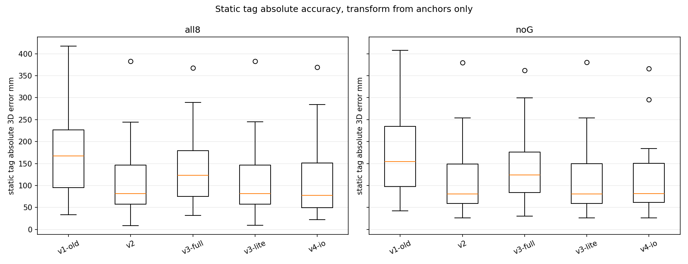

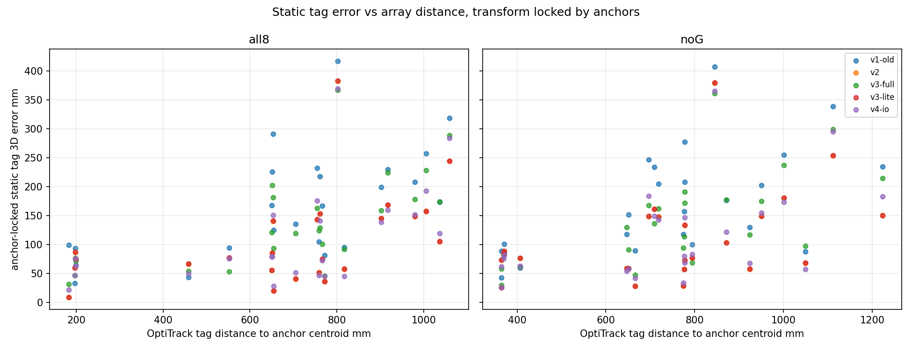

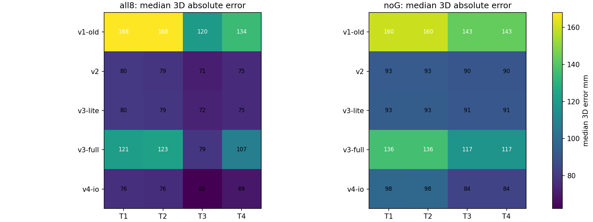


### Localization metric set (cm-scale)

This metric pass is limited to the existing corrected static-tag error outputs. It
does not rerun solvers or regenerate layout, DOP, MC, drift, or the nine additional
diagnostics.

Excluded standard metrics: latency, update rate, drop rate, max gap, availability,
and jitter are not reported because this is an offline static replay, not a real-time
online stream. The static analogue of jitter is repeatability (`D3 std`), which is
cross-referenced below from existing outputs. 2D is also not promoted to the headline:
the system contribution is pure-UWB 3D self-calibration, so 3D remains primary and
OptiTrack Y vertical error is reported explicitly.

3D error percentile set, mm:

| line | mean | RMSE | P50 | P90 | P95 | P99 | max | D3 std P50 | D3 std P95 |
| --- | --- | --- | --- | --- | --- | --- | --- | --- | --- |
| production v4-io/all8 | 111.2 | 138.3 | 77.4 | 187.7 | 270.3 | 349.9 | 369.6 | 58.6 | 88.2 |
| production v4-io/noG | 115.6 | 141.1 | 81.3 | 183.8 | 278.6 | 349.5 | 365.7 | 58.6 | 88.2 |
| best-case raw v4-io/T3/all8 | 84.1 | 101.8 | 62.3 | 149.2 | 158.2 | 261.4 | 292.2 | 58.7 | 137.7 |
| deployment raw v4-io/T4/all8 | 90.2 | 107.0 | 69.1 | 155.7 | 182.3 | 246.0 | 263.8 | 67.4 | 88.4 |

Per-axis signed bias and P95 absolute error, OptiTrack frame with Y vertical:

| line | component | signed bias | signed std | P95 abs | 2D RMSE | 2D P50 | 2D P95 |
| --- | --- | --- | --- | --- | --- | --- | --- |
| production v4-io/all8 | X | 23.7 | 32.4 | 79.9 |  |  |  |
| production v4-io/all8 | Y vertical | -6.2 | 130.8 | 259.4 |  |  |  |
| production v4-io/all8 | Z | -8.8 | 32.6 | 58.0 |  |  |  |
| production v4-io/all8 | horizontal XZ 2D |  |  |  | 51.6 | 43.8 | 82.8 |
| production v4-io/noG | X | 34.5 | 31.9 | 84.3 |  |  |  |
| production v4-io/noG | Y vertical | -13.3 | 131.8 | 267.1 |  |  |  |
| production v4-io/noG | Z | 0.6 | 31.2 | 54.9 |  |  |  |
| production v4-io/noG | horizontal XZ 2D |  |  |  | 55.7 | 46.9 | 86.2 |

Cm-scale 3D outlier rates:

| line | >50 | >80 | >100 | >200 | >300 | <=50 | <=80 |
| --- | --- | --- | --- | --- | --- | --- | --- |
| production v4-io/all8 | 75.0% | 41.7% | 41.7% | 8.3% | 4.2% | 25.0% | 58.3% |
| production v4-io/noG | 87.5% | 50.0% | 41.7% | 8.3% | 4.2% | 12.5% | 50.0% |
| best-case raw v4-io/T3/all8 | 66.7% | 33.3% | 29.2% | 4.2% | 0.0% | 33.3% | 66.7% |
| deployment raw v4-io/T4/all8 | 70.8% | 37.5% | 37.5% | 4.2% | 0.0% | 29.2% | 62.5% |

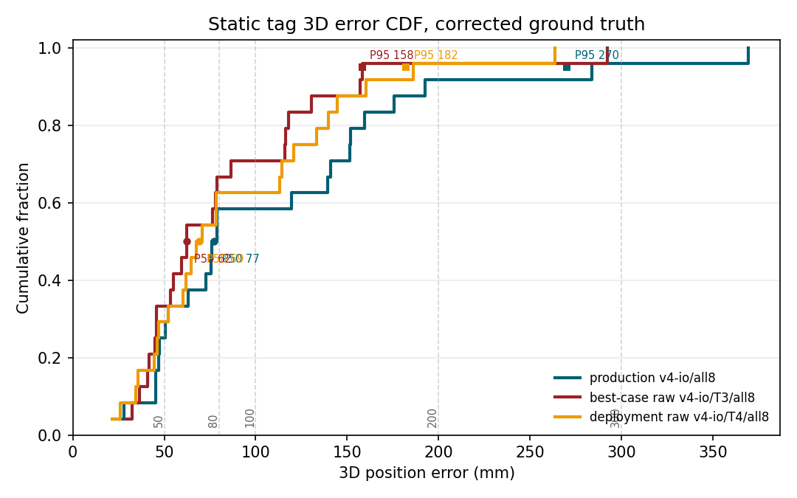

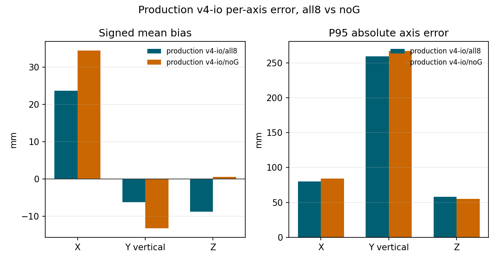

Read: production `v4-io/all8` is P50 77.4 mm and P95 270.3 mm. It has 25.0% of
positions within 50 mm and 58.3% within 80 mm, but 8.3% above 200 mm and 4.2% above
300 mm. This matches the established radial/scale structure: the median is respectable,
but the tail is not random isotropic noise and must stay visible in the report.

### Surveyed-anchor baseline: isolating self-calibration cost from the UWB floor

This baseline uses OptiTrack-truth anchor antenna coordinates directly as the solver
layout, solves the static tag from the raw tag-to-anchor ranges, and compares the result
directly to the corrected OptiTrack `Iantenna` truth. The full path is in the OptiTrack
frame end to end:

```text
OptiTrack anchor coords -> T4 tag solve -> corrected OptiTrack Iantenna comparison
```

There is zero frame fitting in this baseline: no Kabsch alignment, no reflection choice,
and no scale fit. It is therefore a control for the cost of replacing surveyed anchors
with AutoPos self-calibrated anchors.

Two delay treatments are reported:

- `raw_zero_delay`: raw tag ranges, anchor delays = 0, tag delay = 0.
- `autopos_v4io_delay_vector`: OptiTrack-truth anchors with the V4-io AutoPos
  per-anchor delay vector. This is generated from AutoPos data, but the delay vector
  is jointly estimated with the AutoPos layout and is therefore gauge/scale-coupled.
- `inter_anchor_delaycal`: per-anchor endpoint delays fit from raw inter-anchor medians
  against OptiTrack true inter-anchor distances; the tag delay is set to the median
  endpoint delay. This uses OptiTrack for both anchors and delay, so it is partly
  circular and should be read as an optimistic lower bound, not a field-achievable number.

The inter-anchor delaycal diagnostic has median common endpoint bias 84.3 mm and
per-anchor LS residual RMS 51.1 mm.

Headline comparison against the requested production-output AutoPos line:

| eval set | anchor source | delay | tag method | median 3D mm | p95 mm | RMS mm | horiz med mm | vert med mm |
| --- | --- | --- | --- | ---: | ---: | ---: | ---: | ---: |
| all8 | OptiTrack truth | raw_zero_delay | T4 | 296.0 | 443.1 | 297.8 | 95.5 | 279.9 |
| all8 | OptiTrack truth | autopos_v4io_delay_vector | T4 | 241.9 | 376.3 | 240.4 | 79.9 | 214.8 |
| all8 | OptiTrack truth | inter_anchor_delaycal | T4 | 58.4 | 134.8 | 74.9 | 37.6 | 39.5 |
| all8 | AutoPos v4-io | autopos_estimated_delays | production-output | 77.4 | 270.3 | 138.3 | 43.8 | 63.1 |
| noG | OptiTrack truth | raw_zero_delay | T4 | 322.1 | 534.1 | 349.7 | 126.2 | 286.2 |
| noG | OptiTrack truth | autopos_v4io_delay_vector | T4 | 255.1 | 471.0 | 287.7 | 114.5 | 206.0 |
| noG | OptiTrack truth | inter_anchor_delaycal | T4 | 78.1 | 198.2 | 118.4 | 50.1 | 64.1 |
| noG | AutoPos v4-io | autopos_estimated_delays | production-output | 81.3 | 278.6 | 141.1 | 46.9 | 63.5 |

AutoPos minus surveyed baseline:

| eval set | baseline delay | delta median 3D mm | delta p95 mm | delta RMS mm |
| --- | --- | ---: | ---: | ---: |
| all8 | raw_zero_delay | -218.6 | -172.9 | -159.5 |
| all8 | autopos_v4io_delay_vector | -164.5 | -106.0 | -102.2 |
| all8 | inter_anchor_delaycal | 18.9 | 135.4 | 63.4 |
| noG | raw_zero_delay | -240.8 | -255.5 | -208.6 |
| noG | autopos_v4io_delay_vector | -173.8 | -192.4 | -146.6 |
| noG | inter_anchor_delaycal | 3.2 | 80.4 | 22.7 |

The raw-zero-delay rows are intentionally included, but they are dominated by the missing
endpoint delay and therefore are not the physical floor. The AutoPos-delay-vector rows
answer the new hybrid question: "what if we keep the AutoPos delay estimate but use the
surveyed anchor layout?" They remain poor, which means the V4-io delay vector is not a
standalone transferable physical delay calibration; it is coupled to the self-calibrated
layout gauge. The delaycal rows answer the "what if the anchors were surveyed and the
common delay were known" question. Under that optimistic control, AutoPos is close in
median but much worse in p95/RMS, so the tail is where self-calibration/layout/frame-lock
error matters most.

Worst-point resolution:

| ID | production AutoPos all8 3D mm | surveyed AutoPos-delay all8 3D mm | surveyed delaycal all8 3D mm | interpretation |
| --- | ---: | ---: | ---: | --- |
| ID03 | 369.6 | 432.5 | 78.2 | collapses only with OptiTrack-derived delaycal |
| ID04 | 283.9 | 388.1 | 89.5 | collapses only with OptiTrack-derived delaycal |
| ID06 | 192.8 | 244.5 | 34.6 | collapses only with OptiTrack-derived delaycal |
| ID05 | 52.1 | 145.2 | 32.6 | already moderate; truth correction shift was only 2.1 mm |

This is the cleanest separation so far: the 270 mm-class production tail does not survive
the OptiTrack-anchor delaycal control. The median result says AutoPos self-calibration is
already near the optimistic floor for typical positions; the p95/RMS result says the
remaining tail is mainly an AutoPos layout/self-calibration/frame-lock problem rather than
intrinsic UWB failure at ID03/ID04/ID06.

Figures:


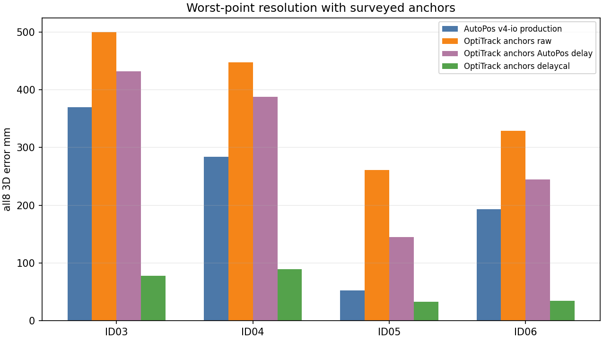

## Additional diagnostics (error structure, delay decomposition, anchor health)

This section adds nine diagnostics on top of the corrected static-tag analysis. Unless
stated otherwise, the primary line is production-output `v4-io / all8` with corrected
ID01/ID05 tag truth.

### 1. Antenna-delay common/differential decomposition

AutoPos v4-io's common effective delay is 34.4 mm, while the OptiTrack inter-anchor
endpoint fit has common term 90.6 mm. The differential patterns only weakly agree
(Pearson r=-0.03); the AutoPos delay vector should therefore be described as an
effective joint self-calibration delay, not a pure physical antenna-delay measurement.

[delay_common_differential.csv](../tables/delay_common_differential.csv)  
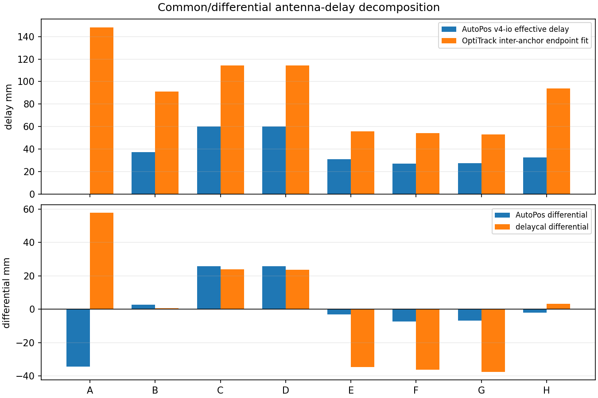

### 2. Tag error vs distance-from-array-center

The all8 3D-error slope is 166.5 mm/m (R^2=0.28, p=0.007), which supports a positive
scale-propagation component. The signed radial slope is 229.9 mm/m (p=0.000). The
moderate R^2 means scale propagation is real but not the whole tail explanation.

[tag_error_vs_center_distance.csv](../tables/tag_error_vs_center_distance.csv)  


### 3. Tag error vector field

The all8 mean error vector is (23.7, -6.2, -8.8) mm in OptiTrack XYZ, with
|mean|/RMS-scatter=0.19. Median signed radial error is 63.4 mm, median tangential
magnitude is 40.1 mm, and 83% of points are radially outward.

[tag_error_vector_decomposition.csv](../tables/tag_error_vector_decomposition.csv)  


### 4. Worst-point raw-range residual fingerprint

ID01/ID03/ID04/ID06 show structured residual fingerprints rather than identical common
offsets. The table reports raw range residuals against both the production solved point
and the OptiTrack truth point, with centered per-ID columns to expose anchor-specific
structure.

[worstpoint_range_residuals.csv](../tables/worstpoint_range_residuals.csv)  
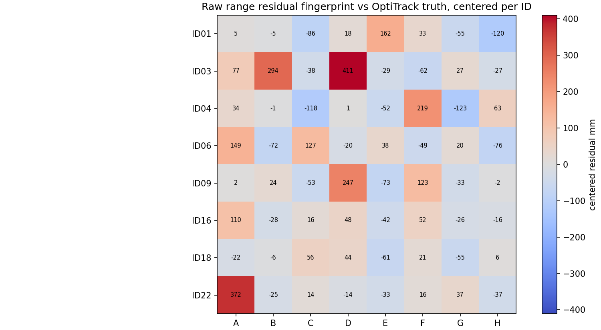

### 5. Per-anchor health / trust score

The lowest heuristic trust anchors are G, D, H. This score combines pair residuals, raw
asymmetry, temporal drift, OptiTrack marker status, and delay differential magnitude; it
is a triage score, not a formal probability of failure.

[anchor_health_scorecard.csv](../tables/anchor_health_scorecard.csv)  


### 6. Tag error by height

Height grouping uses bootstrap CIs because each group is small. The output table reports
3D median/p95 and OptiTrack X/Y/Z split for all8/noG.

[tag_error_by_height.csv](../tables/tag_error_by_height.csv)  
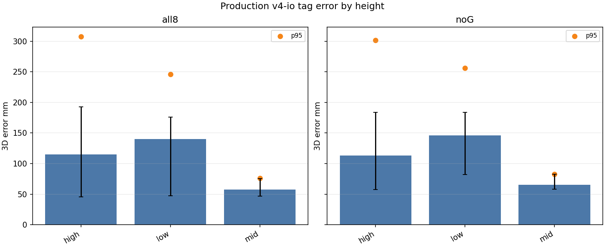

### 7. Tag error: edge vs center

Edge/center grouping checks whether positions farther from the array centroid are worse.
Interpret it together with the distance regression rather than as an independent
high-power test.

[tag_error_edge_vs_center.csv](../tables/tag_error_edge_vs_center.csv)  
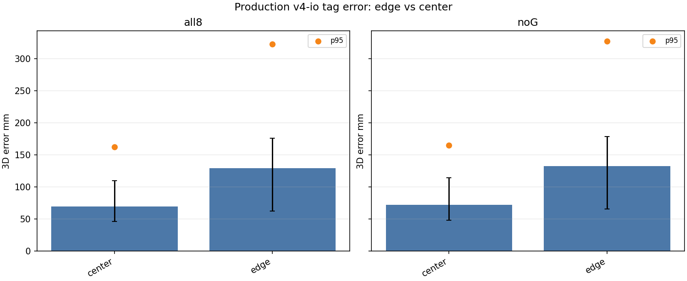

### 8. Tag error by facing group

Facing groups are exploratory because n is small. The table also includes median VDOP
and condition number from the existing grid25 DOP-by-facing table for the same IDs.

[tag_error_by_facing.csv](../tables/tag_error_by_facing.csv)  


### 9. Single-anchor criticality

Drop-one keep7 results rank the most critical anchors to keep as E, D, A for the
combined static/roto degradation score. Compare this with the health score: a low-trust
anchor can still be geometrically important.

[single_anchor_criticality.csv](../tables/single_anchor_criticality.csv)  
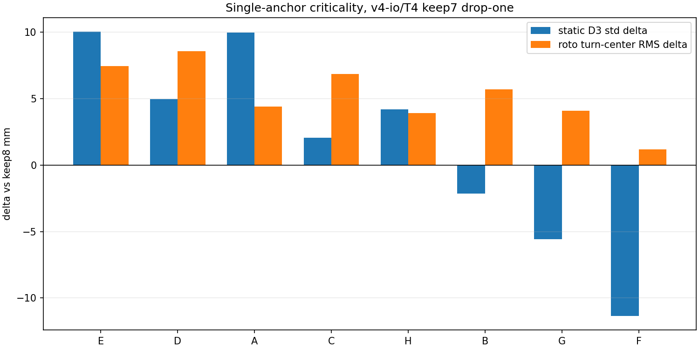

### Synthesis

The extra diagnostics point to a coupled error structure rather than one simple cause.
The common delay term is gauge-coupled with layout scale, the distance/radial tests do
not reduce the tag tail to pure scale propagation, and the worst-point fingerprints plus
single-anchor criticality show anchor-specific structure. The best current reading is:
typical-position median accuracy is near the surveyed-delaycal floor, while the
production p95 tail comes from layout/self-calibration/frame-lock coupling interacting
with a few anchor/link weaknesses, not isotropic measurement noise alone.

## 3. VDOP Geometry Explanation

Source:

- [dop_summary_grid100.md](../tables/dop_summary_grid100.md)
- [dop_summary_grid50.md](../tables/dop_summary_grid50.md)
- [dop_summary_grid25.md](../tables/dop_summary_grid25.md)
- [dop_by_facing_group_grid25.csv](../tables/dop_by_facing_group_grid25.csv)
- [dop_facing_height_summary_grid25.csv](../tables/dop_facing_height_summary_grid25.csv)

The default VDOP model is the range-only solver model:

```text
G_row = [ux, uy, uz]
```

The optional range-bias model `[ux, uy, uz, 1]` is computed only as a diagnostic and
should not be used as the default solver geometry explanation.

Final 25 mm grid summary:

| mask | grid points | finite points | VDOP median | VDOP p90 | VDOP p95 | GDOP median | HDOP median | cond p95 | device |
| --- | ---: | ---: | ---: | ---: | ---: | ---: | ---: | ---: | --- |
| all8 | 2762625 | 2762625 | 0.804 | 0.911 | 0.941 | 1.170 | 0.861 | 5.561 | cuda |
| noG | 2762625 | 2762625 | 0.856 | 1.057 | 1.177 | 1.278 | 0.943 | 7.190 | cuda |
| dropH | 2762625 | 2762625 | 0.861 | 1.075 | 1.199 | 1.283 | 0.941 | 7.353 | cuda |

Interpretation:

- The all8 geometry is healthy across the tested volume.
- Dropping one upper anchor such as G or H increases VDOP and condition number, but it
  does not create immediate rank failure across the grid.
- CDHG low-height samples have high measured radial p95 even when all8 VDOP is not the
  worst. This suggests that geometry alone does not explain all bad static tag points;
  NLOS, body/antenna orientation, local obstruction, or per-anchor range bias remain
  plausible.
- The worst absolute tag points should not be explained by VDOP alone unless their
  DOP is also bad. Where DOP is good but absolute error is bad, the cause is likely
  measurement bias or field condition rather than pure geometry. The ID01/ID05
  I-marker label issue has been corrected and no longer explains the main tail.

Figures:


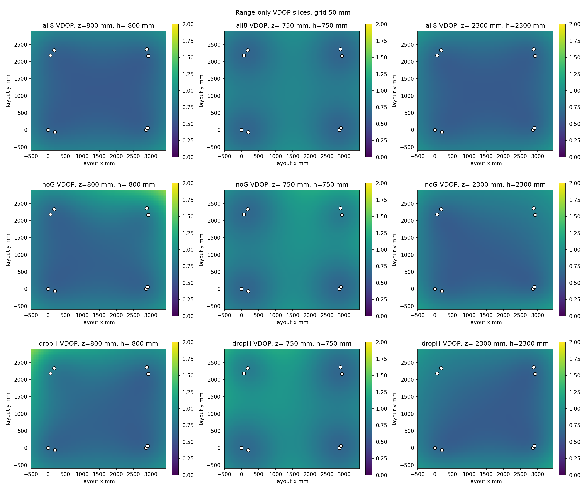

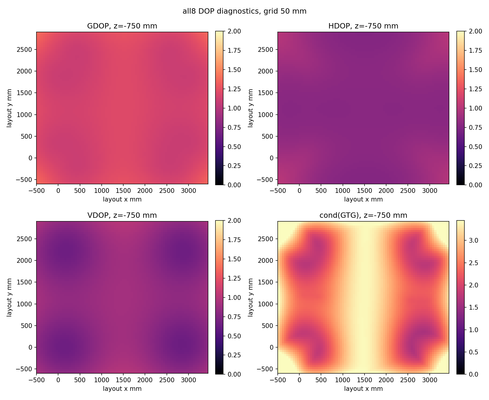

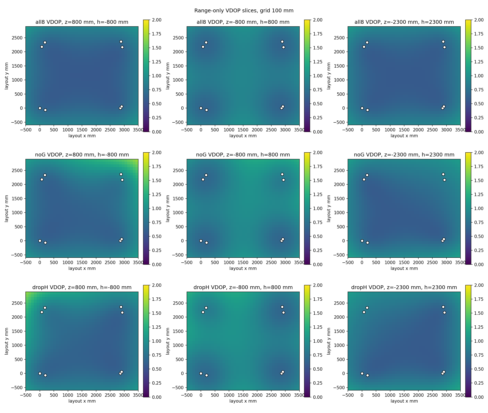


Range-bias diagnostic figures:

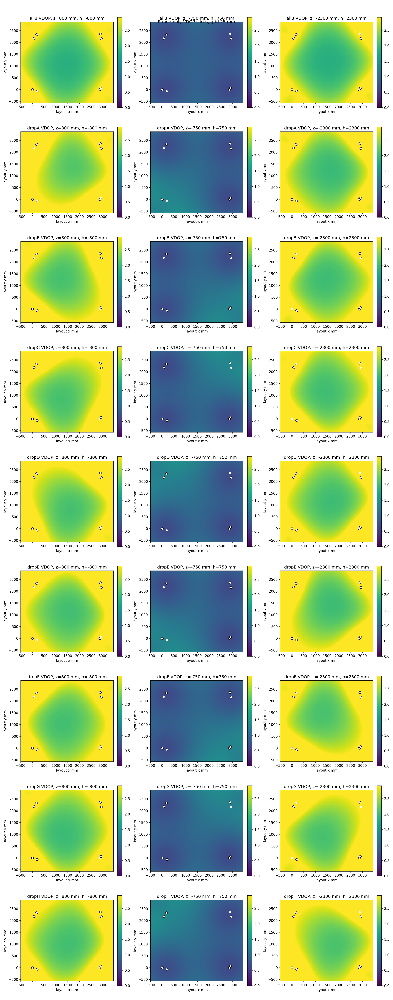

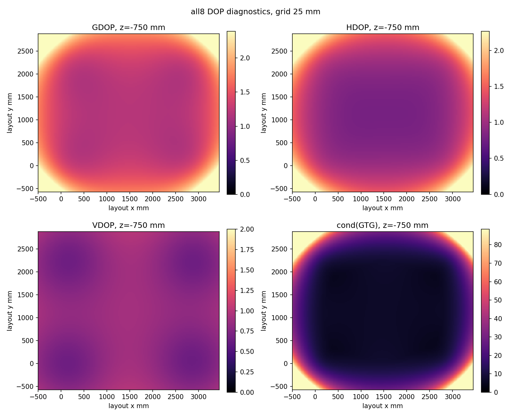

## 4. Random MC5000 Keep-k Robustness

Source:

- [mc_integrity_summary.md](../tables/mc_integrity_summary.md)
- [mc_keepk_combined_summary.csv](../tables/mc_keepk_combined_summary.csv)
- [metric_confidence_intervals.csv](../tables/metric_confidence_intervals.csv)

Completed matrix:

```text
5 anchor-layout solvers x 4 tag solvers x static/roto x keep 8/7/6/5/4 x MC5000
```

Integrity:

```text
40/40 blocks PASS
No integrity issues detected
```

`v4-io / T4` headline:

| kind | keep8 | keep7 | keep6 | keep5 | keep4 |
| --- | ---: | ---: | ---: | ---: | ---: |
| static D3 std median mm | 61.7 | 83.2 | 107.3 | 149.1 | 196.4 |
| roto turn-center RMS median mm | 12.1 | 21.6 | 30.5 | 41.4 | 63.9 |

Interpretation:

- The degradation is monotonic and physically plausible.
- keep7 remains usable but clearly worse than keep8.
- keep6 is a noticeable degradation but may remain informative depending on clinical
  tolerance.
- keep5/keep4 are robust enough to produce numbers, but should not be treated as
  equivalent-quality motion capture.
- The random MC5000 run answers "how bad is random anchor loss on average", not "which
  specific anchor is most dangerous." That second question is handled by stratified
  keep-k below.

Figures:

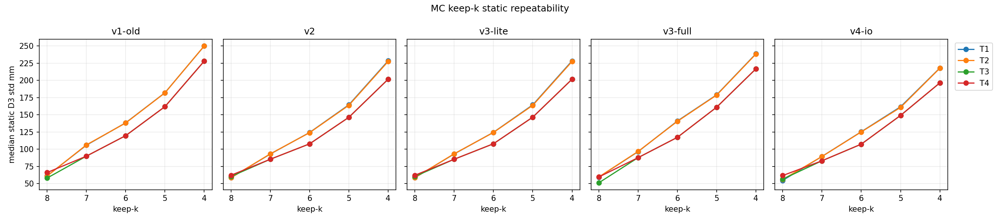

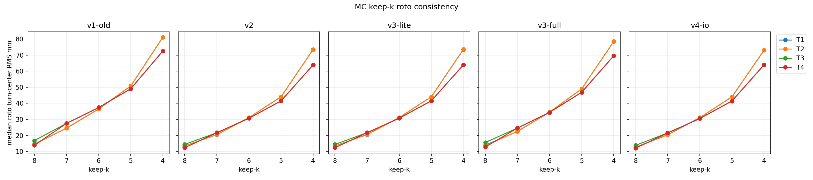

## 5. Stratified Fixed-Drop Keep-k

Source:

- [stratified_keepk_summary.md](../tables/stratified_keepk_summary.md)
- [stratified_keepk_by_drop_set.csv](../tables/stratified_keepk_by_drop_set.csv)
- [stratified_keepk_category_summary.csv](../tables/stratified_keepk_category_summary.csv)
- [stratified_keepk_composition_summary.csv](../tables/stratified_keepk_composition_summary.csv)

Method:

```text
exhaustive fixed dropped-set replay
5 Vx x 4 Tx x static/roto x keep 7/6/5/4
```

Integrity:

| item | value |
| --- | ---: |
| detail rows | 6480 |
| blocks | 40/40 |
| fixed keep-sets per block | 162 |

`v4-io / T4` composition snapshot:

| kind | keep_k | lower-heavy metric mm | upper-heavy metric mm | interpretation |
| --- | ---: | ---: | ---: | --- |
| static D3 std | 7 | 65.2 | 61.0 | lower drop slightly worse |
| static D3 std | 6 | 84.5 | 63.1 | lower drop worse |
| static D3 std | 5 | 96.0 | 65.1 | lower drop worse |
| static D3 std | 4 | 117.3 | 57.2 | lower drop much worse |
| roto center RMS | 7 | 18.3 | 16.0 | lower drop slightly worse |
| roto center RMS | 6 | 25.2 | 18.1 | lower drop worse |
| roto center RMS | 5 | 30.9 | 24.1 | lower drop worse |
| roto center RMS | 4 | 48.5 | 34.0 | lower drop worse |

Worst `v4-io / T4` fixed-drop sets:

| kind | keep_k | dropped set | category | metric mm |
| --- | ---: | --- | --- | ---: |
| roto | 4 | ACEG | balanced | 257.7 |
| static | 4 | ACDE | lower-heavy | 162.7 |
| static | 4 | ABDH | lower-heavy | 160.6 |
| static | 4 | ABCE | lower-heavy | 153.4 |

Interpretation:

- The simple intuition "dropping upper anchors hurts Z most" is not what the data shows.
- In this geometry, lower-heavy drops are more damaging for both static repeatability and
  roto turn-center stability.
- Balanced drops can still be catastrophic when they destroy the useful spatial spread.
- The worst roto keep4 set `ACEG` is a strong warning that anchor identity matters, not
  just the number of remaining anchors.

Figure:


## 6. Roto UWB-only Consistency

Source:

- [metric_confidence_intervals.md](../tables/metric_confidence_intervals.md)
- [mc_keepk_combined_summary.csv](../tables/mc_keepk_combined_summary.csv)

Current `v4-io` bootstrap headline:

| metric | point | 95% CI low | 95% CI high | unit |
| --- | ---: | ---: | ---: | --- |
| roto abs deltaR error median | 33.33 | 22.52 | 40.15 | mm |
| roto abs deltaR error p95 | 42.58 | 40.17 | 47.25 | mm |
| roto turn-center RMS median | 14.31 | 13.16 | 17.36 | mm |

Interpretation:

- Roto UWB-only consistency is much tighter than static absolute tag error.
- This is expected because roto consistency mostly tests shape/periodic consistency
  around a fitted trajectory, not absolute alignment to OptiTrack.
- This section must not be presented as absolute roto accuracy until roto OptiTrack
  ground truth is processed.

The most relevant roto figures are the MC keep-k roto curve and stratified keep-k figure
already included above.

## 7. Pair Residual And Raw Sweep Diagnostics

Source:

- [pair_residual_diagnostics.md](../tables/pair_residual_diagnostics.md)
- [pair_residual_summary.md](../tables/pair_residual_summary.md)
- [pair_raw_asymmetry.csv](../tables/pair_raw_asymmetry.csv)
- [pair_raw_direction_summary.csv](../tables/pair_raw_direction_summary.csv)
- [pair_raw_scatter.csv](../tables/pair_raw_scatter.csv)
- [worst_pairs.csv](../tables/worst_pairs.csv)

`v4-io` worst all1000 residual pairs:

| pair | residual mm | abs residual mm | involves G |
| --- | ---: | ---: | --- |
| B-C | -141.7 | 141.7 | no |
| B-G | 113.7 | 113.7 | yes |
| D-E | 99.8 | 99.8 | no |
| D-F | 91.4 | 91.4 | no |
| F-H | -59.3 | 59.3 | no |
| B-H | 38.4 | 38.4 | no |
| C-E | 31.4 | 31.4 | no |
| E-G | -31.3 | 31.3 | yes |

Largest raw directional asymmetries:

| pair | asymmetry mm | abs asymmetry mm |
| --- | ---: | ---: |
| D-F | 22.0 | 22.0 |
| E-F | 20.0 | 20.0 |
| C-F | 18.0 | 18.0 |
| A-H | -17.0 | 17.0 |
| B-E | -16.0 | 16.0 |

Interpretation:

- The worst residual pairs are not only G-involving pairs.
- G remains suspicious, but B-C, D-E, D-F, and F-H show that residual structure is broader
  than a single-anchor G issue.
- Directional asymmetry exists but is modest relative to the largest layout residuals.
- Residual heatmaps are useful for diagnosing which physical spans or anchor groups need
  special attention.

Figures:

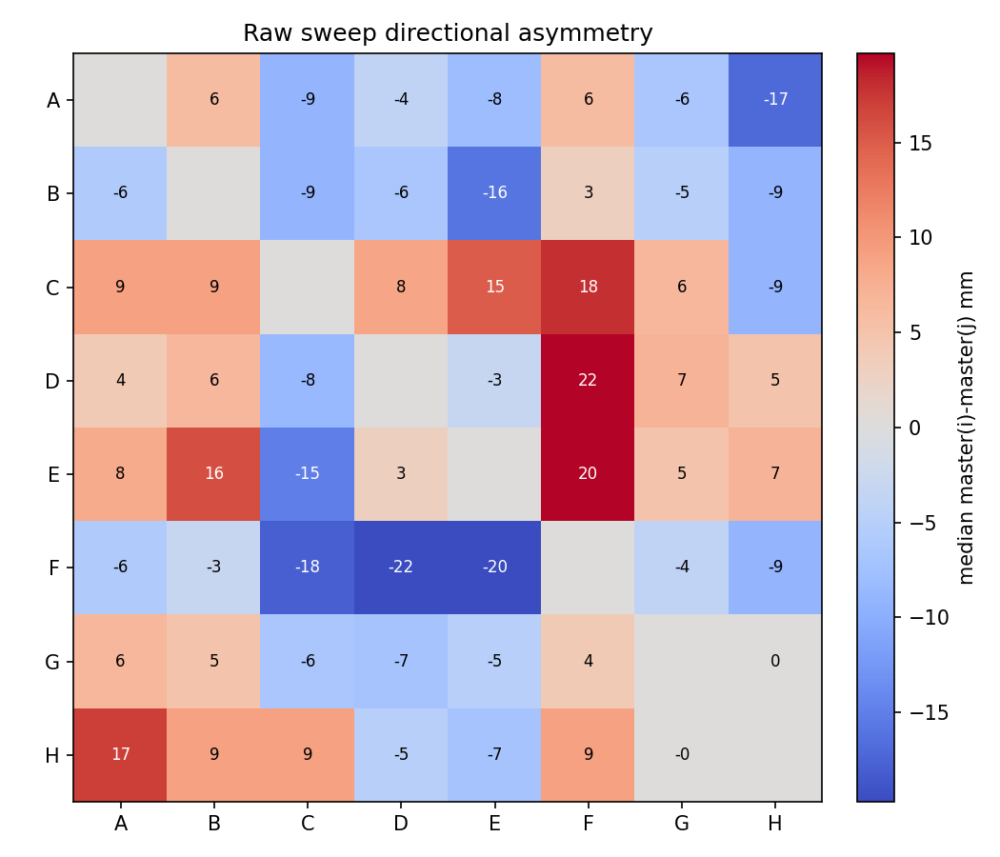

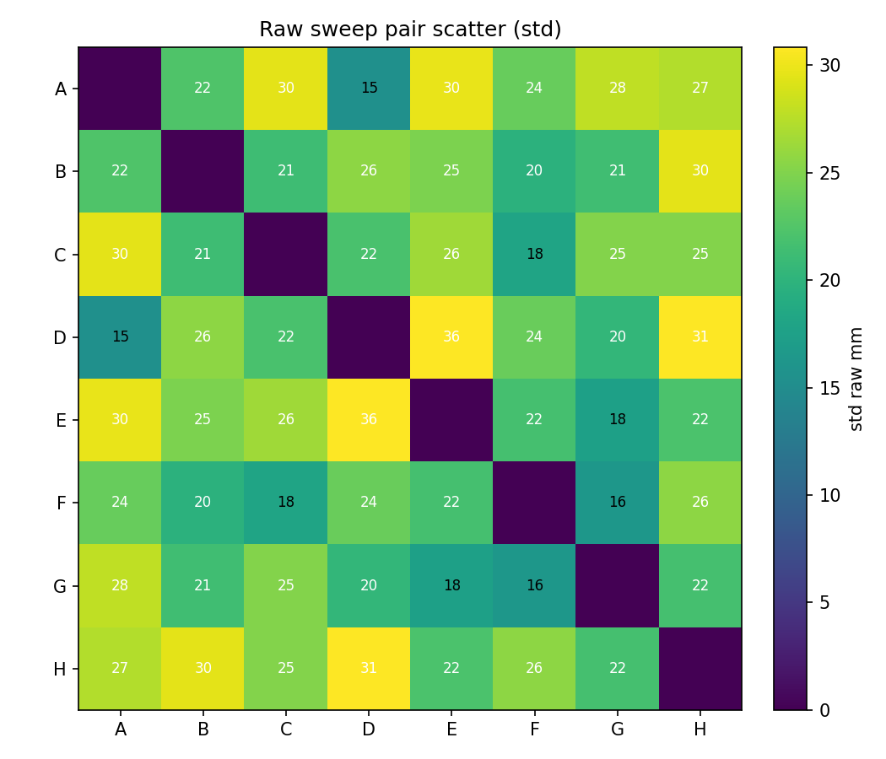

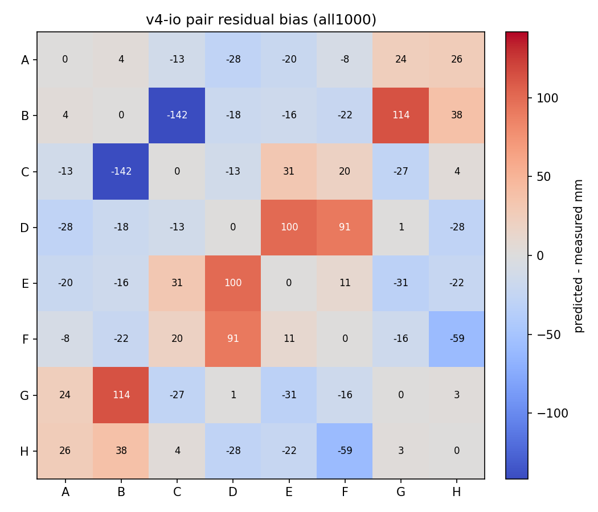

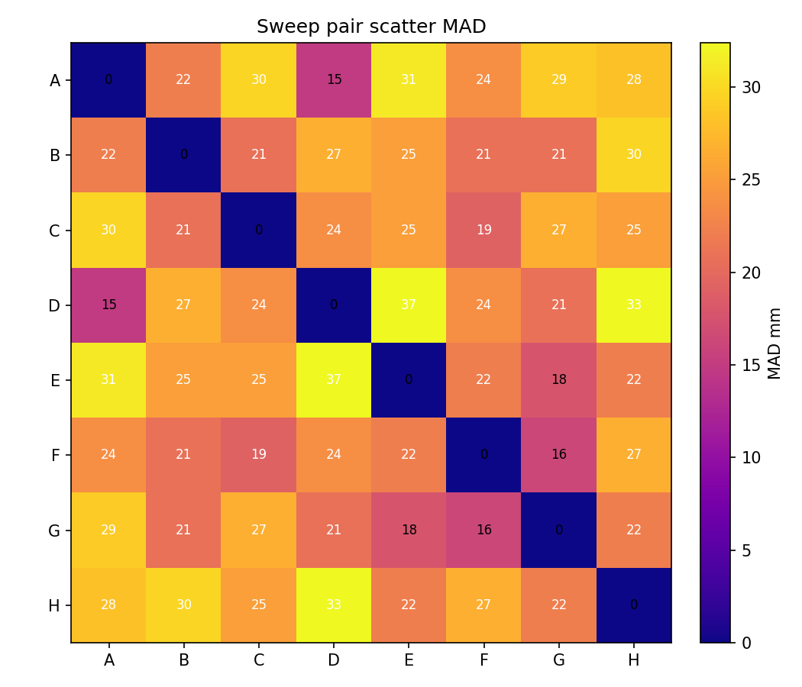

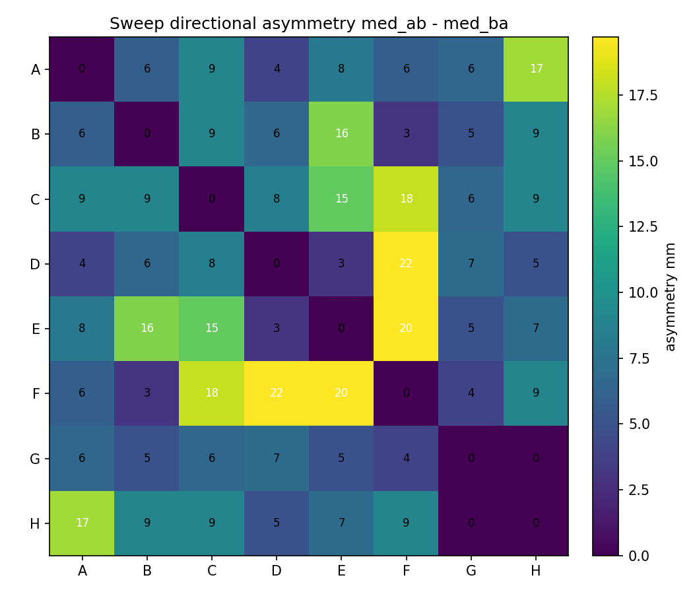

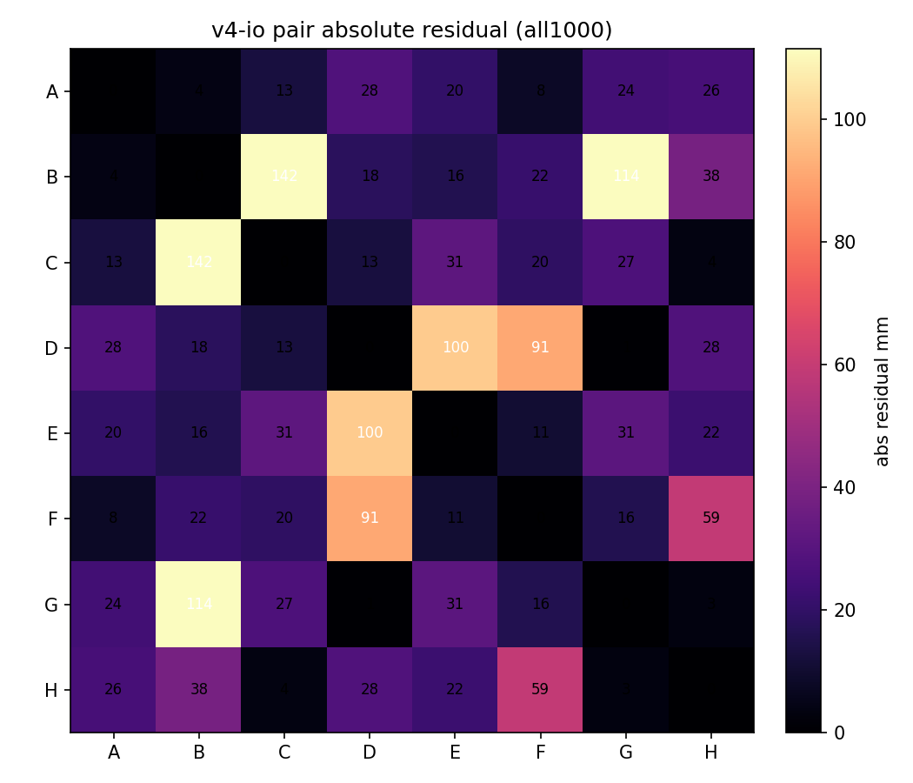

V4-io focused residual maps:

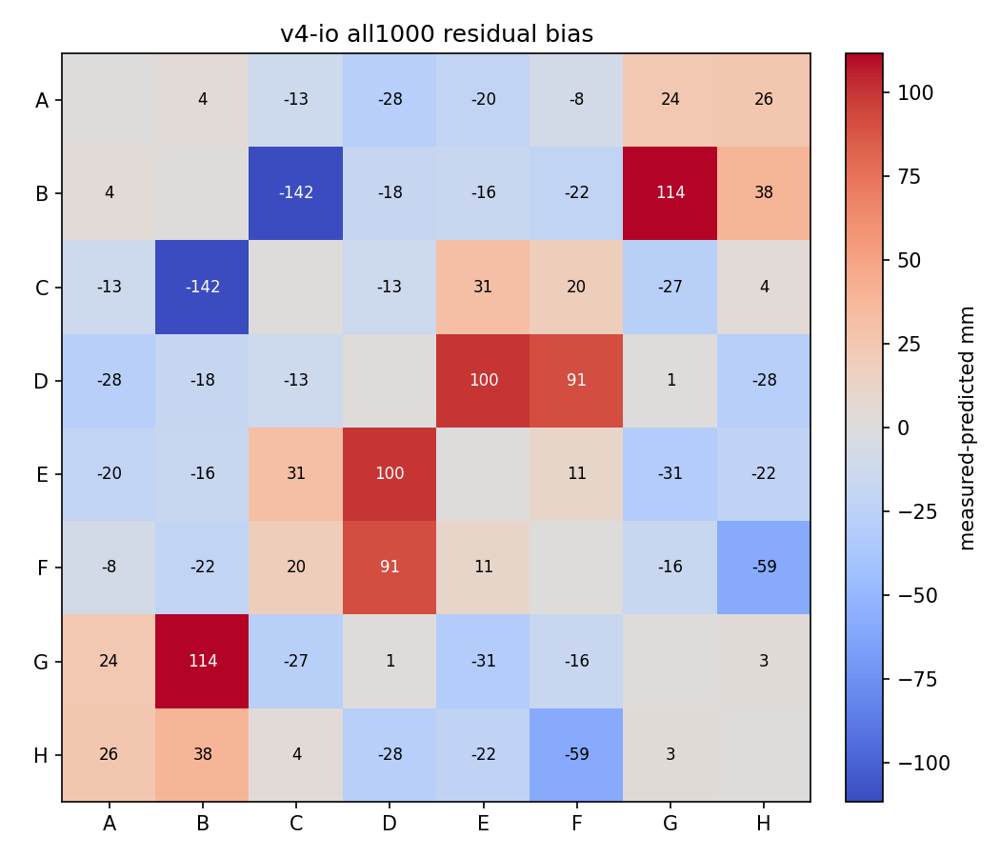

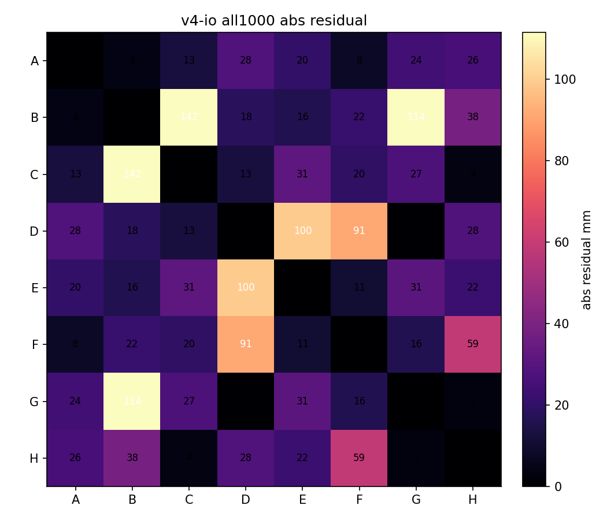


## 8. Temporal And Thermal Drift

Source:

- [temporal_drift_summary.md](../tables/temporal_drift_summary.md)
- [temporal_drift_per_anchor_session.csv](../tables/temporal_drift_per_anchor_session.csv)
- [temporal_drift_anchor_summary.csv](../tables/temporal_drift_anchor_summary.csv)
- [temporal_drift_exclusions.csv](../tables/temporal_drift_exclusions.csv)

This analysis uses static raw per-anchor ranging rows and fits:

```text
range_mm - median(range_mm) = slope * elapsed_minutes + intercept
```

It is a raw-link drift diagnostic, not a tag-position solver result.

Headline:

| metric | value |
| --- | ---: |
| static sessions analyzed | 24 |
| anchor-session links analyzed | 192 |
| median absolute drift slope | 1.54 mm/min |
| p95 absolute drift slope | 16.21 mm/min |
| median absolute drift over capture | 3.07 mm |
| p95 absolute drift over capture | 32.42 mm |

Per-anchor pattern:

| anchor | median abs slope mm/min | p95 abs slope mm/min | median abs drift mm | p95 abs drift mm | median MAD mm |
| --- | ---: | ---: | ---: | ---: | ---: |
| A | 0.71 | 2.44 | 1.43 | 4.89 | 22.24 |
| B | 1.36 | 3.50 | 2.73 | 7.01 | 23.72 |
| C | 1.02 | 4.64 | 2.03 | 9.28 | 22.24 |
| D | 1.44 | 4.71 | 2.88 | 9.42 | 22.98 |
| E | 0.83 | 3.03 | 1.65 | 6.06 | 24.46 |
| F | 6.76 | 19.23 | 13.52 | 38.46 | 50.41 |
| G | 9.68 | 24.67 | 19.35 | 49.31 | 25.95 |
| H | 2.44 | 8.60 | 4.88 | 17.19 | 29.65 |

Worst links include ID01-G, ID15-G, ID01-H, ID13-G, ID08-F, and ID03-F.

Interpretation:

- Drift is not the dominant explanation for the median static absolute error.
- Most A-E links drift only a few mm over the capture.
- F/G/H have larger tails and should be treated as placement/hardware-sensitive.
- G and F outliers are especially important because G is already flagged in the
  OptiTrack marker analysis, and F/G/H are upper-layer anchors involved in the height
  alignment story.

Figures:

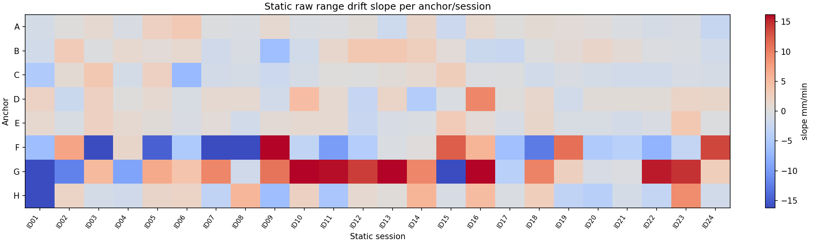

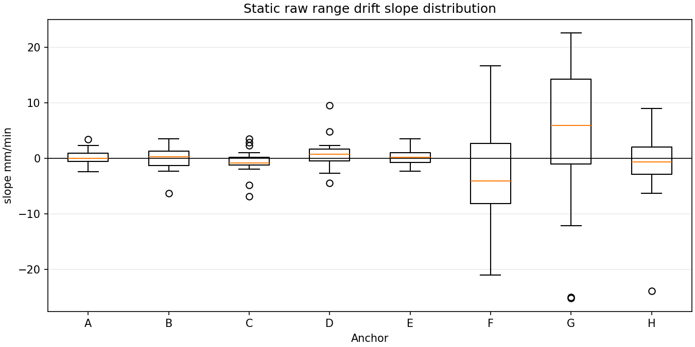

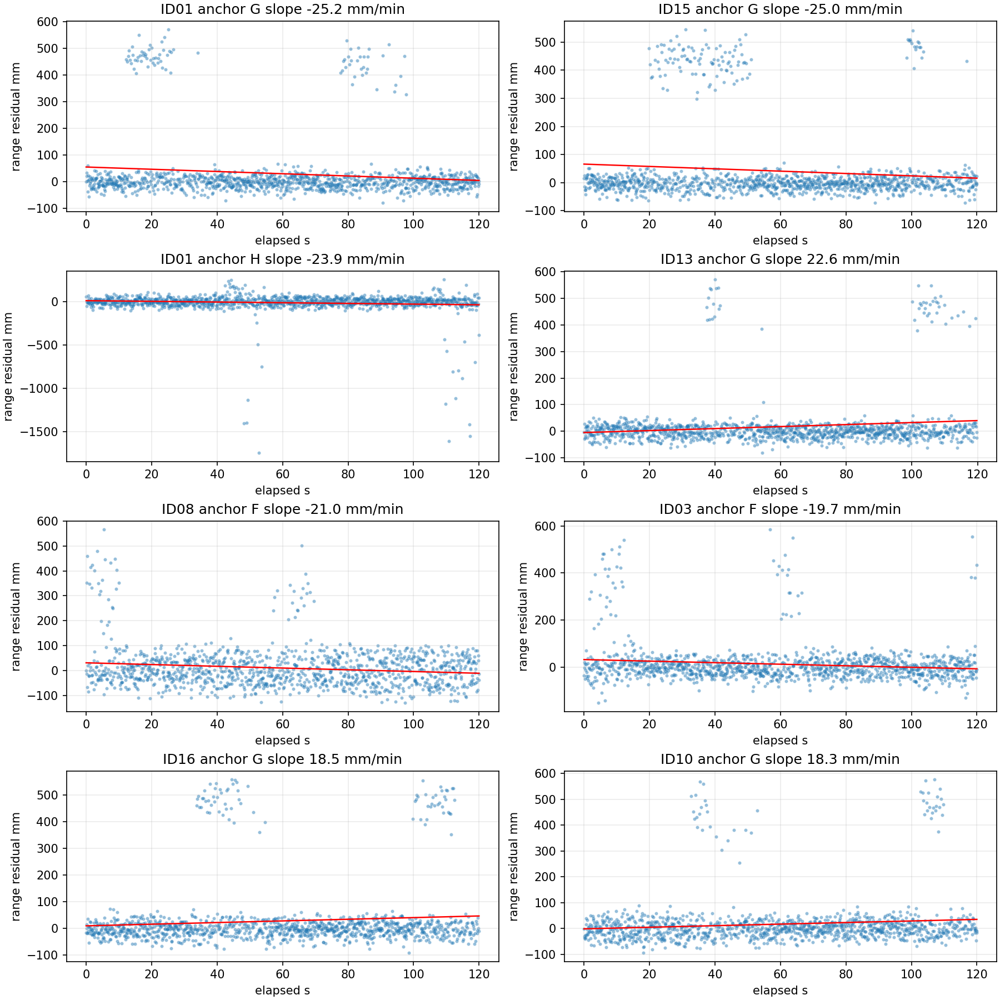

## 9. Bootstrap Confidence Intervals

Source:

- [metric_confidence_intervals.md](../tables/metric_confidence_intervals.md)
- [metric_confidence_intervals.csv](../tables/metric_confidence_intervals.csv)

Bootstrap settings:

```text
n_boot = 10000
seed = 42
MC metrics included = true
```

Selected V4-io CI rows:

| metric | eval set | stat | point | CI low | CI high | unit |
| --- | --- | --- | ---: | ---: | ---: | --- |
| layout rigid 3D error | all8 | RMS | 104.94 | 81.35 | 133.24 | mm |
| layout rigid 3D error | noG | RMS | 104.41 | 78.06 | 133.05 | mm |
| tag absolute 3D error | all8 | median | 77.38 | 52.12 | 141.08 | mm |
| tag absolute 3D error | all8 | p95 | 270.26 | 151.92 | 369.57 | mm |
| tag raw replay 3D error T3/all8 | median | 62.26 | 45.78 | 96.32 | mm |
| tag raw replay 3D error T3/all8 | p95 | 158.17 | 116.44 | 292.22 | mm |
| tag raw replay 3D error T4/all8 | median | 69.14 | 52.17 | 114.50 | mm |
| tag raw replay 3D error T4/all8 | p95 | 182.33 | 133.28 | 263.83 | mm |
| roto turn-center RMS | roto tags | median | 14.31 | 13.16 | 17.36 | mm |

Interpretation:

- The CI width is large for 24-position static tag summaries, especially p95 values.
- Median comparisons of 5-10 mm should not be overinterpreted unless the CI and
  paired-session structure support it.
- The layout RMS CI is broad because it is based on only 8 anchors.
- MC repeat intervals are more stable because they come from MC5000 repeat distributions.

Figure:

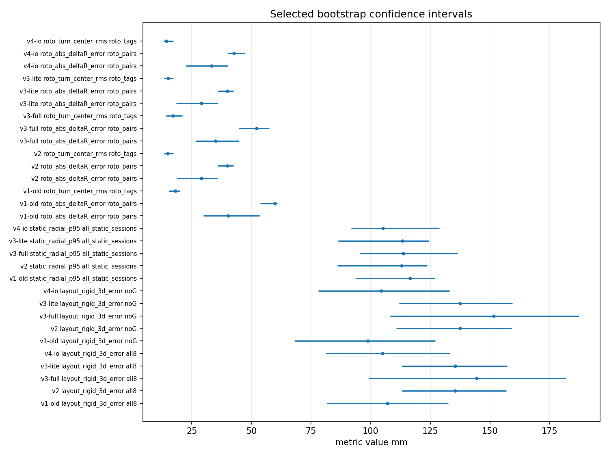

## 10. Cross-Cutting Interpretation

### 10.1 Why Internal Repeatability And Absolute Accuracy Differ

Internal repeatability asks whether repeated estimates cluster tightly in the solver
frame. Absolute accuracy asks whether the resulting position is correct in the OptiTrack
frame after locking the transform from anchors only.

The absolute error includes:

- anchor-layout shape error,
- anchor-layout scale/additive-delay structure,
- residual UWB range bias,
- tag solver behavior,
- local NLOS/body/antenna effects,
- OptiTrack marker and frame uncertainty.

Therefore, internal repeatability around 50-70 mm and absolute median error around
60-80 mm are not contradictory. They measure different layers of the system.

### 10.2 V4-io Is Best, But Not Dramatically Best

V4-io is currently the best anchor-layout solver by all8 rigid RMS, but only by about
2 mm relative to V1-old. This is too small to market as a major solver improvement.

The more defensible statement is:

```text
V4-io is the preferred current layout because it is best or near-best across the
combined analysis, but the official dataset shows that residual range structure and
OptiTrack G uncertainty dominate over the difference between V1 and V4.
```

### 10.3 T3 vs T4

For static absolute accuracy on this dataset, T3 gives the best median raw replay
result:

```text
v4-io / T3 / all8 median 3D = 62.3 mm
v4-io / T4 / all8 median 3D = 69.1 mm
```

However, T4 was developed as a robustness-oriented path. It should not be judged only by
static median absolute error. The correct decision is a deployment tradeoff:

- T3 is attractive for clean all8 static absolute accuracy, but it is the best-case
  solver combination rather than the production-output headline.
- T4 remains attractive when anchor dropout, NLOS, and motion robustness matter.
- The report should present both rather than hiding one.

### 10.4 G Is Useful For UWB But Suspect In OptiTrack

This is subtle:

- G's OptiTrack marker construction/labeling is suspect.
- Removing G from the tag solve worsens V4-io tag absolute accuracy.
- The G marker issue has negligible impact on the final layout RMS: all8 is 104.9 mm
  and noG is 104.4 mm.

These statements can both be true. The OptiTrack representation of G can be questionable
while the UWB measurement from G still improves the tag solve. The safest paper/report
language is:

```text
G is retained for deployed UWB solving. OptiTrack-based layout claims are reported with
both all8 and noG variants for rigor, but the G issue does not change the layout
conclusion.
```

### 10.5 Geometry Does Not Explain Everything

The VDOP maps show reasonable geometry across the test volume. Some poor static points
occur where VDOP is not obviously bad. After the ID01/ID05 I-marker relabel correction,
the remaining large tail is not a tag ground-truth construction artifact; it points
toward layout/self-calibration/frame-lock error and residual range-model bias rather
than pure geometry. The surveyed-anchor delaycal control is the decisive clue: ID03,
ID04, and ID06 collapse to 78.2, 89.5, and 34.6 mm when OptiTrack anchors are used.

## 11. Current Limitations

Roto OptiTrack absolute validation:

- Pending. Current roto section is UWB-only consistency.
- Do not claim absolute roto accuracy from current results.

G anchor:

- G marker fingerprint is suspect.
- It changes the final layout RMS by only about 0.5 mm, so the G issue is negligible
  for the layout headline.
- Keep all8/noG reporting for rigor and traceability.

Static tag marker fixture:

- ID01 and ID05 had I-ball label swaps and have been corrected by deterministic relabel
  plus consensus ball-local `Iantenna` rebuild.
- The next-generation tag fixture should use asymmetric, unequal marker arm lengths.

Delay/scale circularity:

- OptiTrack-derived delay calibration and OptiTrack anchor-layout validation are not
  independent if used together as a closed loop.
- The cleanest future path is an independent tape/laser baseline delay calibration,
  frozen before OptiTrack validation.

Static tag p95:

- The median static absolute result is usable, but p95 remains wide and placement
  sensitive.
- Worst points need AutoPos layout/self-calibration/frame-lock investigation first;
  local NLOS/body-condition/per-anchor range-bias remains relevant after that.

## 12. Recommended Report Headline Statements

Anchor layout:

```text
Using reflection-allowed rigid alignment with no scale fit, the official V4-io anchor
layout reaches 104.9 mm 3D RMS against OptiTrack across all 8 anchors, with 86.1 mm
horizontal RMS and 59.9 mm vertical RMS. The similarity scale diagnostic is 0.960 but
is not used as an accuracy claim.
```

Static tag:

```text
Using the anchor-locked OptiTrack transform and corrected tag ground truth, the
production-output V4-io/all8 static tag result is 77.4 mm median 3D absolute error
and 270.3 mm p95. The best-case raw replay solver combination is V4-io/T3/all8, with
62.3 mm median and 158.2 mm p95; the deployment-oriented V4-io/T4/all8 path gives
69.1 mm median and 182.3 mm p95.
```

Surveyed-anchor control:

```text
With OptiTrack-truth anchors and an OptiTrack-derived inter-anchor delay calibration,
the all8 T4 surveyed-anchor lower bound is 58.4 mm median 3D and 134.8 mm p95.
Production AutoPos is close in median (+18.9 mm) but much worse in p95 (+135.4 mm),
and the ID03/ID04/ID06 tail collapses under surveyed anchors.
Using the V4-io AutoPos delay vector with OptiTrack anchors does not reproduce that
floor: it gives 241.9 mm median all8, so the AutoPos delay vector is coupled to the
self-calibrated layout and should not be treated as an independent surveyed-layout
delay calibration.
```

MC robustness:

```text
The MC5000 forced keep-k replay completed all 40 solver blocks without integrity issues.
For V4-io/T4, static D3 std median degrades from 61.7 mm at keep8 to 83.2, 107.3,
149.1, and 196.4 mm at keep7/6/5/4 respectively.
```

Stratified keep-k:

```text
The exhaustive fixed-drop replay shows that in this field geometry lower-heavy drops
are more damaging than upper-heavy drops for both static repeatability and roto
turn-center stability.
```

Roto:

```text
Roto UWB-only consistency is strong, with V4-io turn-center RMS median 14.31 mm
(95% CI 13.16-17.36 mm), but roto OptiTrack absolute validation is still pending.
```

## 13. Complete Figure Gallery

This section collects the meaningful figures generated by the current analysis pass.
Shard/debug-only duplicates are omitted; final aggregate plots are included.

### Layout


### Static Tag


### VDOP And DOP


### Random MC5000 Keep-k


### Stratified Fixed-Drop Keep-k


### Pair Residuals


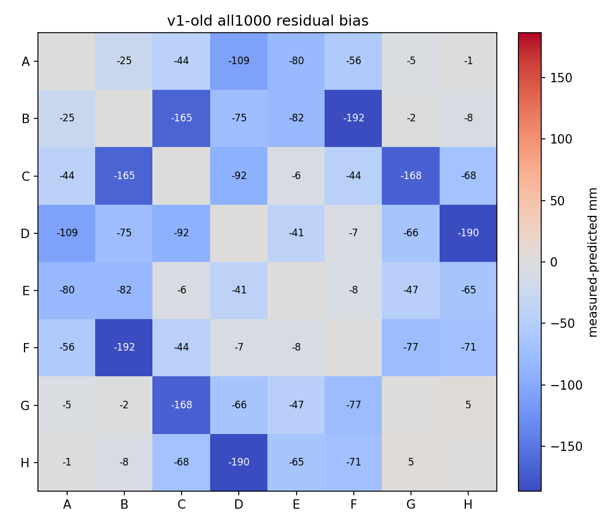

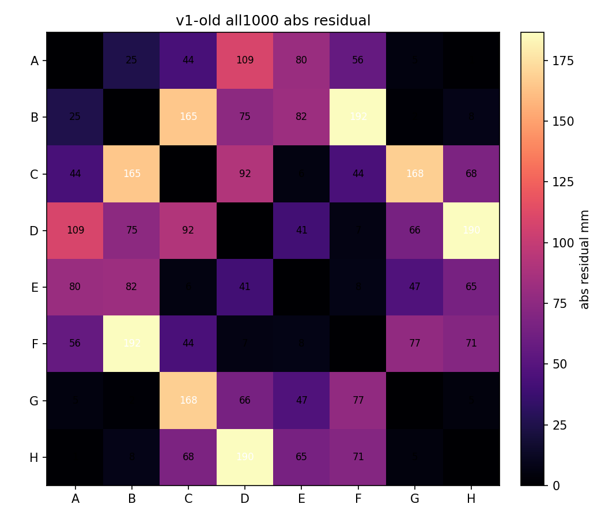


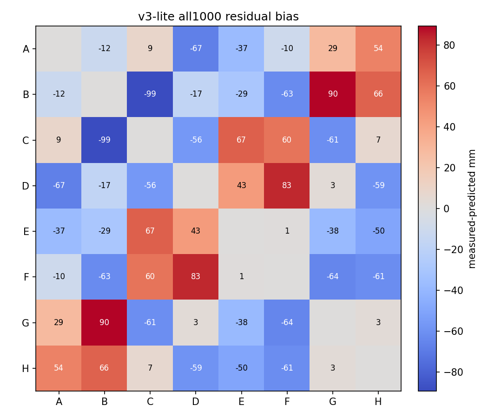

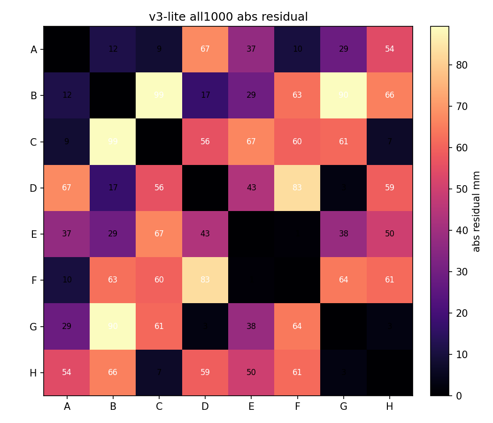

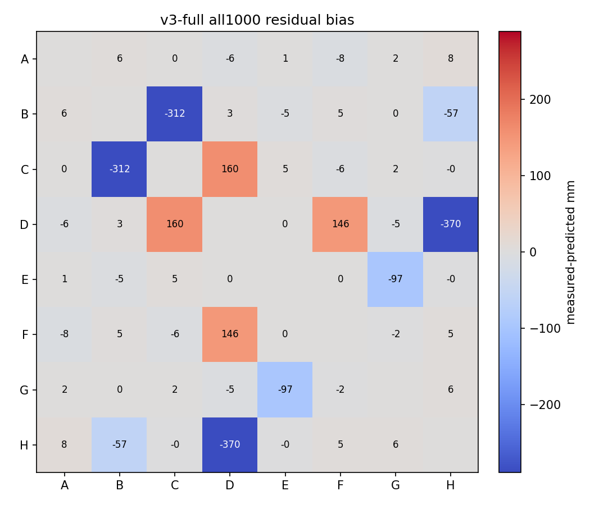

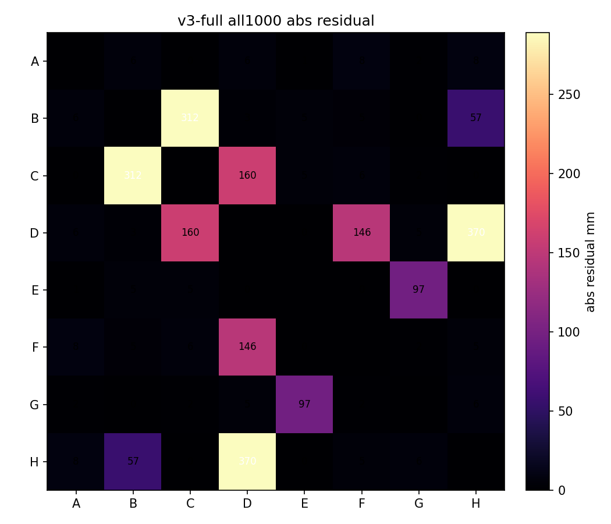


### Temporal Drift


### Bootstrap


## 14. Audit Trail

This report layer now includes the generated additional diagnostics from:

```text
official_extra_analysis/scripts/additional_diagnostics.py
```

The script adds delay decomposition, tag error structure, worst-point residual
fingerprints, anchor health, height/edge/facing stratifications, and single-anchor
criticality outputs. The report also consolidates the existing generated outputs under:

```text
official_extra_analysis/tables
official_extra_analysis/figs
official_extra_analysis/report.md
```

The report-specific output location is:

```text
official_extra_analysis/reports/DETAILED_OFFICIAL_ANALYSIS_REPORT.md
```

The report-local figure bundle is:

```text
official_extra_analysis/reports/fig/
```
