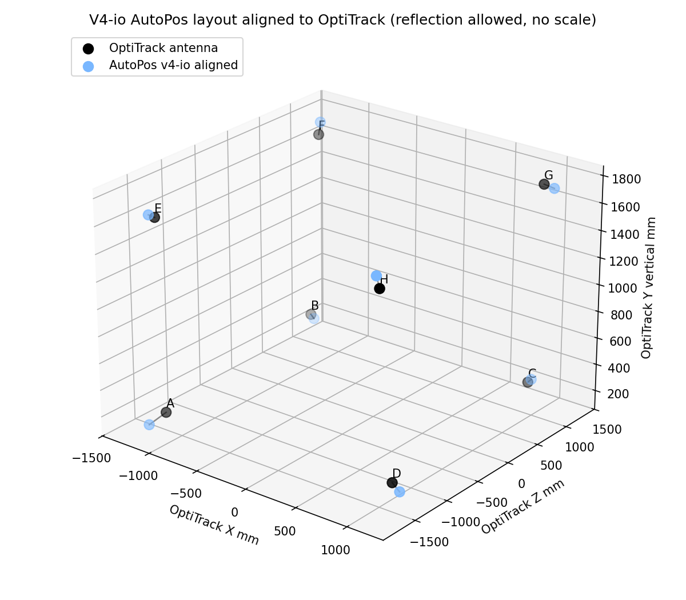
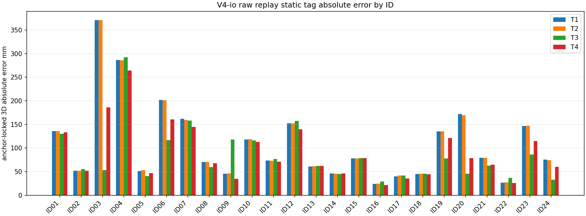
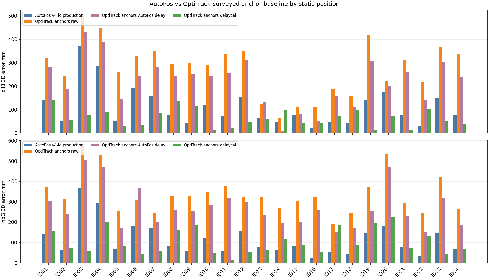
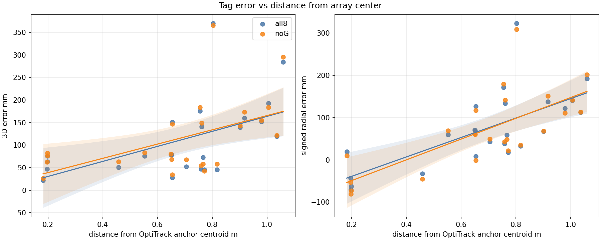
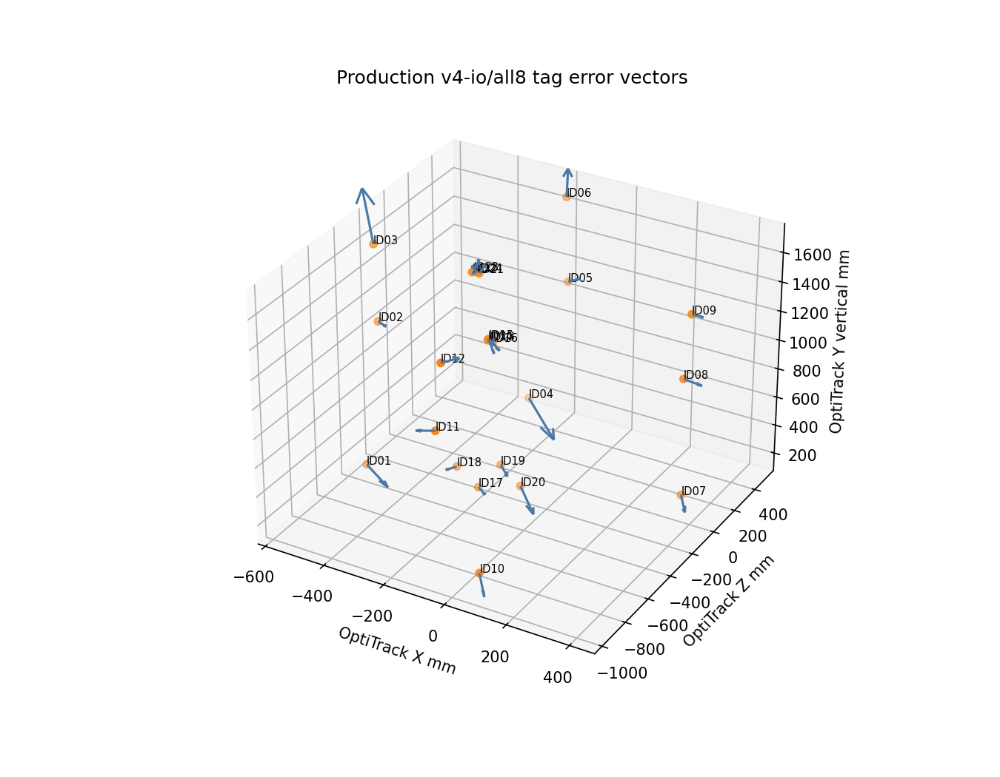
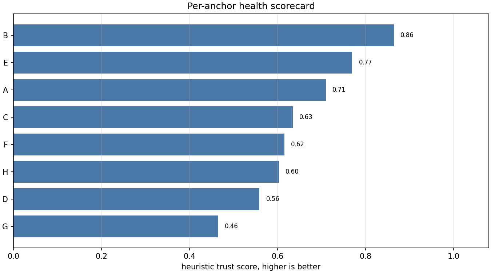
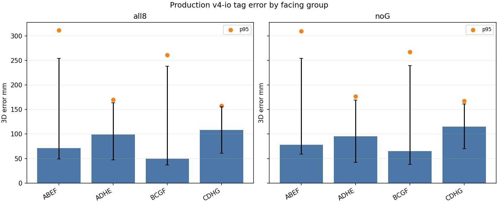
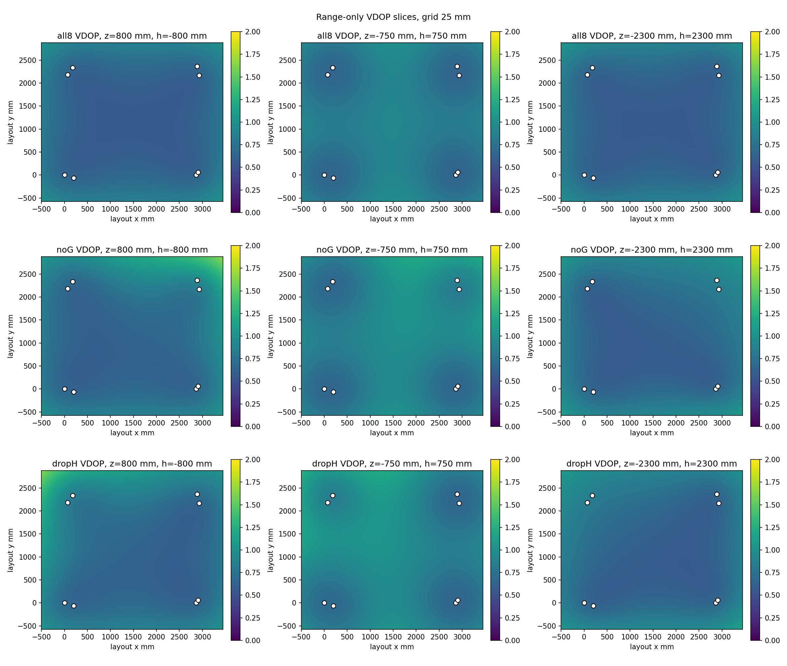
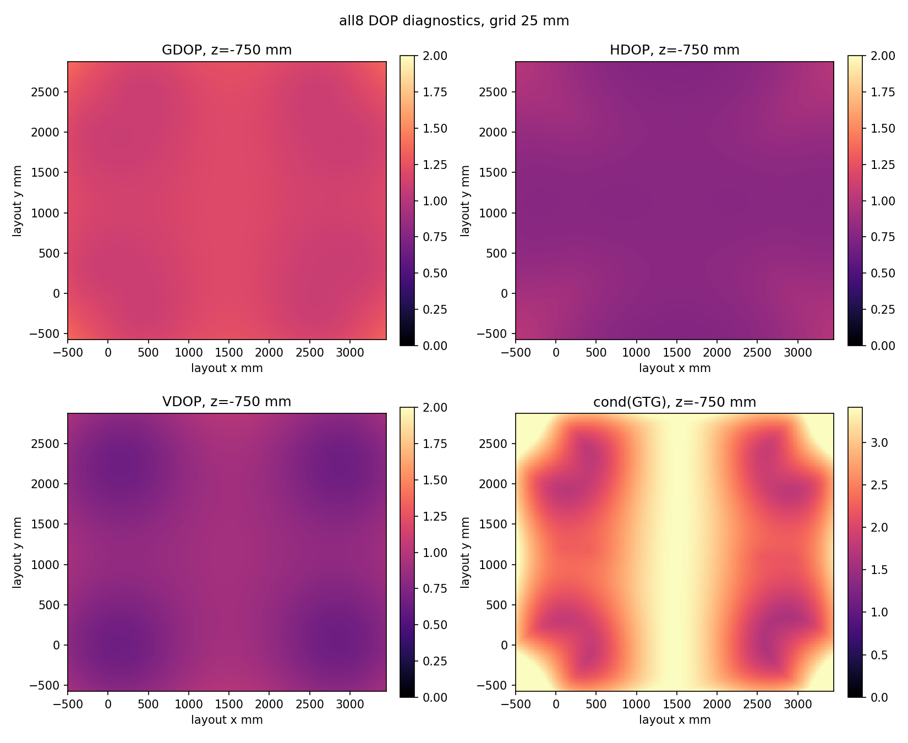
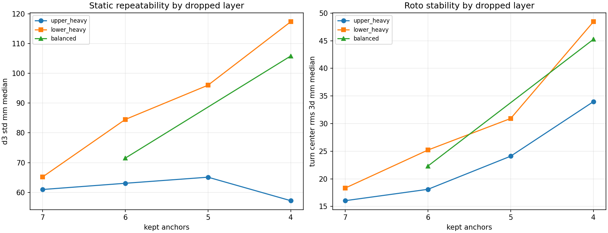

# Open Items And Serious Discussion Points

Generated: 2026-05-30

This file collects the work that is still pending and the findings that should be
discussed explicitly before the analysis is turned into a paper/report narrative.

Main report:

[DETAILED_OFFICIAL_ANALYSIS_REPORT.md](../DETAILED_OFFICIAL_ANALYSIS_REPORT.md)

## Local Figure Bundle

This folder is meant to be zipped and sent to another model/reviewer. The most relevant
discussion figures are copied locally into:

`fig/`

These are the figures most likely to matter when discussing open questions:





























## A. Not Yet Done

### A1. Roto OptiTrack absolute validation

Status: pending.

Current roto results are UWB-only consistency diagnostics. They include turn-center RMS
and delta-radius consistency, but they are not absolute errors against OptiTrack.

Required next work:

- Process roto OptiTrack truth.
- Define the roto marker/tag antenna center mapping.
- Align UWB roto output into OptiTrack frame using the anchor-derived transform only.
- Report roto absolute 3D, radial, vertical, and phase/trajectory errors.
- Keep current UWB-only roto consistency as a separate diagnostic.

Why it matters:

- Current roto numbers look strong, but they are not yet absolute validation.
- This is likely important for motion-capture credibility.

### A2. OptiTrack anchor G correction

Status: unresolved.

G has multiple warning signs:

- marker fingerprint short/long relationship is suspect,
- G antenna position consistency across ID01-ID05 is worse than other anchors,
- G-involving residual pairs appear in pair diagnostics.

Required next work:

- Re-export from Motive with corrected G marker labels if possible.
- If re-export is impossible, document G as suspect and keep both all8/noG analysis.
- Avoid template reconstruction unless its uncertainty is explicitly reported.

Why it matters:

- G affects absolute layout validation, but only weakly in the current headline
  numbers: V4-io all8 is 104.9 mm RMS and noG is 104.4 mm RMS.
- The noG variant remains useful for transparency and rigor, not because it changes the
  layout conclusion.
- At the same time, UWB tag solving often benefits from keeping G.

### A2b. Static tag I-marker relabel correction

Status: corrected in the regenerated tag tables.

ID01 and ID05 had swapped `I1..I5` marker-ball labels because the tag optical fixture
uses equal-length arms and is rotationally ambiguous. The correction is deterministic:

```text
ID01: new I1..I5 = old indices (0, 1, 4, 2, 3)
ID05: new I1..I5 = old indices (3, 4, 2, 0, 1)
```

The corrected `Iantenna` is rebuilt from the clean 22-capture ball-local consensus.
ID01 moves 54.1 mm from Motive's virtual marker, while ID05 moves only 2.1 mm.

Design lesson:

- The next marker-hole PCB / optical fixture must use asymmetric, unequal arm lengths.
- Each ball needs a unique distance signature so Vicon/Motive cannot rotate the label
  assignment into another plausible solution.

### A3. Independent antenna delay calibration

Status: surveyed-anchor OptiTrack delaycal control is done; independent physical delay
calibration is still not done.

The OptiTrack comparison shows a scale/additive-delay structure, but using OptiTrack truth
to calibrate delay and then validate the same anchor layout is circular.

The additional delay decomposition reinforces this boundary: AutoPos v4-io has common
effective delay 34.4 mm, while the OptiTrack inter-anchor endpoint fit has common term
90.6 mm, and the differential patterns agree weakly (Pearson r=-0.03). Treat the AutoPos
delay vector as an effective joint self-calibration parameter, not an independent
physical antenna-delay measurement.

Required next work:

- Measure independent known baselines using tape/laser.
- Estimate common/per-anchor delay from those baselines.
- Freeze the delay before OptiTrack validation.
- Re-run anchor and tag absolute accuracy with the frozen delay.

Why it matters:

- This is the cleanest way to separate true scale bias from additive range delay.
- It makes future claims more defensible.
- The new surveyed-anchor delaycal result is useful as a lower bound, but it is partly
  circular because OptiTrack supplies both anchor coordinates and the delay fit.

### A4. Roto OptiTrack report section placeholder

Status: intentionally empty for now.

The final report should include a reserved section:

```text
Roto OptiTrack absolute validation: pending
```

Do not fill it with UWB-only claims.

### A5. Worst-point root cause investigation

Status: narrowed by the surveyed-anchor baseline, not closed.

Some static points have poor absolute error even when VDOP is not bad. This means the
bad points are probably not explained by geometry alone.

New surveyed-anchor control:

- OptiTrack anchors + inter-anchor delaycal all8 T4 gives 58.4 mm median, 134.8 mm p95.
- OptiTrack anchors + AutoPos v4-io delay vector gives 241.9 mm median, 376.3 mm p95.
- Production AutoPos all8 is 77.4 mm median, 270.3 mm p95.
- ID03/ID04/ID06 collapse to 78.2 / 89.5 / 34.6 mm with surveyed anchors and delaycal.
- Therefore the 270 mm-class production tail is mostly AutoPos layout/self-calibration/
  frame-lock cost rather than intrinsic UWB failure at those specific points.
- The AutoPos delay vector is not independently transferable to the OptiTrack layout;
  it appears coupled to the AutoPos layout gauge/scale.
- Distance/radial diagnostics show a real scale-like component: all8 3D error slope is
  166.5 mm/m versus array-centroid distance, and signed radial error slope is 229.9 mm/m.
- The vector field is not just one common translation: 83% of points are radially outward,
  while the common mean vector is only 0.19 of RMS scatter.
- Worst-point raw-range fingerprints show anchor-specific structure for
  ID01/ID03/ID04/ID06.
- Anchor triage now ranks the lowest heuristic trust anchors as G, D, H; drop-one
  criticality ranks E, D, A as the most important anchors to keep.

Candidate causes:

- local NLOS,
- body/hand/antenna orientation,
- nearby metal,
- per-anchor range bias,
- raw range bias on specific anchors,
- local placement issue in the official capture.

Required next work:

- Inspect field photos/notes for per-ID NLOS, body, and nearby-metal context.
- Use the generated raw residual, height, facing, and anchor-health tables as the starting
  appendix for a per-ID root-cause narrative.
- Check whether the same bad IDs show high per-anchor p95 residuals across future
  captures.
- Treat ID03/ID04/ID06 as real production errors after the ID01/ID05 tag-truth
  correction, but prioritize AutoPos layout/self-calibration/frame-lock investigation
  because they collapse under surveyed anchors.

## B. Findings That Need Serious Discussion

### B1. V4-io is only slightly better than V1-old in anchor layout

Current result:

```text
v4-io all8 rigid RMS = 104.9 mm
v1-old all8 rigid RMS = 106.9 mm
```

Discussion:

- V4-io is still the preferred current layout, but the improvement over V1-old is about
  2 mm in this dataset.
- This is not enough to claim a large layout-solver breakthrough.
- The report should say that V4-io is best or near-best, not that it decisively solves
  the residual geometry problem.

Decision needed:

- How strongly do we market V4-io?
- Do we present V1 as a surprisingly strong baseline?

### B2. Best static tag solver is T3, but T4 may be better for robustness

Current result:

```text
v4-io / T3 / all8 median 3D = 62.3 mm, p95 = 158.2 mm
v4-io / T4 / all8 median 3D = 69.1 mm, p95 = 182.3 mm
```

Discussion:

- T3 wins clean all8 static absolute median, but it is the best-case solver
  combination rather than the production-output headline.
- T4 was designed for robustness and dropout behavior, not necessarily best static
  absolute median.
- T4 remains the deployment candidate if motion/dropout robustness matters more.

Decision needed:

- Which solver is the official paper headline?
- Which solver is the deployed default?
- Should we report both as "clean-static best" and "robust default"?

### B3. Internal repeatability vs absolute accuracy

Current observation:

- Internal repeatability is around 50-70 mm.
- Absolute tag median is around 60-80 mm depending on solver.
- Production p95 can be much worse.

Discussion:

- This is not contradictory, but it must be explained carefully.
- Repeatability is not absolute accuracy.
- Anchor-frame shape/scale error and range bias add to absolute error.

Decision needed:

- What exact wording should be used to avoid making the result look worse or better than
  it is?

### B4. Lower-heavy anchor dropout is worse than upper-heavy dropout

Current stratified keep-k finding for `v4-io / T4`:

```text
static keep4 lower-heavy metric = 117.3 mm
static keep4 upper-heavy metric = 57.2 mm
roto keep4 lower-heavy metric = 48.5 mm
roto keep4 upper-heavy metric = 34.0 mm
```

Discussion:

- This contradicts the simple expectation that upper anchors should be most important
  for vertical observability.
- The actual field geometry says lower-layer anchors are critical for stability.
- The result may be geometry-specific, so do not overgeneralize.

Decision needed:

- Is this a report highlight or an appendix diagnostic?
- Should future anchor placement prioritize lower-layer redundancy?

### B5. G is both suspect and useful

Current observations:

- G OptiTrack marker is suspect.
- Removing G does not improve V4-io static tag absolute accuracy; it worsens it.
- G has negligible effect on the final layout headline: all8 104.9 mm RMS vs noG
  104.4 mm RMS.

Discussion:

- G can be suspect in OptiTrack truth while still useful as a UWB anchor.
- noG is useful for validation transparency.
- all8 is still relevant for deployed solving.

Decision needed:

- Use all8 as deployed result and noG as validation sensitivity check?
- Or make noG the headline until G is fixed?

### B6. Scale bias vs additive delay

Current observations:

- Similarity scale diagnostic for V4-io is about 0.960.
- Raw inter-anchor sweep vs OptiTrack truth shows all 28 pairs positive with mean around
  +181 mm per pair in the cross-validated analysis.

Discussion:

- In the current baseline range span, scale and additive offset are weakly distinguishable.
- Do not overclaim "scale" if the underlying cause could be common antenna delay.

Decision needed:

- How much of this belongs in main text vs limitations?
- Do we plan an independent baseline calibration before publication?

### B7. F/G/H temporal drift tails

Current result:

```text
F median abs drift over capture = 13.52 mm
G median abs drift over capture = 19.35 mm
H median abs drift over capture = 4.88 mm
```

Discussion:

- A-E are mostly quiet.
- F and G are worse, with G especially notable.
- This may be placement, link quality, hardware, upper-layer geometry, or local field
  condition.

Decision needed:

- Is this a hardware issue to investigate before more field tests?
- Should F/G/H be monitored more aggressively in future captures?

### B8. Roto UWB-only looks good, but absolute truth is missing

Current result:

```text
v4-io roto turn-center RMS median = 14.31 mm
95% CI = 13.16-17.36 mm
```

Discussion:

- This is promising but not absolute.
- The result says the UWB trajectory is internally circle-consistent.
- It does not say the circle is in the correct absolute place relative to OptiTrack.

Decision needed:

- Keep as a separate "UWB-only consistency" section.
- Do not mix it with static absolute accuracy.

### B9. Worst static positions and surveyed-anchor result

Observation:

- Some bad static positions do not have obviously bad VDOP.
- After correcting ID01/ID05 tag truth, the production large tail remains as a real
  localization error: clean-truth ID03, ID04, and ID06 are the main production all8
  examples.
- With OptiTrack-truth anchors plus inter-anchor delaycal, ID03/ID04/ID06 drop to
  78.2 / 89.5 / 34.6 mm, so the tail does not survive the surveyed-anchor control.
- With OptiTrack-truth anchors plus the AutoPos v4-io delay vector, the result remains
  poor: 241.9 mm median all8, and ID03/ID04/ID06 stay at 432.5 / 388.1 / 244.5 mm.
- Distance/radial diagnostics support a scale-propagation component: 166.5 mm/m 3D
  slope with distance from array center and 229.9 mm/m signed radial slope.
- Height and edge splits are consistent with that pattern: mid/center positions are
  cleaner than high/low and edge positions, but group sizes are small.
- Anchor-health and drop-one criticality point to a combined weak-link/geometry story:
  G, D, H are lowest trust, while E, D, A are most critical to keep.

Discussion:

- This points away from tag-truth artifact and away from irreducible UWB failure at
  those points.
- It points toward AutoPos layout/self-calibration/frame-lock error, with measurement
  bias and per-anchor residuals still relevant to explain why the layout/tag pipeline
  fails at those placements.
- It also says the AutoPos-estimated delay vector should be reported as layout-coupled,
  not as an independent antenna-delay calibration.

Decision needed:

- Do we need a per-ID NLOS/anchor contribution appendix?
- Should the final paper include an explicit "geometry is not the only limitation" note?

## C. Cleanliness / Workspace Notes

Current report files:

- [../DETAILED_OFFICIAL_ANALYSIS_REPORT.md](../DETAILED_OFFICIAL_ANALYSIS_REPORT.md)
- [open_items_and_discussion.md](open_items_and_discussion.md)

Do not delete:

- MC random keep-k outputs.
- Stratified keep-k outputs.
- Existing tables and figures used by the detailed report.

If future analysis conflicts with current report text:

1. Update the source table/figure.
2. Update the concise `official_extra_analysis/report.md`.
3. Update `reports/DETAILED_OFFICIAL_ANALYSIS_REPORT.md`.
4. Update this discussion file if a pending item is closed or a new issue appears.

## D. Suggested Next Execution Order

1. Fix or confirm OptiTrack G.
2. Process roto OptiTrack absolute truth.
3. Decide T3 vs T4 reporting/deployment language.
4. Run independent antenna delay/baseline calibration.
5. Turn the generated per-ID residual/height/facing/anchor-health diagnostics into a
   photo/field-note NLOS appendix for worst static points.
6. Redesign the tag optical marker fixture with asymmetric arm lengths.
7. Polish final paper/report narrative.
