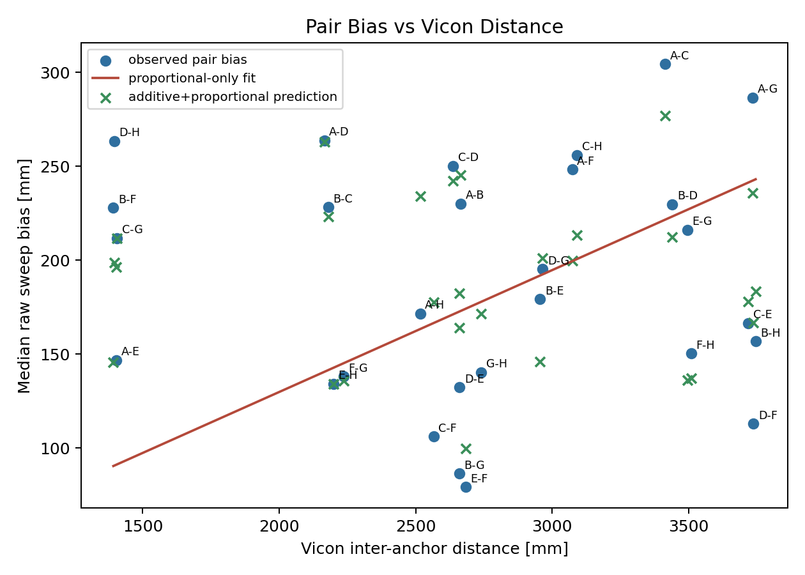
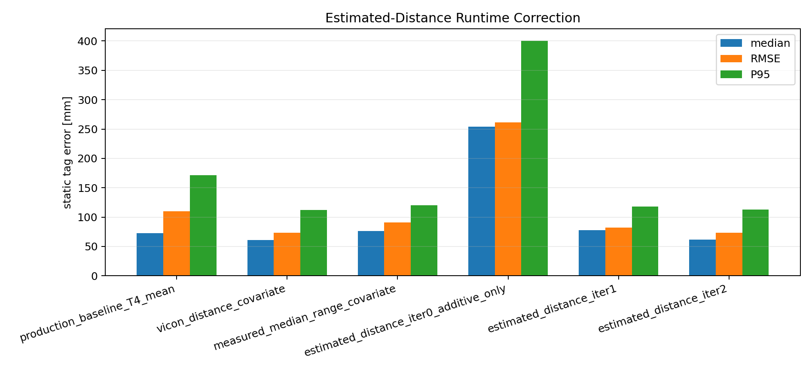

# Individual Report Draft: Diagnosing and Correcting Range Bias in the Erlangen AutoPos Dataset

This standalone Markdown draft is not part of the existing LaTeX or Typst report tree. It is written from the frozen Phase 0--2.13 diagnostic records for the Erlangen dataset and uses **Vicon** as the ground-truth terminology throughout.

## Abstract

This report analyses a systematic scale artefact observed in the BioSpur UWB AutoPos pipeline using the 28 May 2026 Erlangen dataset with Vicon ground truth. The central result is that the apparent +4.4% layout-scale diagnostic, which appears as up to about +6.6% at the raw-range ratio level, is not primarily a true multiplicative geometry error. At the anchor-anchor range level, the bias is explained almost entirely by additive per-device delay terms between about 95 mm and 294 mm, while the fitted proportional term is approximately zero. The production solver constrains these delay terms to a much narrower range, which forces the remaining bias into the estimated anchor geometry and produces an inflated, internally self-consistent layout. External delay calibration removes this scale artefact: the pairwise positive-scale pattern changes from 27/28 pairs to 13/28 pairs, the median pairwise scale error changes from +4.06% to -0.08%, and the anchor RMS error improves from 105.4 mm to 47.9 mm.

The same calibration does not transfer directly to tag links. With the V-B layout, sweep-derived anchor Delta_i terms alone degrade static tag localization from the production baseline of 72.7 mm median and 109.8 mm RMSE to 100.4 mm and 135.9 mm. A coherent tag-side additive-only refit, however, reaches 49.4 mm median and 64.2 mm RMSE, while a refit that removes the top-12 absolute-bias links from each training set remains close at 48.3 mm median and 69.6 mm RMSE. A joint additive-plus-distance-rho fit gives 60.7 mm median, 73.2 mm RMSE, and a slightly lower P95 of 112.4 mm, but it is no longer the best median/RMSE result. This corrects an earlier strawman: using the intercept from a joint rho fit while discarding rho gives 254.0 mm median error, but that is an incoherent partial correction, not a valid additive-only result. A runtime-implementable estimated-distance fixed-point iteration for the joint-rho branch, still using supervised in-situ calibration coefficients but not using Vicon distances at runtime, converges to 62.9 mm median, 73.6 mm RMSE, and 113.0 mm P95. The convergence sequence, 302.0 mm to 21.2 mm to 1.41 mm to 0.099 mm, follows the fitted rho of 7.67%, confirming that the outer iteration is a contraction. These results prove a static-only correction mechanism and a deployable runtime algorithm, but they do not yet prove a deployable calibration protocol or dynamic tracking improvement. Dynamic RotoArm validation, Vicon-free in-situ calibration, cross-environment transfer, the F/G noise anomaly, and the physical origin of the tag-side proportional term remain open.

## 1. Motivation

The original production analysis showed an apparent scale bias in the AutoPos layout in protokoll Section 3.3 and Figure 4, and a characteristic four-way delay-layout ablation in protokoll Section 4 and Table 3: a Vicon-registered geometry could be accurate for anchors but worse for tag localization when the range corrections were not matched to the link type. The published static tag baseline referred to below is the protokoll Table 4 T4 result. This report revisits those observations using a deliberately staged diagnostic chain. The goal is not to tune the production solver directly, but to identify which component of the error budget is observable from the anchor sweep, which component transfers to tag links, and which corrections can be applied at runtime without using Vicon measurements.

The key distinction is between three types of errors that can produce similar symptoms in the final layout. A true proportional range bias scales with distance and can be interpreted as a geometric scale effect. An additive delay bias enters each two-way range as a per-device offset and can mimic a proportional error over a limited distance range. A link-type-dependent tag bias can be invisible in anchor-anchor sweeps but dominate tag localization. The diagnostics below separate these effects by fitting range-level models before any solver change is evaluated.

## 2. Dataset, Ground Truth, and Validation Gates

The analysis uses the 28 May 2026 Erlangen dataset. The ground-truth system is referred to as Vicon throughout this report. The strongest local raw-file evidence for this terminology is the static `.trc` export header, which contains a `F:\ViconData\...` source path. Some derived analysis tables retain `motive_*` field names, but these are treated here as internal variable names rather than primary vendor evidence. The static tag analysis uses 24 static positions and eight anchors. The dynamic RotoArm captures are not re-evaluated under the final corrected static pipeline in this report, so all claims about the new tag correction are static-only.

Before the Phase 1 and Phase 2 diagnostics, the anchor ID mapping was verified programmatically rather than assumed. The best mapping was 0->A, 1->B, 2->C, 3->D, 4->E, 5->F, 6->G, and 7->H. It produced a best RMS of 196.1 mm in the static link-distance assignment test, while the second-best mapping produced 238.5 mm. Direction columns in the sweep file were also checked: `(a, b)` was consistent with `(initiator, responder)` on all rows, `master` equalled `initiator`, and direction was defined as `initiator->responder`.

Quality fields were audited before use. The sweep `quality_percent` field is saturated at 100 for 99.4% of rows and was therefore treated as uninformative for weighting. `quality_flag_percent` is fully saturated at zero in static and roto logs. The static and roto `quality_percent` fields contain a small tail below 100, but the final analyses reported here do not rely on quality-derived heteroscedastic weights. Two static tag truth positions are reconstructed from relabelled marker balls rather than direct antenna markers; these positions are retained but flagged in the link-level diagnostics. The capture `R01-Static-middle-test` is excluded from dynamic RotoArm analysis and used only as an auxiliary static check.

## 3. Anchor-Anchor Range Bias Is Additive, Not Proportional

The Phase 1 pair-bias model fits the anchor-anchor median range bias as the sum of per-anchor additive terms and an optional proportional term,

`bias_ij = (Delta_i + Delta_j) / 2 + rho * d_ij`.

The full additive-plus-proportional fit has an RMS residual of 43.8 mm and a fitted rho of 0.119%, with a 95% interval from -3.03% to 3.97%. The additive-only model has essentially the same RMS residual, 43.8 mm. In contrast, the proportional-only model estimates rho at 6.49% but has a much worse RMS residual of 78.5 mm. This decomposition explains why the raw Phase 0 ratio looked large: over 1.4--3.7 m links, additive offsets of order 100--300 mm appear as several percent of distance even when the true proportional term is negligible.

The directed asymmetry check does not change this modelling choice. Twenty-six of 28 directed pair medians have bootstrap confidence intervals excluding zero, but the median absolute asymmetry is only 7 mm and the maximum is 22 mm. This antisymmetric component cancels when opposite directions are averaged for the symmetric delay-distance fit, and the sweep has no per-sample timestamps for a defensible time-drift model. Direction therefore remains a diagnostic, not a separate correction branch in this report.

The fitted per-anchor additive terms are large compared with the production delay bound. In the full fit, Delta_A is 294.2 mm, Delta_B is 189.8 mm, Delta_C is 251.4 mm, Delta_D is 226.4 mm, Delta_E is 95.2 mm, Delta_F is 97.9 mm, Delta_G is 168.4 mm, and Delta_H is 167.9 mm. The production v4-io solver, however, uses a bounded relative delay parameterization with `d_A=0` and `abs(d_i)<=60 mm`. This creates a three-way mismatch: the absolute gauge is anchored at A even though A has the largest fitted delay, the bound is far smaller than the inferred offsets, and the solver must also estimate geometry from only 28 anchor-anchor distances. Under this constraint, the unmodelled additive bias is forced into geometry.

Figure 1. Anchor-anchor bias as a function of Vicon distance. The apparent raw scale ratio is mainly an additive delay effect over a limited distance range, not a stable proportional scale factor.

The sweep-fit circularity guard is consistent with this interpretation. In 200 leave-pairs-out trials, the in-sample residual RMS is 43.8 mm and the held-out RMS median is 66.9 mm. The increase is real, but the held-out error remains far below the proportional-only residual scale, indicating that the fitted additive terms capture structure that generalises within the anchor sweep rather than only memorising the 28 fitted pairs.

## 4. Scale Artefact and Observability Limit

The most direct test of the delay-clipping explanation is the pairwise scale diagnostic. In the production baseline, 27 of 28 anchor pairs have positive AutoPos-vs-Vicon scale error, with a median scale error of +4.06% and an RMS scale error of 5.41%. After subtracting the sweep-fitted additive terms and solving geometry only, the V-B calibrated variant reduces the positive count to 13/28, the median scale error to -0.08%, and the RMS scale error to 1.71%. This is the clearest evidence that the production scale artefact is a consequence of clipped additive delay rather than a true multiplicative expansion of the hardware geometry.

Figure 2. Pairwise scale-error histogram. The V-B externally calibrated geometry collapses the 27/28 positive-scale pattern to a balanced distribution around zero.

The solver ablation confirms the same mechanism at the anchor-layout level. The production baseline reproduces the expected v4-io anchor result, with a median anchor error of 92.8 mm, anchor RMS of 105.4 mm, and shape RMS of 136.3 mm. Simply widening the delay bound to +/-400 mm does not fix the problem. The V-A unbounded variant has an anchor RMS of 111.3 mm and a median anchor error of 105.9 mm, which is worse than baseline. This negative result is important: when geometry and delay are estimated jointly from 28 observations with many coupled parameters, the solver can move along a nearly degenerate delay-layout direction instead of recovering the physically correct delays.

The sign sanity check strengthens this conclusion. A rerun with the delay sign convention reversed produced a sign-mirrored delay solution but the same geometry and objective value to numerical precision. The failure of V-A is therefore not an implementation sign bug. It is an observability limit: the 28-pair anchor sweep is sufficient to fit a set of additive corrections when geometry is known from Vicon, and it is sufficient to solve geometry when external corrections are provided, but it is not sufficient to self-calibrate both geometry and delay robustly inside the production solver.

External calibration changes the anchor result materially. V-B, which subtracts the sweep-fitted `(Delta_i + Delta_j) / 2` terms and then solves geometry, reduces anchor RMS from 105.4 mm to 47.9 mm and shape RMS from 136.3 mm to 36.0 mm. This is not only better than the rigid production layout; it is also better than the protokoll Sim(3) diagnostic residual of 67.1 mm. That comparison matters because Sim(3) can only remove one global scale factor, while the real range bias is per-device additive. V-C, which adds a small residual delay freedom after the same correction, gives a similar anchor RMS of 48.4 mm. The important result is not the small difference between V-B and V-C, but the contrast between V-A and V-B: self-calibration is ill-conditioned, while external per-device delay calibration is effective.

| Variant | Delay policy | Anchor median (mm) | Anchor RMSE (mm) | Shape RMSE (mm) | Pair RMS (mm) |
| --- | --- | ---: | ---: | ---: | ---: |
| Production v4-io | bounded delay, `d_A=0`, `abs(d_i)<=60` | 92.8 | 105.4 | 136.3 | 48.2 |
| V-A unbounded | same objective, widened to +/-400 | 105.9 | 111.3 | 132.8 | 46.5 |
| V-B calibrated | subtract sweep additive terms, solve geometry | 48.3 | 47.9 | 36.0 | 40.3 |
| V-C calibrated residual | V-B plus residual +/-30 | 49.7 | 48.4 | 38.3 | 39.2 |

## 5. Tag Links Require a Coherent Tag-Side Calibration

The anchor-side result is not enough for tag localization, but the failure mode is more specific than the earlier Phase 2 ladder suggested. The V-B layout is geometrically more accurate, but applying only the sweep-derived anchor Delta_i terms breaks the production system's self-consistency and gives a moderate static degradation: 100.4 mm median error and 135.9 mm RMSE, compared with the production T4 baseline of 72.7 mm and 109.8 mm. This is not a catastrophic collapse, but it shows that the anchor-sweep calibration cannot simply be transplanted into tag localization.

The production-style C-core T4 mean path reproduces the published static Table 4 baseline to numerical precision: 72.689 mm median, 109.845 mm RMSE, and 171.497 mm P95 under anchor-only 3D rigid/reflection registration with no scale. This resolves the earlier registration concern. The published static tag numbers were produced by `static_tag_absolute_accuracy.py`, which calls `fit_similarity(..., allow_reflection=True, allow_scale=False)`. The height-preserving path belongs to a raw replay matrix diagnostic and is not the published Table 4 registration path.

The corrected ladder shows that the essential requirement is not necessarily rho, but coherence between the fitted model and the correction that is applied. If Delta_tag is refit with an additive-only model and combined with the sweep Delta_i terms, the result improves to 64.5 mm median and 80.2 mm RMSE. If the whole tag-side additive model is refit coherently, including tag-side anchor Delta_i terms as well as Delta_tag, the static result improves further to 49.4 mm median and 64.2 mm RMSE. The old `delta_only` row of 254.0 mm median is now best understood as a rejected control: it used the intercept from a joint distance-rho fit, where the fitted Delta_tag is about -157 mm and is only meaningful together with the omitted `rho*d` term. In a coherent additive-only refit, Delta_tag is about +145 mm. Discarding rho after fitting it therefore changes the meaning of the intercept and produces an over-correction.

The joint additive-plus-distance-rho fit remains scientifically useful, but its role is narrower. It gives 60.7 mm median, 73.2 mm RMSE, and the lowest P95 in this ladder at 112.4 mm. It also exposes the errors-in-variables problem and motivates the estimated-distance runtime iteration in Sections 6 and 7. As a correction model, however, it shows a bias-variance trade-off: its training RMS is lower than the coherent additive-only fit, about 95.5 mm instead of 99.5 mm, but its leave-one-position-out localization is worse. The fitted Delta_tag also swings from about +145 mm in the additive-only model to about -157 mm in the joint-rho model, showing strong slope-intercept coupling. The corrected static interpretation is therefore that anchor-side calibration alone moderately degrades tag localization, coherent tag-side additive calibration already surpasses the production baseline, and the rho branch is a mechanism and tail-behaviour refinement rather than the only route to a usable static correction.

| Static tag condition | Median (mm) | RMSE (mm) | P95 (mm) | Interpretation |
| --- | ---: | ---: | ---: | --- |
| Production T4 mean | 72.7 | 109.8 | 171.5 | Published static baseline path |
| V-B with sweep Delta_i only | 100.4 | 135.9 | 211.9 | Anchor-side calibration alone breaks production self-consistency |
| V-B with sweep Delta_i + additive-only Delta_tag | 64.5 | 80.2 | 124.4 | Coherent tag intercept recovers most of the static loss |
| V-B with coherent tag-side additive-only fit | 49.4 | 64.2 | 115.6 | Best median/RMSE static result in this ladder |
| V-B with joint additive plus distance rho | 60.7 | 73.2 | 112.4 | Slightly lower P95; basis for runtime rho iteration |
| Rejected control: joint intercept only, rho discarded | 254.0 | 261.5 | 400.6 | Incoherent partial correction; do not cite as additive-only |

The additive-only result is not driven by the largest tag-link outliers. When the top-12 absolute-bias links are excluded from each leave-one-position-out training fit, the coherent additive-only result remains 48.3 mm median, 69.6 mm RMSE, and 119.0 mm P95. The full coherent additive-only model improves 16 of 24 static positions relative to production; the no-top12 refit improves 18 of 24. The joint-rho model improves 15 of 24 positions. This makes the additive-only headline a broad static result rather than a gain from a few favourable positions.

The physical origin of the tag-side proportional term is not fully identified. A set of geometry regressions on the 192 static tag links shows that vertical separation and elevation angle explain more bias variation than horizontal distance alone, and adding elevation to the distance model reduces the distance slope from 7.72% to 4.63%. However, the best single closure model still has an RMS residual of 91.9 mm and an R² of only 0.225. This supports the statement that elevation or antenna orientation is involved, but it does not identify a complete physical model. Facing-stratified rho fits are also suggestive but unstable: ABEF and CDHG show fitted rhos around 14--16%, while ADHE and BCGF are around 5--7%, but these values are coupled strongly to Delta_tag in small six-position groups. The safe conclusion is that tag-link bias has facing-dependent and geometry-dependent structure, not that a single mechanism has been isolated.

Figure 3. Tag bias against elevation angle. Elevation is a stronger covariate than horizontal distance, but it explains only part of the tag-link residual structure.

## 6. Runtime Covariate Test and Errors-in-Variables

The coherent additive-only result is the cleanest static correction in the ladder, but the joint rho branch still answers a separate runtime question: if a distance-proportional term is used, what runtime covariate can replace the supervised Vicon distance? The supervised distance-rho model is an upper-bound diagnostic because its coefficient is fitted against Vicon or known-reference distances. To implement the same idea online, runtime needs a distance-like covariate that is not the ground truth. A naive attempt is to use measured session-median range as the covariate. This degrades the result to 76.6 mm median, 91.0 mm RMSE, and 120.3 mm P95. It still improves RMSE and P95 relative to the production baseline, but the median becomes worse than production. This is not evidence that runtime correction is impossible. It is evidence for an errors-in-variables failure: the raw measured range contains the same bias being regressed, so the covariate is contaminated by the dependent variable. The fitted coefficient jumps from about 7.7% to 12.5%, and Delta_tag shifts from about -157 mm to -386 mm, showing that the slope-intercept balance is distorted.

The correct runtime candidate is to use solver-estimated link distance rather than raw range. In this procedure, the supervised calibration stage still fits rho, Delta_i, and Delta_tag using Vicon or known reference-point geometry on the training positions. Runtime then uses only measured ranges and the current solver estimate. The first solve applies additive correction only. The next solve estimates the tag position, computes `||x_hat - a_i||` for each anchor, subtracts `rho * ||x_hat - a_i||`, and solves again. This is a fixed-point iteration whose contraction factor is approximately rho.

The three covariate variants form a clean controlled comparison inside the joint-rho branch. The supervised Vicon-distance covariate gives 60.7 mm median and 73.2 mm RMSE. The raw-range covariate gives 76.6 mm median and 91.0 mm RMSE. The estimated-distance runtime iteration converges to 62.9 mm median, 73.6 mm RMSE, and 113.0 mm P95. Runtime does not use Vicon link distance in this row. It recovers the supervised joint-rho static bound to within approximately 2 mm median and 0.5 mm RMSE.

| Static T4 mean condition | Fit uses supervised Vicon/reference geometry | Runtime uses Vicon distance | Median (mm) | RMSE (mm) | P95 (mm) |
| --- | --- | --- | ---: | ---: | ---: |
| Production baseline | no | no | 72.7 | 109.8 | 171.5 |
| Supervised distance-rho upper bound | yes | no | 60.7 | 73.2 | 112.4 |
| Naive raw-range covariate | no | no | 76.6 | 91.0 | 120.3 |
| Estimated-distance runtime, converged | yes | no | 62.9 | 73.6 | 113.0 |

Relative to the production static baseline, the converged runtime iteration reduces median error by about 13%, RMSE by about 33%, and P95 by about 34%. The correct wording is therefore that, on the static Erlangen positions, a runtime-implementable estimated-distance iteration recovers the supervised joint-rho calibration bound. It is not yet correct to claim that the full deployed dynamic system achieves 62.9 mm, because the calibration remains supervised and the dynamic RotoArm data have not been evaluated under this correction.

Figure 4. Runtime covariate comparison. Raw measured range suffers from errors-in-variables distortion, while estimated link distance recovers the supervised static bound.

## 7. Fixed-Point Convergence

The estimated-distance correction converges rapidly because the proportional term is small. The median movement between successive static session means is 302.0 mm from iter0 to iter1, 21.2 mm from iter1 to iter2, 1.41 mm from iter2 to iter3, and 0.099 mm from iter3 to iter4. The corresponding ratios are 0.070, 0.067, and 0.070, which closely follow the fitted median rho of 7.67%. This is exactly the expected fixed-point behaviour: the position-induced covariate error is multiplied by approximately rho at each outer iteration.

The converged value should be quoted from iter4, not from iter2. Iter2 happens to have a slightly lower median error of 61.9 mm and RMSE of 73.0 mm, but iter3 and iter4 stabilize around 62.9 mm median and 73.6 mm RMSE. Using iter2 as the headline value would cherry-pick a transient point on the iteration path. The stable static runtime result is 62.9 mm median, 73.6 mm RMSE, and 113.0 mm P95.

Figure 5. Estimated-distance fixed-point convergence. Median movement follows the rho^k reference line and falls below 2 mm by iter3-to-iter4.

## 8. Secondary Negative Results

Two negative results are worth preserving because they constrain future explanations. First, the CIR multipath watchlist does not predict the residual anchor-pair bias after the additive fit. The watched pairs C-G, F-G, and E-H have residuals near zero, while the largest residuals are B-G at -96.0 mm, B-F at +82.3 mm, and E-G at +80.0 mm, none of which are on the watchlist. This means the existing CIR tail/main diagnostic is not a reliable predictor of the range-bias residual used here.

Second, F and G show a clear static link-noise anomaly independent of the solver ablations. The median per-link standard deviation is about 22--25 mm for A through E, 41.0 mm for H, but 85.9 mm for F and 95.5 mm for G. This is a hardware, slot, antenna, or environment diagnostic target rather than a reason to reject the delay-calibration result. The final correction can improve the static error distribution while still leaving the F/G noise mechanism unresolved.

## 9. Deployment Interpretation

The analysis supports a staged deployment concept, with one important missing calibration step. The first stage is a one-time per-device anchor-anchor calibration that estimates the additive Delta_i terms outside the AutoPos geometry solve. This stage is supported by the anchor sweep analysis and explains the production scale artefact. The second stage is an in-situ tag-side calibration for the tag link type. The simplest successful static variant is a coherent additive-only tag-side calibration, which requires no distance covariate at runtime and reaches 49.4 mm median and 64.2 mm RMSE in this dataset. The joint rho variant is also runtime-implementable: apply the additive terms, solve once, compute estimated link distances from the solver output, apply the rho correction, and repeat the outer solve until convergence. In this report, both tag-side calibration variants are still supervised by Vicon or equivalent known reference points.

This means the runtime part of the correction is implementable, but the full deployment recipe is not complete. The report should not state that the deployed BioSpur system achieves 49.4 mm or 62.9 mm. The defensible statement is narrower: with in-situ supervised calibration on the static Erlangen dataset, the same hardware and V-B geometry support coherent static tag corrections that substantially outperform the production baseline; the additive-only branch reaches 49.4 mm median and 64.2 mm RMSE, while the joint-rho estimated-distance runtime branch converges to 62.9 mm median, 73.6 mm RMSE, and 113.0 mm P95 without using Vicon at runtime.

## 10. Limitations and Open Questions

The most important limitation is dynamic evaluation. All results from the tag-side correction chain in Sections 5 through 7 are static-only. The corrected pipeline has not been evaluated on the RotoArm dynamic captures, and the earlier dynamic floor in the production analysis was not explained by layout error alone. Therefore, no claim should be made that the static correction transfers to dynamic tracking. A future RotoArm replay using the same estimated-distance runtime correction is the first required follow-up.

The second limitation is calibration deployability. The runtime correction does not need Vicon distances, but the fitted tag-side additive terms and, for the joint-rho branch, rho still come from supervised in-situ calibration. A practical system needs a reference-point calibration protocol that does not require Vicon. This could be a small set of measured tag positions, a fixture, or a controlled calibration motion, but this report does not evaluate those options.

The third limitation is transfer. The dataset contains one room, one static tag, one anchor deployment, and one relevant radio configuration. There is no evidence yet that rho or the tag-side geometry-dependent bias transfers across rooms, floor materials, antenna orientations, devices, or TX power settings. If rho is mainly an antenna-pattern property, it may transfer partly; if it is dominated by room-specific ground reflection, it may not. The present evidence cannot distinguish these cases.

The fourth limitation is the F/G noise anomaly. F and G have approximately four times the static link noise of the cleaner anchors. That anomaly survives the range-level diagnostics and should be investigated separately through hardware, slot, antenna, and environment checks.

The fifth limitation is physical mechanism. Facing dependence points toward an antenna-pattern component, elevation and vertical separation partially absorb the tag-side slope, and distance parameterization works better than elevation alone in the static localization experiment. However, the geometry models leave about 92 mm RMS residual, and the CIR watchlist does not predict the remaining pair residuals. A related open question is why distance structure is statistically visible in the link-bias regression but does not improve the best static correction. The most likely explanation is outlier leverage plus rho-Delta_tag coupling: the distance term lowers training residuals and slightly improves P95, but it adds enough variance to worsen median and RMSE in leave-one-position-out localization. The honest conclusion is that the empirical correction is effective in this static setting, while the physical source of rho and the per-link residual structure remains unresolved.

## 11. Conclusion

The full diagnostic chain changes the interpretation of the original scale bias. The anchor-anchor data show that the apparent scale expansion is mainly a clipped additive-delay artefact. External per-device calibration removes the scale pattern and reduces anchor RMS error from 105.4 mm to 47.9 mm. The tight bound and the `d_A=0` gauge explain the specific production scale artefact; the V-A result shows that relaxing the bound cannot repair it, because joint delay-geometry estimation from 28 pair distances is ill-conditioned. Tag links, however, do not share the anchor-sweep bias model. Anchor-side calibration alone breaks the production self-consistency and moderately degrades static tag localization, while coherent tag-side calibration recovers a much lower static error budget.

The final static result is conditional but strong. Under the same C-core T4 mean estimator and anchor-only 3D rigid/reflection registration used for the published static baseline, production gives 72.7 mm median, 109.8 mm RMSE, and 171.5 mm P95. A coherent supervised tag-side additive-only calibration gives 49.4 mm, 64.2 mm, and 115.6 mm, and the result remains close at 48.3 mm, 69.6 mm, and 119.0 mm when the top-12 absolute-bias links are excluded from training. A supervised distance-rho branch gives 60.7 mm, 73.2 mm, and 112.4 mm, and its runtime-implementable estimated-distance iteration converges to 62.9 mm, 73.6 mm, and 113.0 mm without using Vicon link distance at runtime. This demonstrates that the static error budget is correctable and that the runtime part of the correction is practical. It does not yet demonstrate unsupervised deployment, dynamic tracking improvement, or cross-environment transfer.
