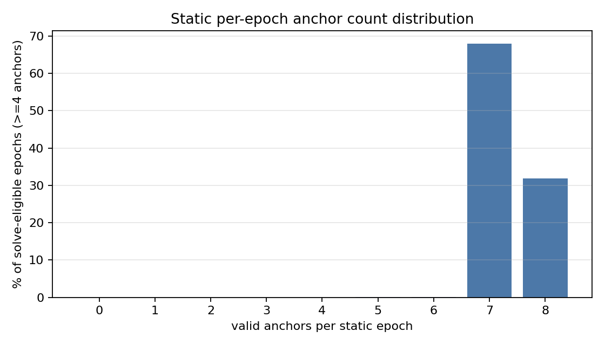
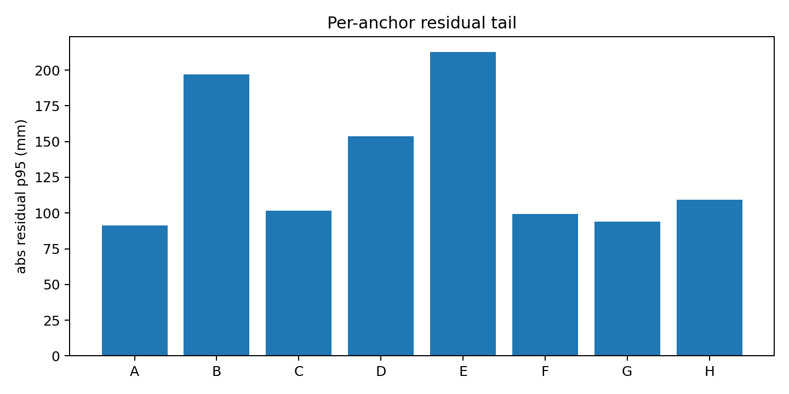
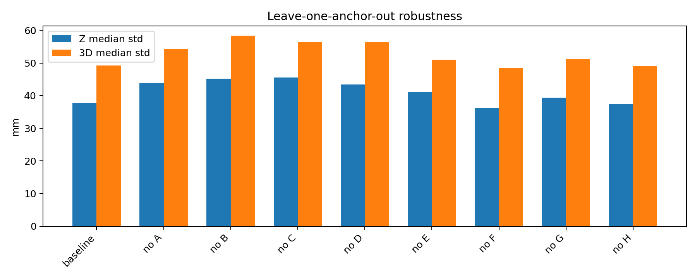

# AutoPos 2026-05-13 Final Report

本报告汇总 2026-05-13 户外实验的 clean rebuild 结果、XYZ 分解、Roto/Wand 验证和 robustness 分析。它不是原始日志说明，而是给教授/组会使用的最终解释版本。

核心口径先说清楚：

- 本次没有 OptiTrack ground truth，因此不能把所有定位数字都称为 absolute accuracy。
- 当前可严格报告的是 **AutoPos layout self-consistency**、**static repeatability / consistency**、**Roto kinematic consistency**、**Wand relative-geometry consistency** 和 **anchor redundancy robustness**。
- 本次实验使用 broadcast SS-TWR：Tag poll 后多个 anchors 在同一 epoch 内响应，使 all-available solve 有机会使用接近 8 个 anchor。它和旧 concept 中 sequential unicast / low-redundancy selector 条件不是同一个下游定位问题。
- 文中 `all-available solve under an 8-anchor infrastructure` 表示：在 8 个 anchor 系统下，每一帧使用当前可用的所有有效 ranges。它不是每一帧严格固定 all-8 positioning。
- `fail rate` 指 numerical solve failure rate，不代表定位质量 pass rate。solver 能给出解，不等于该解的 repeatability 足够好。

## 1. Experimental Setup and Data Coverage

本次实验相对旧 concept/report 有一个重要架构变化：从 sequential unicast polling 转向 broadcast SS-TWR。

旧系统更接近：

- Tag 与 anchor sequentially/unicast ranging。
- 每个 epoch 很容易只得到 4 个左右可用 anchors。
- 下游定位依赖 quality-aware selector，例如 `>=2 upper + >=2 lower` 的 subset selection。
- 因此旧报告中的 `100mm+` Z regime 很可能混合了 layout error、selector geometry、runtime anchor availability 三个因素。

本次 broadcast SS-TWR 更接近：

- Tag broadcast poll，一帧内 A-H 多个 anchors 尝试响应。
- downstream offline evaluation 使用 all-available ranges，而不是固定 4-anchor selector。
- 因此本次 `49mm` static repeatability 代表的是高冗余 broadcast 条件下的 repeatability，不应直接和旧的 4-anchor/variable-subset 条件混为一谈。

这个架构变化是解释新旧结果差异的核心背景：不是单纯 solver 变了，而是 ranging/session 的 anchor availability 也变了。

数据覆盖：

本次 clean rebuild 使用三套 layout generation / validation 口径：

| Folder | Layout generation | Holdout / validation meaning |
| --- | --- | --- |
| `FULL-COMPARE-1000` | 使用 1000-set sweep 生成 layout | 主结果，全部 captured static / roto / wand 都参与 validation |
| `FULL-COMPARE-500` | 使用 first-500 sweep 生成 layout | 检查较少 sweep 数据下是否稳定 |
| `FULL-COMPARE-500+500` | first-500 solve，last-500 holdout，同时保留 all1000 summary | 检查 layout generalization / holdout consistency |

Captured data:

| Type | Coverage | Note |
| --- | --- | --- |
| Static Tag | 23 sessions: ID01-ID09, ID11-ID24 | ID10 没有采集，不参与统计 |
| Roto | 17 sessions: ID25-ID41 | 所有已采集 Roto capture 都用于验证 |
| Wand | W01-W05 | W01-W04 可做静态刚体约束；W05 主要做 coverage / diagnostic |

所有 solver 使用同一套 captured validation data。区别只在 layout generation 或 downstream compensation，不随机挑选 capture。

### Anchor layout

V4-io layout recovered from the 1000-set sweep:

| Anchor | Layer | X mm | Y mm | Z mm | delay mm |
| --- | --- | ---: | ---: | ---: | ---: |
| A | lower | 0.0 | 0.0 | 0.0 | 0.0 |
| B | lower | 2961.0 | 0.0 | 0.0 | 20.2 |
| C | lower | 3167.2 | 4507.1 | 0.0 | 32.3 |
| D | lower | 191.7 | 4650.6 | -70.9 | 20.7 |
| E | upper | 106.8 | -103.5 | 1441.4 | 5.9 |
| F | upper | 2882.6 | -14.6 | 1418.2 | -2.4 |
| G | upper | 2958.8 | 4672.3 | 1673.5 | 1.8 |
| H | upper | 39.4 | 4623.6 | 1420.8 | -0.7 |

Geometry summary:

| XY footprint | Z span | lower mean Z | upper mean Z | layer separation |
| ---: | ---: | ---: | ---: | ---: |
| 3.17m x 4.78m | 1.74m | -17.7mm | 1488.5mm | 1.51m |

这里使用物理展示坐标，已经把 solver 的 Z mirror 翻到现场约定方向：A-D 是 lower layer，E-H 是 upper layer。这个 Z 翻转只影响报告展示，不改变 solver residual / repeatability 结果。布局是典型 4 lower + 4 upper 的立体结构，但 Z 方向观测性仍然弱于水平面；后面的 XYZ 分解和 strict 8/8 结果都会体现这一点。

### Per-epoch anchor availability

Static validation 的 solve-eligible epochs 中，每帧有效 anchor 数如下：

| Valid anchors per epoch | Epochs | Percent of solve-eligible epochs |
| ---: | ---: | ---: |
| 4 | 0 | 0.0% |
| 5 | 2 | 0.0% |
| 6 | 12 | 0.1% |
| 7 | 9395 | 68.0% |
| 8 | 4408 | 31.9% |

这个分布很关键：本次 broadcast static dataset 不是大量 4/5/6-anchor 定位，而是几乎全部 7/8-anchor 定位。因此当前 all-available result 和 strict 8/8 result 接近是合理的；旧 concept 中的 `100mm+` regime 更像旧 unicast/selector 条件下的 low-redundancy 问题。

## 2. Solver 主线

为了避免历史文件名混乱，本报告按真实算法能力定义版本：

| Paper name | 实际算法能力 | Delay-aware | 额外信息注入 |
| --- | --- | ---: | --- |
| V1 | simple bidirectional mean + no-delay geometry solve | No | none |
| V2 | weighted / IVW pair fusion + no-delay solve | No | none |
| V3-lite | MAD/MVUE robust pair fusion + no-delay layout | No | none |
| V3-full | robust fusion + per-anchor delay/bias estimation | Yes | none |
| V4-io | production bounded-delay robust solver | Yes | none |
| V4-io-td | V4-io fixed layout + common Tag delay scan | Partial | common tag delay only |
| V4-io-roto | V4-io + RotoArm soft constraints | Yes | Roto only |
| V4-io-wand | V4-io + W01-W04 Wand soft constraints | Yes | Wand only |
| V5 | V4-io diagnostics / FIM / usable-area layer | Uses V4 | diagnostics |

重要解释：

- V1-V3 里 Roto/Wand 只作为 validation data，不注入 layout。
- V4-io-roto 使用 RotoArm 信息注入 layout，所以它的 Roto 指标不能完全当作 independent holdout；它主要用于验证 Roto constraint 与数据是否相容。
- V4-io-wand 使用 W01-W04 静态 Wand 约束，但当前结果显示它只带来小幅改善，不是主贡献。

## 3. 一眼结论

V4-io 在三套数据切分下非常稳定：

| Dataset | AutoPos RMS | AutoPos p95 | Static 3D med | Static 3D p95 | Static Z med | Roto dR RMS | Roto turn-center med |
| --- | ---: | ---: | ---: | ---: | ---: | ---: | ---: |
| FULL-COMPARE-1000 | 44.3 | 87.7 | 49.2 | 81.6 | 37.9 | 32.3 | 20.6 |
| FULL-COMPARE-500 | 44.7 | 89.2 | 48.4 | 80.9 | 39.9 | 33.0 | 20.9 |
| FULL-COMPARE-500+500 | 44.2 | 88.5 | 48.4 | 80.6 | 40.7 | 33.4 | 21.0 |

结论：

1. 1000 / 500 / 500+500 三套结果基本一致，说明当前 AutoPos layout generation 对 sweep 数量和 holdout 切分不敏感。
2. Static repeatability median 稳定在 `48-49mm`。
3. Z 是主要弱轴，static Z median 约 `38-41mm`，贡献约 `62-64%` 的 3D variance。
4. Roto 不能再用 raw circle thickness 当动态定位误差；更合理指标是 `R_outer - R_inner` 是否稳定在 120mm，以及每转圆心重复性。
5. Anchor redundancy 是决定 robustness 的关键：从 all-available 退化到 keep-4 后，Z median 会从 `37.9mm` 恶化到 `124.6mm`。

## 4. AutoPos Layout Self-Consistency

AutoPos layout self-consistency 只看 inter-anchor / layout 内部残差，不涉及 Tag positioning。它适合回答：不同 solver 对 anchor layout 本身是否能解释 sweep 数据。

FULL-COMPARE-1000:

| Version | RMS | p50 | p95 | max |
| --- | ---: | ---: | ---: | ---: |
| V1 | 64.2 | 28.3 | 143.9 | 183.1 |
| V2 | 40.4 | 27.1 | 80.4 | 90.4 |
| V3-lite | 40.8 | 27.4 | 82.0 | 91.7 |
| V3-full | 66.4 | 2.0 | 182.6 | 207.9 |
| V4-io | 44.3 | 15.3 | 87.7 | 163.3 |
| V4-io-roto | 57.9 | 22.8 | 134.1 | 146.9 |
| V4-io-wand | 44.2 | 17.5 | 87.6 | 163.8 |

解释：

- V2/V3-lite 的 inter-anchor residual 最干净，说明 pair fusion 本身很强。
- V4-io 的 inter-anchor RMS 略高，但它引入 bounded delay 和 field-robust objective，更偏工程稳定性。
- V3-full 的 p50 很低但 p95/max 很高，说明它对大部分 pair 拟合得非常紧，但 tail 更重；这类指标不能只看 p50。
- V4-io-roto 会牺牲部分 inter-anchor residual 来满足 RotoArm soft constraints，因此 self-consistency 不能单独评价它的好坏。

## 5. Static Tag Repeatability

Static Tag 是当前最接近“定位稳定性”的主验证，因为 Tag 静止时，解算位置的 scatter 越小，说明该 layout + downstream solver 在实际 ranging 条件下越稳定。

FULL-COMPARE-1000:

| Version | N | 3D med | 3D p95 | 3D max |
| --- | ---: | ---: | ---: | ---: |
| V2 | 23 | 48.7 | 71.0 | 77.5 |
| V3-lite | 23 | 48.7 | 70.9 | 77.1 |
| V4-io | 23 | 49.2 | 81.6 | 88.2 |
| V4-io-td | 23 | 48.9 | 82.8 | 89.4 |
| V4-io-roto | 23 | 48.1 | 71.9 | 81.1 |
| V4-io-wand | 23 | 48.6 | 77.3 | 83.5 |

解读：

- V2/V3-lite/V4-io 的 static median 都在 `49mm` 左右；在当前 clean broadcast dataset 下，all-available evaluation 不会复现旧 concept 中 V1/V3 那种巨大差距。
- 这不矛盾：旧 concept 的 sequential unicast 条件更容易产生 low availability，`offline quality-aware anchor selection (>=2 upper + >=2 lower)` 本质上更接近 variable subset / low-redundancy selector，而不是本次 broadcast all-available solve。
- V4-io-roto 的 static tail 更好，但因为它注入 Roto 信息，应作为 constraint compatibility / ablation 结果，而不是纯 inter-anchor baseline。
- V4-io-td 对 static 改善很小，说明当前 repeatability 不是由一个统一 common tag delay 主导。

## 6. XYZ Repeatability Breakdown

V4-io static XYZ 主结果：

| Dataset | N | X med | Y med | Z med | Horizontal med | 3D med | Z share med | X p95 | Y p95 | Z p95 | 3D p95 |
| --- | ---: | ---: | ---: | ---: | ---: | ---: | ---: | ---: | ---: | ---: | ---: |
| FULL-COMPARE-1000 | 23 | 26.0 | 16.3 | 37.9 | 30.4 | 49.2 | 62.1% | 41.5 | 21.9 | 67.8 | 81.6 |
| FULL-COMPARE-500 | 23 | 26.4 | 16.5 | 39.9 | 30.5 | 48.4 | 63.8% | 43.1 | 22.0 | 68.4 | 80.9 |
| FULL-COMPARE-500+500 | 23 | 26.3 | 16.6 | 40.7 | 30.5 | 48.4 | 63.7% | 43.1 | 21.9 | 68.6 | 80.6 |

注意：表里的 median 是对每个 capture 的对应指标分别取中位数。因此 `3D med` 是 per-capture 3D std 的 median，不是由 `X med / Y med / Z med` 重新计算得到。

主要结论：

- X/Y median 大约 `26mm / 16mm`。
- Z median 大约 `38-41mm`。
- Z 贡献约 `62-64%` 的 3D variance。
- 当前系统限制不是各向同性随机噪声，而是明显受垂直方向 observability / geometry 影响。

## 7. 空间与朝向：哪里最容易出 Z tail？

FULL-COMPARE-1000 V4-io 空间分组：

| Group type | Group | N | X med | Y med | Z med | 3D med | Z share med | worst ID |
| --- | --- | ---: | ---: | ---: | ---: | ---: | ---: | --- |
| location | center | 12 | 25.9 | 15.0 | 36.5 | 46.9 | 63.0% | ID18 |
| location | edge | 11 | 26.3 | 18.1 | 41.8 | 50.4 | 62.1% | ID08 |
| height | high | 8 | 25.9 | 15.2 | 29.3 | 41.6 | 47.3% | ID09 |
| height | low | 7 | 27.1 | 16.4 | 49.9 | 59.7 | 70.8% | ID07 |
| height | mid | 8 | 22.7 | 16.6 | 39.8 | 48.8 | 66.1% | ID08 |
| facing | ABEF | 6 | 23.6 | 17.6 | 36.1 | 47.3 | 64.4% | ID17 |
| facing | ADHE | 5 | 25.9 | 17.7 | 35.4 | 47.8 | 54.8% | ID20 |
| facing | BCGF | 6 | 25.8 | 14.2 | 39.7 | 49.7 | 63.4% | ID18 |
| facing | CDHG | 6 | 30.4 | 17.6 | 56.0 | 67.8 | 63.0% | ID08 |

解释：

- `low` height 比 `high` height 明显更差，Z median 从 `29.3mm` 增加到 `49.9mm`。
- `CDHG` facing 是最差朝向，3D med `67.8mm`，Z med `56.0mm`。
- edge 区域略差于 center，说明空间位置和 anchor geometry 有影响。
- facing 分组样本数小，p95 更接近 near-worst-case 指示值，不应过度解释为稳定尾部分布。

最差 static captures：

| Rank | ID | location | height | facing | X std | Y std | Z std | 3D std | Z share | pct >=8 anchors |
| ---: | --- | --- | --- | --- | ---: | ---: | ---: | ---: | ---: | ---: |
| 1 | ID08 | edge | mid | CDHG | 42.5 | 30.3 | 71.1 | 88.2 | 64.9% | 19.5 |
| 2 | ID09 | edge | high | CDHG | 46.0 | 21.1 | 64.9 | 82.3 | 62.1% | 35.4 |
| 3 | ID07 | edge | low | CDHG | 27.5 | 18.8 | 68.2 | 75.9 | 80.7% | 14.8 |
| 4 | ID18 | center | low | BCGF | 27.1 | 13.7 | 60.7 | 67.9 | 80.0% | 39.9 |
| 5 | ID17 | center | low | ABEF | 26.8 | 19.7 | 51.8 | 61.5 | 70.8% | 35.8 |

这些 worst captures 的 `pct >=8 anchors` 很低，进一步支持一个判断：Z tail 往往和低可用 anchor 数、subset geometry、朝向/空间区域共同出现。

## 8. Robustness：Anchor Redundancy 是关键

Robustness 分析使用 `FULL-COMPARE-1000/v4-io/layout.json`，对 static captures 做 500-repeat Monte Carlo keep-k / dropout 实验。

Random keep-k:

| Effective anchor count | Z median | 3D median | 3D p95 | Interpretation |
| --- | ---: | ---: | ---: | --- |
| keep 8 | 37.9 | 49.2 | 81.6 | 高冗余，bias 多数被平均/吸收 |
| keep 7 | 43.6 | 53.2 | 105.6 | 轻微退化 |
| keep 6 | 60.9 | 77.1 | 166.5 | 已经明显退化 |
| keep 5 | 83.4 | 100.7 | 225.2 | 进入 80-100mm regime |
| keep 4 | 124.6 | 156.3 | 355.3 | 复现 100mm+ failure regime |

关键解释：

- `keep-4 fail rate = 0%` 只说明 solver 数值上能解出来；它不代表定位质量合格。
- keep-4 的 3D median 已经 `156.3mm`，3D p95 `355.3mm`，说明低冗余 selector 会严重放大 Z 弱几何。
- 旧 concept 里 100mm+ Z 误差，很可能不是 AutoPos layout 单独失败，而是 sequential unicast 带来的 low availability，再叠加 variable subset / 4-anchor selector 共同造成。

Independent dropout:

| Dropout | solved rate | fail rate | Z median | 3D median | 3D p95 |
| --- | ---: | ---: | ---: | ---: | ---: |
| p05 | 100.0% | 0.0% | 46.9 | 59.5 | 115.5 |
| p10 | 99.8% | 0.2% | 55.7 | 69.4 | 142.5 |
| p20 | 97.5% | 2.5% | 70.9 | 87.9 | 188.4 |
| p30 | 89.5% | 10.5% | 83.8 | 104.8 | 225.0 |
| p40 | 74.7% | 25.3% | 94.9 | 119.0 | 285.3 |

这说明如果运行时 response availability 下降，系统不是立刻 crash，而是先进入“还能出结果但质量明显变差”的状态。

## 9. Per-Anchor Residual 与几何重要性

Per-anchor residual diagnostic:

| Anchor | N | residual med | residual RMS | abs p95 | low-Q<80 | downweighted | large >100mm |
| --- | ---: | ---: | ---: | ---: | ---: | ---: | ---: |
| A | 13806 | -15.8 | 44.1 | 91.1 | 0.0% | 18.6% | 3.3% |
| B | 13808 | -12.5 | 101.7 | 196.9 | 0.0% | 18.3% | 10.6% |
| C | 13804 | 24.2 | 51.0 | 101.7 | 0.0% | 17.0% | 5.1% |
| D | 13802 | -27.2 | 69.5 | 153.6 | 0.0% | 23.5% | 13.0% |
| E | 13801 | 37.8 | 98.6 | 212.7 | 0.0% | 45.3% | 27.2% |
| F | 13811 | -5.3 | 42.7 | 99.2 | 0.0% | 15.7% | 4.9% |
| G | 13800 | -4.5 | 43.5 | 94.1 | 0.0% | 17.5% | 4.2% |
| H | 4479 | 18.6 | 52.5 | 109.1 | 90.6% | 19.9% | 6.5% |

结论要分开讲：

- `E` 的 residual tail 最大，是 residual diagnostics 里最可疑的 high-tail anchor。
- `H` 的 low-Q rate 很高，而且 observation count 低，说明 H 的 availability/quality 需要单独检查。
- 但 residual tail 不等于几何重要性。Leave-one-out 里 `B/C` 对整体 Z/3D 更关键。

Leave-one-out 结果：

| Condition | Z med | 3D med | 3D p95 | Note |
| --- | ---: | ---: | ---: | --- |
| baseline all-available | 37.9 | 49.2 | 81.6 | baseline |
| no_B | 45.2 | 58.4 | 78.1 | 3D 最差 |
| no_C | 45.5 | 56.4 | 68.6 | Z 最差 |
| no_E | 41.2 | 51.1 | 80.6 | E tail 大，但移除 E 不导致最大退化 |
| no_H | 37.4 | 49.0 | 73.4 | H 可用数少，移除后 median 不差 |

一句话：`E` 是 residual tail 问题，`B/C` 是 geometry robustness 问题，`H` 是 availability / low-Q 问题。这三个不要混为一谈。

## 10. Strict 8/8 Static Subset

为了检查 all-available 结果是否被“缺 anchor 帧”污染，我们额外做了一次 strict 8/8 static validation：

- 固定使用 `FULL-COMPARE-1000/v4-io/layout.json`。
- 只保留每帧 A-H 8 个 anchor 全部有效的 static frames。
- 少一个 anchor 就丢弃该帧。
- 使用同一个 downstream sigma-weighted Huber position solver。

结果：

| Condition | captures | frames | X med | Y med | Z med | 3D med | 3D RMS | 3D p95 |
| --- | ---: | ---: | ---: | ---: | ---: | ---: | ---: | ---: |
| All-available | 23 | 13817 | 26.0 | 16.3 | 37.9 | 49.2 | 54.8 | 81.6 |
| Strict 8/8 only | 23 | 4408 | 23.4 | 14.8 | 37.4 | 44.5 | 49.4 | 67.0 |

Strict 8/8 只保留 `31.9%` 的 static frames。它让 X/Y 明显改善：X median 从 `26.0mm` 降到 `23.4mm`，Y median 从 `16.3mm` 降到 `14.8mm`，3D RMS 从 `54.8mm` 降到 `49.4mm`，3D p95 从 `81.6mm` 降到 `67.0mm`。这说明缺 anchor epoch 确实会污染 horizontal/tail。

但最重要的发现是：Z median 几乎不变，`37.9mm -> 37.4mm`。这说明当前 Z weakness 不是简单的 availability 问题；即使每帧 8 个 anchor 全部在，Z 方向仍然弱。换句话说，strict 8/8 过滤可以减少 tail，但不能根治 Z，因为 Z 主要受 vertical geometry / layout observability 限制。

因此更准确的结论是：

> Missing-anchor frames mainly add horizontal/tail degradation. The persistent Z median under strict 8/8 indicates that the Z weakness is geometry-driven rather than availability-driven. The 100mm+ regime is more consistent with long low-redundancy periods, such as 4/5-anchor selector behavior, rather than occasional missing-anchor frames alone.

这个结果进一步支持前面的 robustness 结论：问题核心不是“是否每一帧都刚好 all-8”，而是系统是否长时间退化到低冗余 subset。

Source: [`strict8_static/README.md`](strict8_static/README.md)

## 11. Roto：不要把 Raw Circle Thickness 当动态定位误差

Roto 是运动数据，Tag 在转动。直接把整条圆轨迹的 scatter 当作“动态定位误差”会吓人，而且物理意义不对。

本报告采用两个更合理的 Roto 指标：

1. `dR RMS = RMS((R_outer - R_inner) - 120mm)`：两个 Roto Tag 的半径差是否稳定在机械 GT `120mm`。
2. `turn-center med`：每转一圈拟合一个圆心，再看多圈圆心的重复性。

FULL-COMPARE-1000:

| Version | N | dR mean | dR RMS | abs dR med | abs dR p95 | turn-center med | turn-center p95 |
| --- | ---: | ---: | ---: | ---: | ---: | ---: | ---: |
| V4-io | 17 | -24.3 | 32.3 | 23.5 | 50.5 | 20.6 | 28.9 |
| V4-io-td | 17 | -23.5 | 31.6 | 22.8 | 49.1 | 20.0 | 28.3 |
| V4-io-roto | 17 | -21.4 | 29.9 | 24.9 | 45.4 | 18.0 | 25.9 |
| V4-io-wand | 17 | -23.2 | 31.7 | 21.4 | 49.8 | 19.1 | 28.6 |

解释：

- V4-io 的 Roto dR RMS 约 `32mm`，turn-center median 约 `21mm`。
- `dR mean` 持续为负，约 `-24mm`，表示解算出的 `R_outer - R_inner` 系统性小于机械 GT `120mm`。这不是随机噪声，而是一个 bias。可能来源包括：两个 Roto Tag 的 tag delay / antenna delay 不同但未分别建模、内外半径对应的天线遮挡/NLOS pattern 不同、或者 layout 在 Z/scale 上仍有 residual bias。当前没有外部 GT，不能把原因钉死，但报告里应把它作为 systematic radius-difference bias 记录下来。
- V4-io-roto 略好，说明 RotoArm constraint 与数据相容。
- Roto 的价值不是证明“动态定位误差 20mm”，而是证明 AutoPos layout 下，运动学结构在多圈重复中是稳定的。

## 12. Wand：作为约束和作为 Tag 验证要分开

Wand 有两种不同角色：

1. **Wand as constraint**：W01-W04 静态 Wand 刚体边长作为 soft constraints 注入 layout。
2. **Wand as Tag validation**：把三颗 Wand Tag 当普通 Tag 解位置，再检查三角形边长是否接近卷尺 GT。

Wand constraint ablation:

| Dataset | Version | AutoPos RMS | Static 3D med | Static 3D p95 | Roto dR RMS |
| --- | --- | ---: | ---: | ---: | ---: |
| FULL-COMPARE-1000 | V4-io | 44.3 | 49.2 | 81.6 | 32.3 |
| FULL-COMPARE-1000 | V4-io-wand | 44.2 | 48.6 | 77.3 | 31.7 |
| FULL-COMPARE-500 | V4-io | 44.7 | 48.4 | 80.9 | 33.0 |
| FULL-COMPARE-500 | V4-io-wand | 44.3 | 48.2 | 79.1 | 32.4 |
| FULL-COMPARE-500+500 | V4-io | 44.2 | 48.4 | 80.6 | 33.4 |
| FULL-COMPARE-500+500 | V4-io-wand | 44.2 | 48.1 | 79.3 | 32.7 |

结论：

- Wand soft constraint 有小幅改善，但不是主贡献。
- W01-W04 静态数据仍然有用，尤其可作为 rigid-body consistency sanity check。
- W05 是动态自由移动，受 TDMA 时间错位影响，不能直接逐帧当作三 Tag rigid body constraint；它更适合做 coverage / usable-area / residual map。

## 13. Candidate Anchor / FIM 方向

FIM simulation 是几何可观测性仿真，不是实测。它假设新 anchor range noise 为 unbiased Gaussian，sigma 约 `50mm`，不包含 NLOS、天线方向性、同步误差、安装误差或 TDMA availability 问题。

Candidate summary:

| Candidate | x | y | z | median Z uncertainty reduction factor | p05 factor | Interpretation |
| --- | ---: | ---: | ---: | ---: | ---: | --- |
| center_low_level | 1538 | 2292 | 71 | 3.54 | 0.11 | median 很好，但部分点可能变差 |
| center_extra_high | 1538 | 2292 | -2473 | 3.32 | 1.76 | 更稳健，p05 也改善 |
| center_high_level | 1538 | 2292 | -1673 | 2.15 | 0.23 | 中等改善 |
| center_mid_level | 1538 | 2292 | -735 | 1.50 | 0.08 | 改善有限 |

解释：

- 当前 8-anchor baseline 不能轻易减少 anchor。random keep-k 已经显示少一个、少两个后 tail 明显变差。
- 下一步更合理方向是增加 anchor，但不是随便加；应加在 Z observability 弱的区域。
- 如果只选一个方向，`center_extra_high` 比 `center_low_level` 更稳，因为它的 p05 factor 仍大于 1，表示对 worst-region 的帮助更可靠。
- 真实部署还必须重新检查 broadcast timing，因为多一个 anchor 会增加 TDMA/response window 压力。

## 14. 可以对教授讲的完整故事线

中文版本：

> 本次没有 OptiTrack，因此我们不声称 absolute accuracy，而是报告 AutoPos layout self-consistency、static repeatability、Roto/Wand consistency 和 robustness。Clean rebuild 使用全部 captured data：23 个 static sessions、17 个 Roto sessions 和 5 个 Wand sessions。V4-io 在 1000、500、500+500 三套 sweep 切分下表现稳定，static 3D repeatability median 约 48-49mm，Z median 约 38-41mm。XYZ 分解显示 Z 贡献约 62-64% 的 3D variance，因此当前主要弱点是 vertical observability，而不是单纯随机噪声。
>
> Robustness 分析进一步说明，broadcast SS-TWR 的 all-available solve under an 8-anchor infrastructure 下 Z median 为 37.9mm、3D median 为 49.2mm；随机退化到 keep-6、keep-5、keep-4 后，Z median 分别恶化到 60.9mm、83.4mm、124.6mm，3D median 恶化到 77.1mm、100.7mm、156.3mm。因此早期 100mm+ 级别 Z 误差更可能与 sequential unicast 下的 low availability、low-redundancy selector 和 variable subset geometry 有关，而不是 AutoPos layout 本身单独失败。Strict 8/8 filtering 作为反面验证：它把 X/Y 和 3D tail 小幅改善，但 Z median 几乎不变，说明 Z weakness 更像 geometry-driven，而不是单纯 availability-driven。
>
> Per-anchor residual 显示 E 有最大的 residual tail，H 有明显 low-Q / low-availability 问题，而 leave-one-out 显示 B/C 对整体几何更关键。Roto 不再用 raw circle thickness 表示动态定位误差，而是用半径差和每转圆心重复性：V4-io 的 Roto dR RMS 约 32mm，每转圆心重复性约 21mm。Wand constraint 带来小幅改善，但不是主贡献。下一步应优先增强 anchor availability、改善 Z geometry，并使用 OptiTrack 做 absolute accuracy validation。

English version:

> Since OptiTrack ground truth is not available in this dataset, the reported positioning numbers should be interpreted as repeatability and internal consistency rather than absolute accuracy. The clean rebuild uses all captured data: 23 static sessions, 17 roto sessions, and 5 wand sessions. V4-io is stable across the 1000, 500, and 500+500 sweep configurations, with a static 3D repeatability median of about 48-49 mm and a Z median of about 38-41 mm. The XYZ breakdown shows that Z contributes roughly 62-64% of the total 3D variance, indicating that the dominant weakness is vertical observability rather than isotropic random noise.
>
> The robustness analysis further shows that, under the broadcast SS-TWR all-available solve with an 8-anchor infrastructure, V4-io achieves 37.9 mm Z median and 49.2 mm 3D median. When the available anchor set is randomly reduced to keep-6, keep-5, and keep-4, the Z median degrades to 60.9 mm, 83.4 mm, and 124.6 mm, while the 3D median degrades to 77.1 mm, 100.7 mm, and 156.3 mm. This suggests that the earlier 100mm+ Z-error regime was likely driven by low anchor availability under sequential unicast, low-redundancy selector behavior, and variable subset geometry, rather than by AutoPos layout failure alone. Strict 8/8 filtering provides a counter-check: it improves X/Y and the 3D tail, but the Z median remains almost unchanged, indicating that the Z weakness is geometry-driven rather than simply availability-driven.
>
> Per-anchor diagnostics show that anchor E has the largest residual tail, anchor H has low-Q / low-availability behavior, while B/C are more geometrically influential in leave-one-out tests. For roto, raw circle thickness should not be interpreted as dynamic positioning error; the more meaningful metrics are radius-difference consistency and per-revolution center repeatability. V4-io gives about 32 mm dR RMS and about 21 mm turn-center repeatability. Wand constraints provide a small improvement but are not the main contribution. The next priorities are improving anchor availability, strengthening vertical geometry, and validating absolute accuracy with OptiTrack.

## 15. What We Can Claim / Cannot Claim

可以 claim：

- 当前 AutoPos 在 2026-05-13 clean broadcast dataset 上表现稳定。
- Broadcast SS-TWR 相比旧 sequential unicast 更有利于高 anchor availability；本次结果应被理解为 broadcast all-available 条件下的 repeatability。
- V4-io static repeatability median 约 `49mm`，Z median 约 `38-41mm`。
- Z 是主要弱轴，贡献约 `62-64%` 的 3D variance。
- Low-redundancy anchor selection 会把 Z repeatability 推到 `100mm+` regime。
- Strict 8/8 filtering 能降低 tail，但只保留约 `31.9%` 的 static frames；它不是完整 session 的 production 指标。
- Strict 8/8 证实 Z weakness 更偏 geometry-driven：X/Y 和 3D tail 会改善，但 Z median 几乎不变。
- Roto 的机械一致性可以用 `dR RMS` 和 `turn-center repeatability` 表达，而不是 raw circle thickness。
- Roto `dR mean` 存在约 `-24mm` systematic bias，需要在下一轮用 tag-specific delay / antenna pattern / external GT 检查。
- Wand soft constraint 有小幅帮助，但不是主要 improvement source。

不能 claim：

- 不能说当前 absolute positioning accuracy 是 49mm，因为没有 OptiTrack。
- 不能说 all-available solve 等于每帧严格 all-8 solve。
- 不能把 strict 8/8 子集当作完整 session 的唯一评价，因为它丢掉了约 `68.1%` 的 static frames。
- 不能把 keep-4 `fail rate=0%` 解释成定位质量合格。
- 不能简单说 “E 坏了”；更准确是 E residual tail 最大，B/C 几何更关键，H availability/QF 更可疑。
- 不能把 V4-io-roto 的 Roto improvement 当作完全独立 holdout。
- 不能声称 IR-based LOS/NLOS detection 已经验证；本次没有这类实验数据。

## 16. Next Steps

下一步建议分成实测验证和系统改进两类：

1. 用 OptiTrack 或等价 ground truth 验证 absolute accuracy，特别是 Z bias 和 Roto `dR mean` 负偏差。
2. 做 broadcast vs sequential unicast 的同条件对比，如果还有旧 unicast logs，可以量化 architecture upgrade 对 anchor availability 和 repeatability 的贡献。
3. 对 E/H 做定向检查：E 看 residual tail，H 看 low-Q / low-availability。
4. 增强 Z geometry：优先考虑新增 anchor 放在 FIM 指示的弱方向，而不是减少 anchor 数量。
5. IR-based LOS/NLOS 可以作为下一轮 proposal：如果未来硬件/固件能输出 IR / CIR features，再测试它是否能识别手遮挡、NLOS 和低 QF responses。当前报告不把它作为 result。

## 17. Source Reports

- Main clean rebuild report: [`../FULL-COMPARE-ANALYSE/README.md`](../FULL-COMPARE-ANALYSE/README.md)
- XYZ repeatability breakdown: [`../FULL-COMPARE-ANALYSE/README_XYZ_BREAKDOWN.md`](../FULL-COMPARE-ANALYSE/README_XYZ_BREAKDOWN.md)
- Robustness report: [`../ROBUSTNESS/v4io_1000_static_robustness/README.md`](../ROBUSTNESS/v4io_1000_static_robustness/README.md)
- Setup geometry and anchor availability: [`setup_geometry/README.md`](setup_geometry/README.md)
- Strict 8/8 static validation: [`strict8_static/README.md`](strict8_static/README.md)
- Robustness plan: [`../ROBUSTNESS/NEXT_ROBUSTNESS_PLAN.md`](../ROBUSTNESS/NEXT_ROBUSTNESS_PLAN.md)
