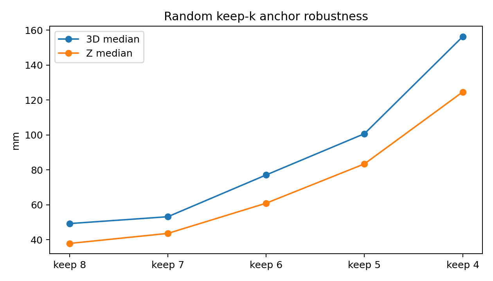

# AutoPos 2026-05-13 Outdoor Experiment: Executive Summary

## 1. Introduction

AutoPos is intended to recover a 3D UWB anchor layout from inter-anchor ranging alone, without using external motion-capture infrastructure during calibration. The 2026-05-13 outdoor experiment used eight DWM1001C anchors in a four-lower plus four-upper arrangement, with a measured footprint of 3.17 m by 4.78 m and an average vertical layer separation of 1.51 m. The ranging architecture was upgraded from sequential unicast to broadcast SS-TWR, increasing per-epoch anchor availability from predominantly 4-anchor fixes in the earlier concept to 68.0% 7-anchor and 31.9% 8-anchor epochs in the current static dataset. Equally important, broadcast SS-TWR reduces the inter-anchor time skew of a Tag position estimate, because ranges to multiple anchors are collected within the same broadcast epoch rather than through a longer sequential polling cycle; this should reduce motion-induced inconsistency for moving tags, although it is not isolated as a controlled result in this dataset. Since no OptiTrack ground truth was available, all numbers below should be read as repeatability, internal consistency, or positioning standard deviation, not as absolute positioning accuracy (see Section 1 of the full report).

## 2. Main Result

The main V4-io result is stable under the clean 1000-sweep layout generation setting. A strict 8/8 subset was also evaluated as a diagnostic check by keeping only static frames in which all eight anchors were present.

| Evaluation condition | Frames | X med (mm) | Y med (mm) | Z med (mm) | 3D med (mm) | 3D p95 (mm) |
| --- | ---: | ---: | ---: | ---: | ---: | ---: |
| All-available under 8-anchor infrastructure | 13817 | 26.0 | 16.3 | 37.9 | 49.2 | 81.6 |
| Strict 8/8 frames only | 4408 | 23.4 | 14.8 | 37.4 | 44.5 | 67.0 |

The strict 8/8 diagnostic keeps only 31.9% of the static frames. It improves X, Y, and the 3D tail, but the Z median is essentially unchanged, moving only from 37.9 mm to 37.4 mm. This is an important result: missing-anchor frames add horizontal and tail degradation, but the persistent Z weakness is primarily geometry-driven rather than simply availability-driven (see Sections 3 and 4 of the full report).

## 3. Error Structure

The XYZ decomposition shows that the current limitation is not isotropic ranging noise. In the V4-io all-available result, X and Y medians are 26.0 mm and 16.3 mm, while Z is 37.9 mm and contributes 62.1% of the 3D variance. The same pattern remains in the 500-sweep and 500+500 split settings, where Z contributes 63.8% and 63.7% of the 3D variance. Spatial grouping also shows that low-height static sessions are worse than high-height sessions, and the CDHG-facing group is the weakest orientation, with 56.0 mm Z median and 67.8 mm 3D median (see Section 3 of the full report).

## 4. Anchor Redundancy and the 100 mm Regime

The strongest explanatory result is the keep-k robustness experiment. Using the same V4-io layout and the same static captures, anchors were randomly reduced with 500 Monte Carlo repeats per keep-k setting.

| Effective anchor count | Z med (mm) | 3D med (mm) | 3D p95 (mm) |
| --- | ---: | ---: | ---: |
| keep 8 | 37.9 | 49.2 | 81.6 |
| keep 7 | 43.6 | 53.2 | 105.6 |
| keep 6 | 60.9 | 77.1 | 166.5 |
| keep 5 | 83.4 | 100.7 | 225.2 |
| keep 4 | 124.6 | 156.3 | 355.3 |

The curve reproduces the 100 mm-plus regime when the solver is forced into low-redundancy subsets. This explains why the earlier paper concept, which used sequential unicast and reported that about 75% of fixes used only four anchors, showed much larger Z-axis degradation. The current broadcast dataset is not a controlled broadcast-versus-unicast experiment, but it does provide the necessary context: the new data have 68.0% 7-anchor epochs and 31.9% 8-anchor epochs, while the earlier concept was dominated by 4-anchor fixes (see Sections 1 and 5 of the full report).

## 5. Kinematic and Geometric Validation

Roto data should not be interpreted through raw circle thickness because the tags are intentionally moving. The more meaningful Roto metrics are the radius-difference consistency and per-revolution center repeatability: V4-io gives a dR RMS of 32.3 mm and a turn-center median of 20.6 mm, with a systematic dR mean of -24.3 mm that should be investigated as a radius-difference bias. Wand validation gives a pairwise distance bias RMS of 59.3 mm for the V4-io layout; using W01-W04 as soft constraints provides only a small improvement and is not the main source of the result (see Sections 6 and 7 of the full report).

## 6. Next Steps

The highest priority is an OptiTrack validation session, because only external ground truth can turn the current repeatability analysis into an absolute accuracy analysis. The second priority is improving vertical geometry, most likely by adding a ninth anchor at a high central position; the FIM simulation suggests that the center-extra-high candidate is the most robust option because its p05 Z-uncertainty reduction factor remains above 1. The third priority is hardware and signal-quality follow-up on anchor E, which has the largest residual tail, and anchor H, which has low availability and a high low-Q rate (see Sections 5, 8, and 9 of the full report).
