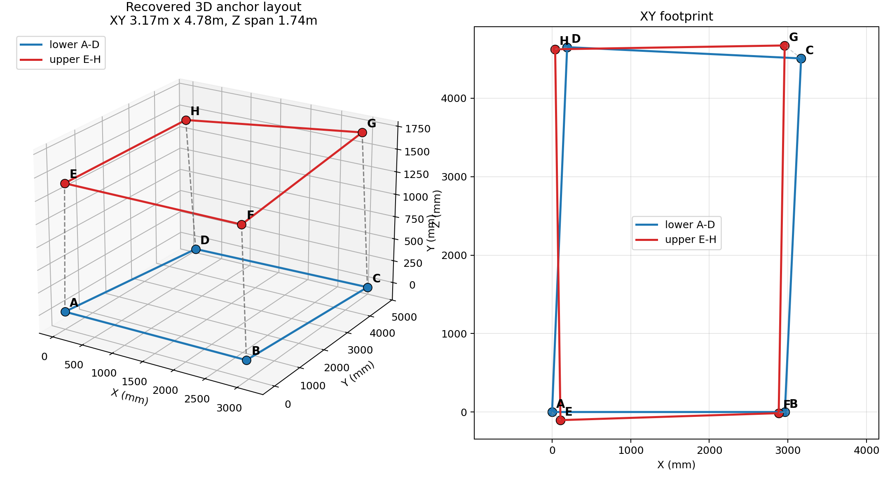
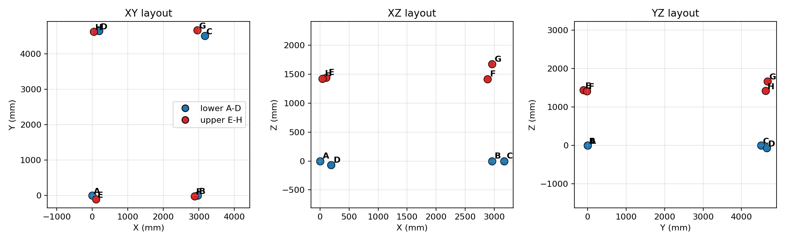
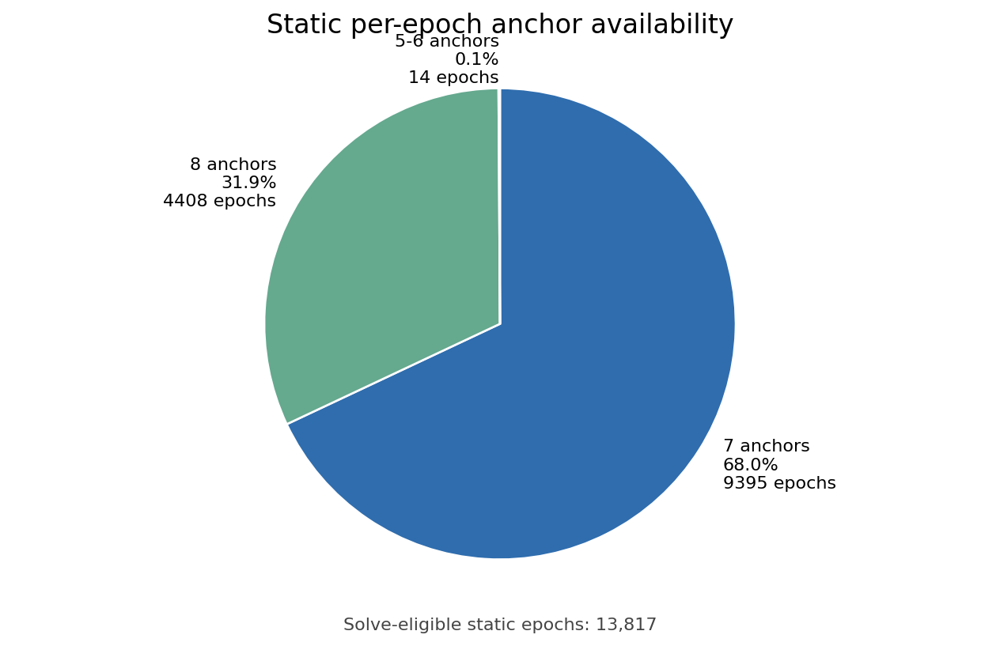

# Setup Geometry and Anchor Availability

本目录给最终报告提供两个 setup-level 证据：

1. V4-io anchor layout 的 A-H 3D 坐标。
2. Static captures 中每个 epoch 实际可用 anchor 数量的分布。

## Anchor Layout

Three-view helper:

| Anchor | Layer | X mm | Y mm | Z mm | delay mm |
| --- | --- | --- | --- | --- | --- |
| A | lower | 0.0 | 0.0 | 0.0 | 0.0 |
| B | lower | 2961.0 | 0.0 | 0.0 | 20.2 |
| C | lower | 3167.2 | 4507.1 | 0.0 | 32.3 |
| D | lower | 191.7 | 4650.6 | -70.9 | 20.7 |
| E | upper | 106.8 | -103.5 | 1441.4 | 5.9 |
| F | upper | 2882.6 | -14.6 | 1418.2 | -2.4 |
| G | upper | 2958.8 | 4672.3 | 1673.5 | 1.8 |
| H | upper | 39.4 | 4623.6 | 1420.8 | -0.7 |

Geometry summary:

| x span | y span | z span | upper z mean | lower z mean | layer separation |
| ---: | ---: | ---: | ---: | ---: | ---: |
| 3167.2 | 4775.8 | 1744.4 | 1488.5 | -17.7 | 1506.2 |

Interpretation: 这里使用物理展示坐标，已经把 solver 的 Z mirror 翻到现场约定方向：A-D 是 lower layer，E-H 是 upper layer。整体 XY footprint 约 `3.17m x 4.78m`，上下层平均 Z separation 约 `1.51m`。这个 Z 翻转只影响报告展示，不改变 solver residual / repeatability 结果。

## Static Anchor Count Distribution

| valid anchors | epochs | % of solve-eligible epochs |
| --- | --- | --- |
| 4 | 0 | 0.0 |
| 5 | 2 | 0.0 |
| 6 | 12 | 0.1 |
| 7 | 9395 | 68.0 |
| 8 | 4408 | 31.9 |

这个分布说明：`all-available` 并不等于 strict all-8；但本次 broadcast static dataset 仍然是高冗余的，几乎全部 solve-eligible epochs 都是 7/8 anchor。也就是说，当前数据里的 all-available 主要是 7/8-anchor solve，而不是旧 unicast/selector 条件下那种长期 4/5-anchor solve。

## Lowest 8/8 Retention Captures

| ID | total epochs | solve eligible >=4 | % ge8 | % ge7 |
| --- | --- | --- | --- | --- |
| ID07 | 600 | 600 | 14.8 | 100.0 |
| ID08 | 601 | 601 | 19.5 | 99.8 |
| ID01 | 601 | 601 | 25.0 | 99.7 |
| ID21 | 600 | 600 | 25.0 | 100.0 |
| ID11 | 601 | 601 | 26.0 | 100.0 |
| ID12 | 601 | 601 | 26.1 | 100.0 |
| ID05 | 601 | 601 | 26.6 | 100.0 |
| ID02 | 601 | 601 | 27.0 | 99.8 |

## Files

- `anchor_layout_v4io.csv`
- `anchor_geometry_summary.csv`
- `static_anchor_count_distribution.csv`
- `static_anchor_count_distribution_pie.png`
- `static_anchor_count_by_capture.csv`
- `anchor_layout_v4io.png`
- `anchor_geometry_report.png`
- `static_anchor_count_distribution.png`
