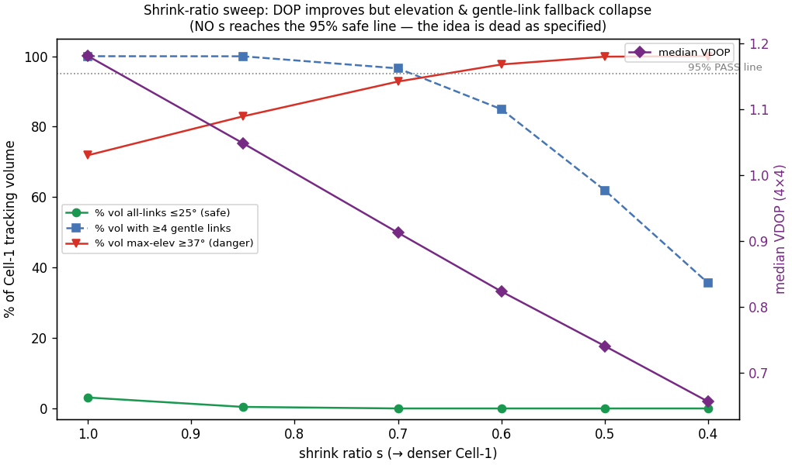
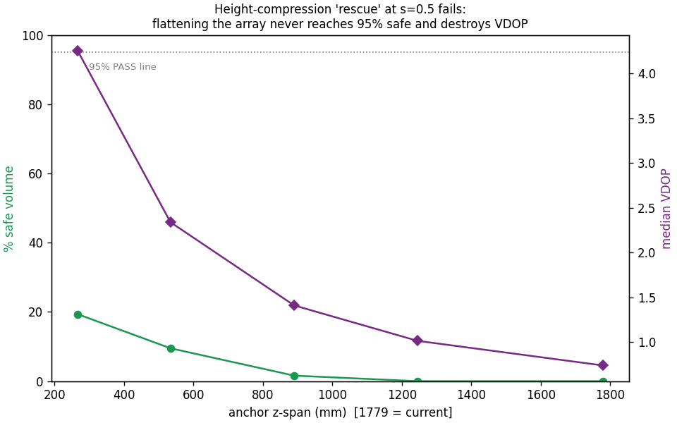
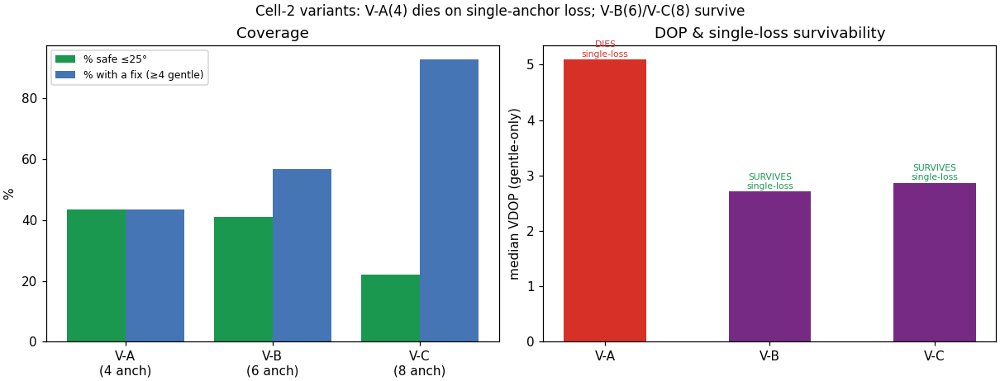
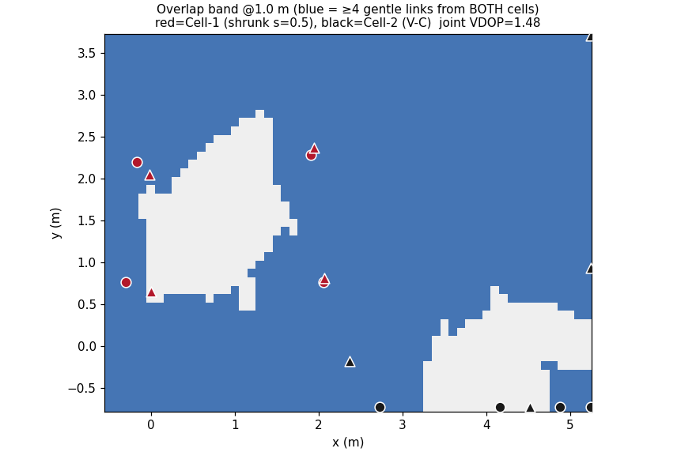

# Cell-Split Layout Simulation — Shrink Ratio × Elevation × DOP

**Pure simulation, run before any physical layout change.** No hardware, no
captures, no firmware. Read-only on all repo data. The operator suspects the
room is too small to split; this run answers that quantitatively.

Generated by [`run_sim.py`](run_sim.py) (geometry kernels in [`geo.py`](geo.py))
and [`make_figures.py`](make_figures.py). All numbers live in
[`results.json`](results.json).

---

## TL;DR — the five decisions

| | Verdict |
|---|---|
| **D1 — does a passing shrink ratio exist?** | **NO. Dead as specified.** No `s ∈ {1.0…0.4}` reaches 95 % safe volume. The *current, un-shrunk* layout already only makes **3.1 %** of its tracking volume "all-links ≤25°". Shrinking drives that to **0 %** and pushes the danger band (≥37°) to **72 % → 100 %**. Height-compression cannot rescue it. |
| **D2 — minimum viable Cell-2 anchor count?** | **6 (V-B).** V-A (4 anchors) **dies on single-anchor loss** — 3 anchors cannot solve the 4-unknown fix (0 % coverage after any drop). But 6 and 8 both **exceed the 5 free radios** → hardware squeeze. |
| **D3 — overlap band / handover at 5 Hz?** | **Geometrically feasible but moot.** Overlap covers 86 % of the room, joint VDOP 1.48 (a genuine DOP sweet-spot), band width 5.7 m ≫ the 0.6 m a 1.5 m/s walker needs. Irrelevant, because the shrunk Cell-1 that creates the overlap is itself non-functional (D1). |
| **D4 — per-cell rate?** | **5.0 Hz/cell (2-block), 3.33 Hz/cell (3-block)** under the rate-preserving policy; **10 Hz/cell** if you spend 2–3 slots. RF airtime is only 16–30 % used — the rate cap is the BLE-locked 100 ms superframe, not airtime. |
| **D5 — net recommendation** | **DO NOT split this room by shrinking.** The premise fails on geometry: a 1.78 m-tall anchor array over a 4.7 × 3.4 m floor cannot keep links gentle anywhere, and the *only* thing that makes the current single cell usable — a ≥4-gentle-link fallback — collapses under shrink. The room supports **one** working cell, not two. If you want two cells, you need two full-size rooms (the court-scale 3-block case), not a compressed sub-cell here. |

The operator's suspicion is correct, and then some: not only is the room too
small to *split*, it is already too vertically tall for the strict Erlangen
≤25° rule at full size — the deployed system works only because it can lean on
distant, gentle links.

---

## Why the strict rule and the fallback both matter (read this before the tables)

Two different pass criteria appear throughout. They are not interchangeable:

- **Strict (the prompt's PASS):** *max* link elevation over **all** anchors ≤25°
  at a grid point — i.e. **no** steep link anywhere. This is the literal
  Erlangen design rule ("no link above 25° for any tag position").
- **Practical fallback:** at least **4 gentle** (≤25°) links exist, so a fix can
  be built from safe links alone and the steep links gated out. This is *how the
  current rig actually survives* — it never satisfies the strict rule but almost
  always has ≥4 gentle links.

A geometric fact drives everything below: **elevation is low when the tag is far
from an anchor** (horizontal separation dominates |Δz|) **and high when it is
close** (small horizontal, large |Δz| to the opposite ring). So gentle links
come from *distant* anchors — good for the ≤25° rule, bad for ranging SNR/DOP.
Shrinking the array pulls every anchor *closer* to every tag → every link
steepens → **both** criteria degrade at once.

---

## D1 — Shrink-ratio sweep (Task 2), with the baseline (Task 1)

Anchor **heights are held fixed** (wall/stand mounted); only horizontal
coordinates scale toward the layout centroid. The tracking box scales with the
anchors (same 0.2–1.8 m height range). DOP is the 4-unknown pseudo-range model
(x, y, z, clock), unit weight, all 8 anchors.

| s | %vol ≤25° (safe) | %vol ≥37° (danger) | %vol ≥4 gentle | median VDOP | p95 VDOP | median GDOP | median max-elev | **PASS?** |
|----:|----:|----:|----:|----:|----:|----:|----:|:--:|
| **1.00** (baseline) | **3.1** | 71.9 | 100.0 | 1.18 | 1.61 | 1.61 | 45.7° | ❌ |
| 0.85 | 0.4 | 82.9 | 100.0 | 1.05 | 1.51 | 1.52 | 50.2° | ❌ |
| 0.70 | 0.0 | 92.8 | 96.5 | 0.91 | 1.43 | 1.45 | 55.4° | ❌ |
| 0.60 | 0.0 | 97.7 | 84.9 | 0.82 | 1.37 | 1.42 | 59.4° | ❌ |
| 0.50 | 0.0 | 99.9 | 61.9 | 0.74 | 1.35 | 1.42 | 63.9° | ❌ |
| 0.40 | 0.0 | 100.0 | 35.5 | 0.66 | 1.35 | 1.42 | 68.9° | ❌ |

*PASS = ≥95 % safe **and** median VDOP ≤ baseline. The VDOP half always passes
(shrinking helps DOP); the elevation half never does.*

**The tension resolves entirely against the idea.** Shrinking does exactly what
was expected to the DOP — median VDOP falls 1.18 → 0.66, GDOP 1.61 → 1.42 (the
z-baseline grows relative to a shrinking footprint). But elevation moves the
other way and much harder: median max-elevation climbs 45.7° → 68.9°, the danger
band saturates at 100 %, and — the decisive part — the **≥4-gentle fallback
collapses** (100 % → 35.5 %) with gentle-only VDOP blowing past 10 by s=0.5.
So shrinking doesn't merely fail the strict rule the baseline already failed;
it destroys the looser criterion that keeps the current system alive.

Elevation-band maps (green ≤25° / yellow 25–37° / red ≥37°) at 0.5/1.0/1.5 m:
[s=1.0](figures/fig_elev_bands_s100.png) ·
[s=0.7](figures/fig_elev_bands_s070.png) ·
[s=0.5](figures/fig_elev_bands_s050.png) (entirely red) ·
[s=0.4](figures/fig_elev_bands_s040.png).
VDOP improving with shrink: [VDOP maps](figures/fig_vdop_maps.png).

**Baseline sweet-spot (Task 1 context).** Even restricting to the realistic
operating envelope — central inner-50 % of the footprint at 0.8–1.2 m, where a
hand-held wand actually lives — only **21.9 %** is strictly safe, but **100 %**
has ≥4 gentle links (median max-elev 29.0°). That is the whole story of why the
rig works today and why it can't be shrunk.

**Baseline DOP is not the problem.** Median VDOP 1.18 (4×4) / 0.98 (3×3 TOA),
HDOP 0.94, GDOP 1.61 — all healthy. The geometric weakness of this layout is
**elevation, not DOP.**

### Can anchor-height compression rescue a shrunk cell? No.

At s=0.5, squeeze the anchor z-span toward its mean:

| z-span | %safe ≤25° | %≥4 gentle | median VDOP | p95 VDOP | median max-elev |
|----:|----:|----:|----:|----:|----:|
| 1779 mm (current) | 0.0 | 61.9 | 0.74 | 1.35 | 63.9° |
| 1245 mm | 0.0 | 84.6 | 1.01 | 2.27 | 58.9° |
| 890 mm | 1.6 | 81.7 | 1.41 | 3.21 | 54.4° |
| 534 mm | 9.5 | 82.9 | 2.34 | 5.38 | 48.6° |
| **267 mm** (nearly flat) | **19.4** | 83.8 | **4.25** | **9.88** | 43.2° |

Flattening the array to a 267 mm z-span — physically drastic — still reaches
only **19 % safe** while median VDOP degrades **6×** (0.74 → 4.25) and p95 VDOP
hits ~10. The two goals (gentle elevation, good vertical DOP) are directly
opposed: you buy elevation by killing the z-baseline. **There is no rescue.**

---

## D2 — Cell-2 variants (Task 3)

Best shrink for a *nominal* Cell-1 is s = 0.5 (fallback, since none pass).
Cell-2 anchors placed on the vacated half's perimeter walls at the two existing
ring heights (z_low ≈ −58 mm, z_high ≈ −1579 mm), coarse random-restart
optimization (1200 restarts) maximizing %safe then minimizing median VDOP.

| Variant | Anchors | %safe ≤25° | median VDOP (gentle-only) | median VDOP (all-link) | %vol with a fix | **worst single-loss VDOP** | Survives single loss? |
|---|:--:|----:|----:|----:|----:|----:|:--:|
| **V-A** | 4 (2 low + 2 high) | 43.4 | 5.09 | 4.53 | 43.4 | **— (no fix at all)** | **❌ NO** |
| **V-B** | 6 (3 low + 3 high) | 41.0 | 2.71 | 2.10 | 56.7 | 5.86 | ✅ yes |
| **V-C** | 8 (4 low + 4 high) | 22.0 | 2.87 | 1.40 | 92.8 | 3.32 | ✅ yes |

- **V-A is the honest killer.** Drop any one of its 4 anchors → 3 remain → the
  4-unknown (x,y,z,clock) fix is unsolvable → **0 % coverage** after a single
  loss. Zero redundancy. Not viable for anything you'd trust a person to.
- **V-B (6) is the minimum viable count** — it keeps a fix through any single
  loss (worst-case median VDOP 5.9, degraded but alive).
- **V-C (8) is the robust choice** — 92.8 % coverage, best all-link VDOP (1.40),
  worst single-loss VDOP only 3.3.
- **Counter-intuitive but real:** *more* anchors gives *lower* %safe (22 % for
  V-C vs 43 % for V-A). "Max elevation over all links" is punished by every
  extra link — one more anchor is one more chance of a steep link. Redundancy
  and the strict ≤25° rule pull in opposite directions. Coverage/DOP/redundancy
  still favor more anchors; the %safe number is an artifact of the strict metric.

### Hardware ledger

| | Count |
|---|---|
| Spare radios (listeners) | 7 |
| Reserved as future gateways | 2 |
| **Free for Cell-2** | **5** (+ any bench spares, count not in repo) |
| V-A needs | 4 → fits, but non-viable |
| V-B needs | 6 → **short by 1** |
| V-C needs | 8 → **short by 3** |

The existing 8 A–H stay in Cell-1. **Every *viable* Cell-2 variant exceeds the
free-radio budget.** V-A is the only one that fits the hardware, and it is the
one that cannot survive a single anchor loss. That is a hard squeeze independent
of the geometry verdict.

---

## D3 — Overlap / handover geometry (Task 4)

Best Cell-1 (s=0.5, translated into the low-x half) + best *viable* Cell-2 (V-C,
high-x half), evaluated over the full room:

| Metric | Value |
|---|---|
| Overlap band (≥4 gentle links from **both** cells) | **86.1 %** of the room (20 236 pts) |
| Joint VDOP on overlap (both cells' anchors) | **1.48** |
| Cell-1 alone, on overlap | 2.47 |
| Cell-2 alone, on overlap | 2.63 |
| Joint GDOP on overlap | 2.24 |
| Overlap width at mid-line (1.0 m slice) | **5700 mm** |
| Width a 1.5 m/s walker needs (≥2 sweeps @ 5 Hz) | 600 mm |
| Handover geometrically feasible? | **Yes** |

The overlap **is** the DOP sweet-spot the doubled geometry predicts — joint VDOP
1.48 beats either cell alone (2.47 / 2.63), because a tag in the seam sees gentle
links from *both* arrays. The band is far wider than a walker can cross in two
sweep periods, so handover has ample dwell.

**But this is moot.** The overlap only looks good because it is populated by
*distant, gentle* links from both cells. The dense Cell-1 whose vacated space
made room for Cell-2 is, per D1, non-functional inside its own footprint. You
cannot hand a tag *off* a cell that cannot hold it in the first place. Handover
geometry is not the bottleneck; the cell that creates the handover is.

---

## D4 — Timing arithmetic (Task 5)

Provenance-anchored constants (from [`analysis/sweep_timing_audit/REPORT.md`](../../analysis/sweep_timing_audit/REPORT.md)):
GUARD 1200 µs, rank SPACING 1000 µs, TAIL 800 µs, poll airtime 335 µs; slot
period 10 ms / active 9 ms (motion profile); superframe 100 ms = 10 slots.
Collector window `= GUARD + (N−1)·SPACING + TAIL − poll`.

> **Correction to the prompt.** The 8-anchor sweep is **8.665 ms**, not 9.665 ms.
> 9.665 ms is the *9-anchor* window that the 9th-anchor audit rejected. Verified:
> `1200 + 7·1000 + 800 − 335 = 8665 µs`.

| N anchors | Sweep window |
|--:|--:|
| 4 | 4.665 ms |
| 6 | 6.665 ms |
| 8 | **8.665 ms** |
| 9 | 9.665 ms (the rejected one) |

FINAL frame (reverse SS-TWR) assumed 200 µs; inter-block guard reuses GUARD
(1200 µs).

**A combined dual-cell epoch cannot share one slot.** Block-1 + FINAL + guard +
Block-2 + FINAL + guard = **16.1–20.1 ms** > the 9 ms active window. The two
cells must occupy **separate** slots.

| Config | Combined epoch | Airtime used / 100 ms | **Rate/cell (rate-preserving, Policy A)** | Rate/cell (slot-doubling, Policy B) |
|---|--:|--:|:--:|:--:|
| 2-block, Cell-2 = V-A (4) | 16.13 ms | 16 % | **5.00 Hz** | 10 Hz (2 slots) |
| 2-block, Cell-2 = V-B (6) | 18.13 ms | 18 % | **5.00 Hz** | 10 Hz (2 slots) |
| 2-block, Cell-2 = V-C (8) | 20.13 ms | 20 % | **5.00 Hz** | 10 Hz (2 slots) |
| **3-block** (3 × 8-anchor, court-scale) | 30.20 ms | 30 % | **3.33 Hz** | 10 Hz (3 slots) |

**~5 Hz per cell is CONFIRMED** for the 2-block case under the rate-preserving
policy (the tag keeps its one slot and alternates cells each superframe: 10 Hz
system ÷ 2 cells = 5 Hz). It is **independent of the Cell-2 anchor count** —
every variant's sweep fits inside one 9 ms slot, so anchor count changes airtime
(16→20 % of the budget) but not the per-cell rate.

Two honest caveats:
- **Policy B doubles it to 10 Hz/cell** if you let the tag own one slot *per
  cell* each superframe — at the cost of occupying 2 (or 3) of the 10 slots, so
  fewer simultaneous tags fit. This is a scheduling choice, not a physics wall.
- **RF airtime is barely touched** (16–30 % of 100 ms). The 5 Hz / 3.33 Hz caps
  are set by the BLE-locked 10 ms slot × 10 superframe structure, *not* by
  sweep airtime. The 7.5 ms BLE connection interval (the ge8 collision
  constraint from the 9th-anchor audit) is the real co-existence limiter on
  going finer than 10 ms slots.

3-block (court-scale preview): **3.33 Hz/cell** rate-preserving, or 10 Hz/cell
across 3 slots. Airtime 30 % — comfortable.

---

## D5 — Net recommendation

**DEAD AS SPECIFIED.** Do not split this room by shrinking the 8-anchor array
into a dense Cell-1.

The reasoning, bluntly:

1. **The room is too small in the dimension that matters — the *vertical* one.**
   A 1.78 m anchor z-span over a ~4.7 × 3.4 m floor cannot keep links ≤25°
   anywhere useful. The *current, un-shrunk* layout already scores 3.1 % strict-
   safe. This is not a shrink problem; shrink just makes an already-failing
   geometry worse.
2. **The current rig survives only on the ≥4-gentle-link fallback, and shrink
   destroys it** (100 % → 36 % of volume; gentle-only VDOP → 10+). Densifying
   the array is the exact wrong move: it steepens every link.
3. **Height compression can't buy it back** — flattening to 267 mm still reaches
   only 19 % safe and craters VDOP 6×.
4. **The hardware doesn't fit either** — the only radio-affordable Cell-2 (4
   anchors) is the one that dies on a single loss; the viable ones (6, 8) need
   1–3 radios you don't have free.

**What *would* work, if the goal is more coverage / a second zone:**

- **Two full-size rooms, not two sub-cells** — the 3-block/court-scale case where
  each cell is a full-footprint array in its own space. Timing supports it
  (3.33 Hz/cell rate-preserving, or 10 Hz/cell at 3 slots; 30 % airtime). This
  is the only "split" the geometry endorses.
- **If you only want redundancy in *this* room:** add the free anchors to the
  existing cell *without shrinking* (a 13-anchor single cell). That improves DOP
  and single-loss margin and keeps the gentle-link fallback — but a 13-anchor
  sweep is 13.665 ms, which **cannot** fit the 9 ms motion slot. It would force
  the 40 ms/24 ms static profile (~2.5 Hz) or a rate drop. Densify-in-place is a
  rate-vs-robustness trade, not a coverage win.
- **Before any of this, get a metric-scale ground truth** (corner reflector /
  measured baseline). The layout scale is still formally unidentifiable
  (`scale_identifiable=false` in V5); every elevation number here inherits that
  ~few-% scale uncertainty. It does not change the verdict (the failure margin is
  huge), but it should be closed before spending money on radios.

---

## Provenance & assumptions

Every assumed constant, one line each:

| Quantity | Value | Source |
|---|---|---|
| Anchor layout | `anchor_layout.json` (V4-io, deployed) | repo; the physically-deployed geometry that would actually be shrunk |
| Cross-check layout | V5 scale-locked | 35 mm RMS from V4-io → baseline bands identical (3.16 % safe, 45.8°); V5 non-locked rejected (scale unidentifiable) |
| Anchor bbox | x[0, 4740], y[−231, 3200], z[−1779, 0] mm | computed from layout |
| Ring heights | z_low ≈ −58 mm, z_high ≈ −1579 mm | mean of A–D (low) / E–H (high) |
| **Room bounds** | anchor bbox + 0.5 m each side | **ASSUMED** — no room-dimension record found in repo (searched analysis scripts, Vicon models) |
| Wall margin | 0.3 m | prompt |
| Tracking volume | bbox + 0.2 m horizontal, 0.2–1.8 m height | derived (room − wall margin); body-worn range from prompt |
| **Floor datum** | low-ring z=0 plane, up = −z | **ASSUMED**; no independent floor survey. Sensitivity: floor-at-low-ring → 3.1 % safe / 45.7°; array-high (low ring 0.9 m) → 2.7 % / 52.7° — **datum-robust**, verdict unchanged |
| Grid | 0.1 m horizontal, 0.2 m vertical (9 height slices) | prompt |
| Display slices | 0.5 / 1.0 / 1.5 m | prompt (recomputed at exact heights for figures) |
| Elevation | asin(|Δz| / range) | prompt |
| Bands | ≤25° safe / 25–37° risk / ≥37° danger | Erlangen orientation campaign (frozen) |
| DOP model | 4-unknown pseudo-range (x,y,z,clock), 4×4, unit weight | prompt (4×4); clock unknown justified by the real per-epoch common-mode bias. 3×3 TOA reported as secondary |
| 8-anchor sweep | **8.665 ms** = 1200 + 7·1000 + 800 − 335 µs | `analysis/sweep_timing_audit/REPORT.md` (**prompt's 9.665 ms is the 9-anchor figure**) |
| FINAL frame | 200 µs | **ASSUMED** (reverse SS-TWR single frame; prompt range 150–200) |
| Inter-block guard | 1200 µs | reuses GUARD (assumed) |
| Slot / superframe | 10 ms slot (9 ms active) / 100 ms | `sweep_timing_audit/REPORT.md` (motion profile) |
| Free radios | 5 (7 listeners − 2 gateways) | prompt; bench-spare count not in repo |

## Execution self-report (GPU-first, CPU-light)

| | |
|---|---|
| Device | **cuda:0 — NVIDIA GeForce GTX 1080 Ti** (all elevation + batched 4×4 DOP inversions in FP32) |
| GPU peak memory | **43 MB** (of 11 GB — the workload is tiny for the card) |
| torch threads | **2** (`torch.set_num_threads(2)`, `OMP/MKL=2`) |
| Live CPU during run | **~15–19 %** of the 12-thread box — well under the 30 % ceiling; J-Link builds/flashes keep their headroom |
| Wall-clock | **~8–9 s** total (grids × 6 ratios × 3 variants × 1200-restart optimization × overlap) |
| FP64 steps | none — FP32 throughout, ample for mm-scale geometry over metres |
| Reproducibility | seeded (`torch.manual_seed(1234)`, optimizer seed 13) |

All outputs under `experiments/cell_split_simulation/`. Nothing written outside
the repo; no existing data modified.
