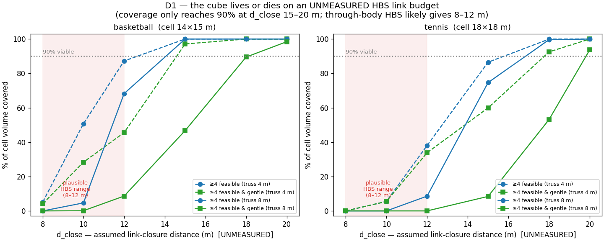
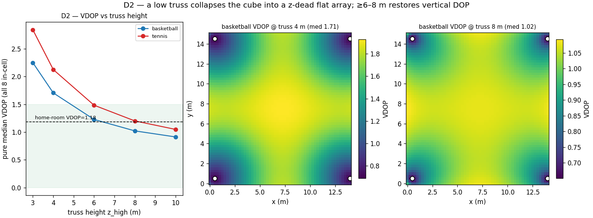
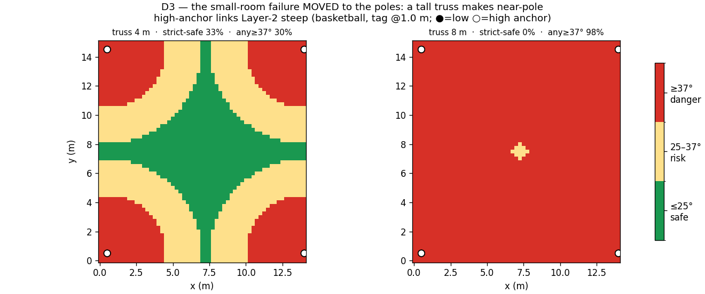
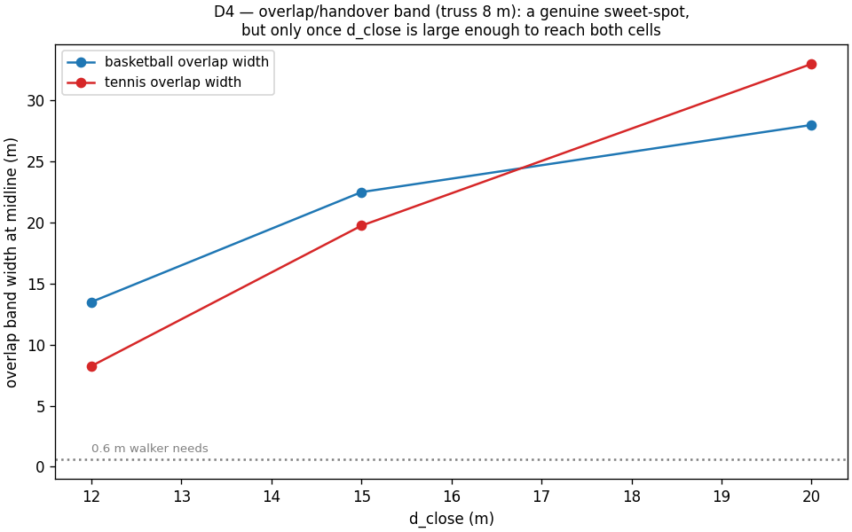

# Court-Scale Double-Cube Cell Simulation (4+4+4, 12 anchors)

**Pure simulation, run before any pole goes up.** No hardware / firmware /
captures. Read-only on existing data. Reuses the `cell_split_simulation`
geometry code path unchanged ([`geo.py`](../cell_split_simulation/geo.py):
`link_geometry` for range/elevation/LOS vectors, `dop_from_uvec` for the
4-unknown `(x,y,z,clock)` DOP — `rows = LOS unit vec + 1`, `sqrt(diag((GᵀG)⁻¹))`).
Driver [`court_sim.py`](court_sim.py), figures [`make_figures_court.py`](make_figures_court.py),
numbers [`results.json`](results.json), run log [`logs/run.log`](logs/run.log).

---

## VERDICT (read first)

> **CONDITIONAL — decide it with a capture, not a build.** The double-cube is
> **not killed by geometry**: at a tall truss on the smaller court it is actually
> *better-conditioned* than the home room (VDOP 1.02 vs 1.18). But its entire
> viability rides on **one number this simulation cannot produce** — the reliable
> link-closure distance `d_close` of a 6.8 Mbps body-worn DW1000 tag under
> **human-body shadowing (HBS)**. At the `d_close` a through-body tag plausibly
> delivers (**8–12 m**), the cube is **DEAD** — a tag in the middle of the cell
> is orphaned (0–68 % coverage). It only works if `d_close ≥ 15 m` (basketball) /
> **≥ 18 m** (tennis), and needs **~20 m** to also keep 4 links *gentle*. Worse,
> the truss height that fixes the vertical DOP (**≥ 6–8 m**) **simultaneously
> lengthens the anchor ranges** (hurts `d_close`) **and drives near-pole links
> into Layer-2 steep territory** (98 % of the cell at 8 m). There is no free
> config. **The single experiment that decides GO/NO-GO is a `d_close`
> measurement on a real, moving body.**

| Decision | Verdict |
|---|---|
| **D1 Link-budget gate** | **The decisive unknown, and the most likely killer.** ≥4-feasible reaches 90 % only at `d_close` **15 m (basketball) / 18 m (tennis)**; ≥4-*gentle* needs **~20 m**. In the plausible HBS band (8–12 m) coverage is 0–68 %. Basketball IS viable at a `d_close` where tennis is not. `d_close` is **UNMEASURED** — every claim below is conditioned on it. |
| **D2 Truss-height gate** | Minimum viable truss **≥ 6 m (basketball) / ≥ 8 m (tennis)** for home-room-class VDOP. Below **4 m** the cube collapses into a near-flat, z-dead array (VDOP 1.7–2.8). |
| **D3 ≤25° compliance** | **The small-room failure MOVED to the poles and got worse.** A tall truss makes near-pole high-anchor links Layer-2 steep: at 8 m, **98 % (basketball) / 83 % (tennis)** of the cell has a ≥37° link; **0 %** is strictly safe. The ≥4-gentle fallback survives on distant+low anchors — but only if the link budget reaches them. |
| **D4 Overlap band** | Genuine DOP sweet-spot (joint 12-anchor VDOP **1.00–1.06**, beats each cell alone), band **22–28 m** ≫ the 0.6 m a walker needs — **but only once `d_close ≥ 15 m`.** At `d_close = 12 m` it collapses (11.8 %, joint VDOP 6.3). |
| **D5 Body-crossing** | Real hazard under **per-tag** zone assignment: a 2.0 m body straddling the centerline splits its tags across two anchor sets + two bias calibrations (injected relative error). **Centroid (whole-body→one-cell) assignment removes it**; residual one-epoch handoff is absorbed by the D4 overlap. |
| **D6 Kill-check** | The "court cube is better-conditioned" claim is **half-right**: true only for **basketball with truss ≥ 8 m** (VDOP 1.02, aspect 0.38 > home 0.30). For **tennis** and for any **low truss** it is **equal or WORSE** than the cramped home room. And VDOP is conditioning only — the accuracy floor stays **~72–100 mm** (Erlangen bias/multipath). The court **tiles** that cell; it does not shrink it. |

---

## Assumptions (every one; sensitivity where it could flip a verdict)

No authoritative court dimensions or truss height exist in the repo → these are
**assumptions**, swept where they matter.

| Assumption | Value | Note |
|---|---|---|
| **Court bounds** | basketball 28×15 m, tennis 36.6×18.3 m (incl. runback) | **ASSUMED**; tennis is the stress case. Each cell = half-length × width. |
| **z_low** (low ring) | 0.3 m | assumed |
| **z_high** (truss) | **SWEPT {3, 4, 6, 8, 10} m** | venue go/no-go — never assumed to a single value |
| **d_close** (link closure) | **SWEPT {8, 10, 12, 15, 18, 20} m** | **UNMEASURED. The central unknown. Must come from a real HBS capture — this sim cannot produce it.** |
| **z_tag** (body-worn) | **SWEPT 0.2–2.0 m** (10 heights); worst-case reported | foot → raised wrist |
| pole inset from lines | 0.5 m | assumed; **sensitivity run** (below) |
| position grid | 0.25 m | GPU-batched |
| ≤25° safe / ≥37° danger | Erlangen bands (frozen) | reused, not redefined |
| range σ | 25 mm | solver-v2 baseline; used only for the accuracy-floor note |
| DOP model | 4-unknown (x,y,z,clock), `sqrt(diag((GᵀG)⁻¹))` | **reused from cell_split `geo.py`** (rank-deficient feasible sets → NaN → 0 coverage; opt-in `rank_guard` so cell_split's results stay byte-identical) |

**Inset sensitivity** (tennis, truss 6 m): inset 0.5 → 1.0 m moves pure median
VDOP 1.48 → 1.43 and ≥4-feasible@`d_close`15 m from 82.1 % → 86.0 %. Small; does
**not** flip any verdict. The verdict-flipping knobs are `d_close` and `z_high`,
both swept.

---

## D1 — Link-budget gate (the biggest unknown, the most likely killer)

A link is "feasible" only if `range ≤ d_close`. The cube is big — a tag at the
centre of a cell is ~10 m (basketball) / ~13 m (tennis) horizontally from its
nearest corner poles, so its shortest links are already 12–16 m once truss
height is added. That sets a hard reachability wall.

**% of cell volume with ≥4 feasible links** (volume-averaged over all tag heights 0.2–2.0 m):

| court · truss | dc=8 | 10 | 12 | 15 | 18 | 20 | **90%-viable at** |
|---|--:|--:|--:|--:|--:|--:|:--:|
| basketball · 4 m | 5 | 51 | 87 | 100 | 100 | 100 | **15 m** |
| basketball · 8 m | 0 | 5 | 68 | 100 | 100 | 100 | **15 m** |
| tennis · 4 m | 0 | 5 | 38 | 87 | 100 | 100 | **18 m** |
| tennis · 8 m | 0 | 0 | 9 | 75 | 100 | 100 | **18 m** |

**Worst tag height is the foot, not the wrist.** Near the feasibility boundary the
coverage is *not* height-flat: a **0.2 m foot-level tag is farthest from the 8 m
truss anchors** (largest Δz → longest range) and covers up to **~14 pp less** than
a raised 2.0 m tag. E.g. basketball·8 m at `d_close = 12 m`: foot **61 %** vs
volume-mean 68 % vs wrist 74 %. Reporting the flattering height would overstate
viability by ~1–2 m of `d_close`; the worst-case foot tag pushes the true
viability wall *outward*.

**% with ≥4 feasible *and gentle* (≤25°) links** — the set you'd actually want to
solve from:

| court · truss | dc=8 | 10 | 12 | 15 | 18 | 20 | **90%-viable at** |
|---|--:|--:|--:|--:|--:|--:|:--:|
| basketball · 8 m | 0 | 0 | 9 | 47 | 90 | 98 | **18–20 m** |
| tennis · 8 m | 0 | 0 | 0 | 8 | 53 | 94 | **20 m** |

**Read this honestly.** A 6.8 Mbps DW1000 link is already near the modulation's
sensitivity floor; put a human body between tag and anchor (HBS is the #1 NLOS
source here) and the reliable range is plausibly **8–12 m**, not 15–20 m. In
that band the cube's centre is **orphaned** (tennis·8 m: 0–9 % coverage). The
honest headline is **"needs a link-budget that HBS probably won't deliver"**, not
"100 % covered at 20 m". **Basketball is viable where tennis is not** (15 m vs
18 m) — the smaller court is the only one with a fighting chance.

**This gate cannot be closed in simulation.** `d_close` must be measured on a
real, moving, body-worn tag. That capture is the go/no-go.

---

## D2 — Truss-height gate (venue go/no-go)

Pure median VDOP over the cell (all 8 in-cell anchors, link budget aside — this
isolates the height→conditioning relationship):

| truss z_high | 3 m | 4 m | 6 m | 8 m | 10 m |
|---|--:|--:|--:|--:|--:|
| basketball | 2.25 | 1.71 | **1.23** | 1.02 | 0.91 |
| tennis | 2.84 | 2.13 | 1.48 | **1.20** | 1.05 |

- **Minimum viable truss** (VDOP ≲ 1.5, i.e. home-room class or better):
  **~6 m for basketball, ~8 m for tennis.**
- **Below 4 m the cube collapses** into a near-flat array: z_span/footprint
  aspect drops to 0.14–0.18, VDOP 1.7–2.8, the vertical is barely observable.
  The spatial maps (right panels) show the centre of the cell is always the
  weakest point (farthest from all corner poles).
- **Caveat that couples straight into D1 and D3:** raising the truss to fix VDOP
  *lengthens* every anchor range (worse `d_close`) and *steepens* near-pole links
  (D3). Height is not free.

If the venue only offers a 3–4 m wall/truss, the cube is z-dead regardless of the
link budget — that alone is a NO-GO.

---

## D3 — ≤25° compliance, and: did the small-room failure move?

**Yes — it moved to the poles and a tall truss makes it worse.** Elevation is low
when the tag is far from an anchor and high when close; a tall high-anchor over a
tag standing near its pole is a near-vertical link.

| court · truss | strict-safe (ALL 8 ≤25°) | any link ≥37° (Layer-2) | mean gentle links | r₂₅(high) | r₃₇(high) |
|---|--:|--:|--:|--:|--:|
| basketball · 4 m | 33.0 % | 29.6 % | 7.2 | 6.4 m | 4.0 m |
| basketball · 8 m | **0.0 %** | **98.3 %** | 4.6 | **15.0 m** | **9.3 m** |
| tennis · 4 m | 56.0 % | 18.6 % | 7.5 | 6.4 m | 4.0 m |
| tennis · 8 m | **0.0 %** | **83.3 %** | 5.7 | 15.0 m | 9.3 m |

- `r₂₅(high) = 15 m` at truss 8 m means: a tag within **15 m horizontally** of a
  high anchor sees ≥25° to it — that is the **entire cell**. `r₃₇ = 9.3 m` means
  within 9.3 m the link is **≥37° Layer-2** (25–30 % wrong-path-lock risk per the
  Erlangen campaign). Almost every tag is within 9.3 m of *some* high pole → 98 %
  of the cell carries a Layer-2 link. **This is the home-room failure, transplanted
  and amplified by the tall truss.**
- A **raised-wrist tag (2.0 m) near a pole** also goes steep to the *low* anchor:
  `r₂₅(low) = 3.65 m`. So the near-pole zone is hostile at both rings.
- **The saving grace:** mean gentle-link count is still ≥4 (4.6–5.7) — the distant
  and low anchors stay gentle — so a gentle-only fix exists **provided the link
  budget reaches those distant anchors (D1, `d_close ≈ 20 m`).** The two gates
  are the same wall from two directions.

**Named tension:** truss height trades VDOP (D2, wants tall) against elevation
compliance (D3, wants short) against link budget (D1, wants short). A three-way
squeeze with no free corner. Basketball at **6 m** is the least-bad compromise
(VDOP 1.23, and elevation less catastrophic than at 8 m) — *if* `d_close ≥ 15 m`.

---

## D4 — Overlap band (the 4 shared centerline anchors)

Band where ≥4 feasible links come from **both** cells, at truss 8 m, tag 1.0 m:

| d_close | overlap % of court | band width (midline) | joint 12-anchor VDOP |
|--:|--:|--:|--:|
| 12 m | 11.8 % | 13.5 m | 6.31 (poor) |
| 15 m | 48.0 % | 22.5 m | **1.06** |
| 20 m | 97.4 % | 28.0 m | **1.00** |

**Verdict: a real DOP sweet-spot, conditioned on `d_close`.** Once the link budget
reaches both cells (`≥15 m`), the joint 12-anchor VDOP (1.00–1.06) beats either
cell alone — exactly the "doubled geometry" the home-room D3 found — and the band
(22–28 m) dwarfs the ~0.6 m a 1.5 m/s walker crosses in two 5 Hz sweep periods.
Handover is *not* the bottleneck. But at the plausible-HBS `d_close = 12 m` the
band collapses to 11.8 % with garbage conditioning (6.3). Same story as every
other decision: **it all hinges on `d_close`.**

---

## D5 — Body-crossing hazard

- **Per-tag zone assignment** (each worn tag picks its cell from its own prior
  position): a rigid body of ~2.0 m horizontal extent (stride / arms / a fall)
  straddling the centerline puts its tags on **opposite sides** → two different
  8-anchor sets → **two different per-anchor bias calibrations on one body**. For
  a rigid-body / multi-tag wand solve that is an **injected relative-pose error**,
  not just a coverage blip. Hazard band width = the body extent = **2.0 m** at the
  centerline (≫ the 0.6 m a walker crosses per epoch).
- **Centroid assignment** (whole body → one cell by its centroid): split-band
  width **0.0 m** — the hazard is removed by construction.
- **Residual cost:** one handoff epoch as the centroid crosses the centerline,
  fully absorbed by the D4 overlap band (22–28 m ≫ 0.6 m) whenever `d_close ≥ 15 m`.

**Recommendation: mandate centroid-based (whole-body→one-cell) zone assignment.**
Per-tag assignment is a latent relative-error source at the seam.

---

## D6 — KILL-CHECK (is the court cube actually better than the home room?)

| | z_span/footprint aspect | pure median VDOP |
|---|--:|--:|
| **home room** (4.74×3.43 m, 1.78 m z-span) | 0.30 | **1.18** |
| basketball · truss 4 m | 0.18 | 1.71 (worse) |
| basketball · truss 6 m | 0.29 | 1.23 (≈ / marginally worse) |
| basketball · truss 8 m | 0.38 | **1.02 (better)** |
| basketball · truss 10 m | 0.47 | 0.91 (better) |
| tennis · truss 4 m | 0.14 | 2.13 (worse) |
| tennis · truss 8 m | 0.30 | 1.20 (≈ home) |
| tennis · truss 10 m | 0.37 | 1.05 (marginally better) |

**The verbal "court cube is better-conditioned" claim was half-wrong.** It holds
**only for basketball with a truss ≥ 8 m**. For the tennis stress case it is *no
better than the cramped home room* until 10 m, and at any low truss (≤4 m) both
courts are **worse** than home. The cube buys vertical conditioning **only** when
you can mount high on a not-too-large footprint — the exact corner that D1 (link
budget) and D3 (elevation) punish hardest.

**Accuracy floor — do not let anyone read this as "court → mm".** VDOP is
geometric *conditioning only*. Achievable position accuracy is
**bias/multipath-floored at ~72–100 mm** (Erlangen), and the court does **not**
lower that floor — it **tiles the same ~72–100 mm cell** across a bigger space.
The conditioning-limited lower bound (VDOP × 25 mm ≈ 25–30 mm at basketball·8 m)
is a floor you will **not** reach in practice. A bigger arena does not make a
better tag.

---

## Net recommendation — what would kill it, and what to do next

**PROCEED TO MEASUREMENT, NOT TO BUILD.** The geometry is survivable; the physics
of the link budget is unproven and is the whole ballgame.

1. **The one experiment that decides everything: measure `d_close`.** Put a
   6.8 Mbps body-worn tag on a moving person and find the reliable link-closure
   distance — LOS *and* through-body (worst-case orientation) — against an anchor
   at the intended truss height. If that number is **≥ 15 m** with 4 of the links
   gentle, basketball is a GO. If it's the more likely **8–12 m**, the cube is
   **DEAD as drawn** (centre tags orphaned) and no layout tweak saves it — you
   would need smaller cells (more poles, back toward the home-room scale, which
   defeats "court-scale").
2. **Venue check second:** if the ceiling/truss is **< 4–6 m**, NO-GO on VDOP
   grounds regardless of `d_close`.
3. **If both pass:** basketball, truss **6–8 m**, is the least-bad corner of the
   three-way squeeze. Tennis is the stress case and needs `d_close ≥ 18–20 m` —
   treat as unlikely.
4. **Cheap wins to bank now:** mandate **centroid-based zone assignment** (kills
   the D5 body-crossing hazard); expect the overlap seam to be a conditioning
   *sweet-spot*, not a weak point (D4).
5. **Set expectations:** court-scale does not lower the ~72–100 mm accuracy floor.
   It tiles it. Sell "coverage of a court at home-room accuracy", never "mm across
   a court".

**Which physical thing kills it, ranked:** (1) HBS link budget `d_close`
(unmeasured, most likely), (2) venue truss height < 4–6 m, (3) court size (tennis
> basketball). All three are actionable checks before spending on poles.

---

## Execution self-report (GPU-first, CPU-light)

| | |
|---|---|
| Backend | **torch on CUDA** (cupy not installed → torch fallback, as specified), FP32 |
| Device | **cuda:0 — NVIDIA GeForce GTX 1080 Ti** (11.7 GB) |
| GPU util (nvidia-smi) | **peak 69 % / mean 38 %** |
| GPU memory | peak **424 MB** used (torch alloc peak 62 MB) — trivial for the card |
| CPU — **my process** | **peak 9.8 % / mean 8.1 % of the 12-core box** — well under the ≤30 % ceiling |
| CPU — box-wide | peak 31 % (includes the user's concurrent J-Link load; my share is the 9.8 % above) |
| Workers / threads | 1 process, `torch.set_num_threads(2)`, `OMP/MKL=2` |
| Wall-clock | **~1.4 s** (2 courts × 5 truss heights × 6 d_close × 10 heights, GPU-batched) |
| FP64 | none — FP32 throughout (mm-scale geometry over metres) |
| Reproducibility | seeded (20260715) |

All artifacts under `experiments/court_cube_cell_simulation/`; logs under its
`logs/`. Nothing written outside the repo; no existing data modified (the shared
`geo.py` gained an opt-in `rank_guard` flag only — cell_split output verified
byte-identical).
