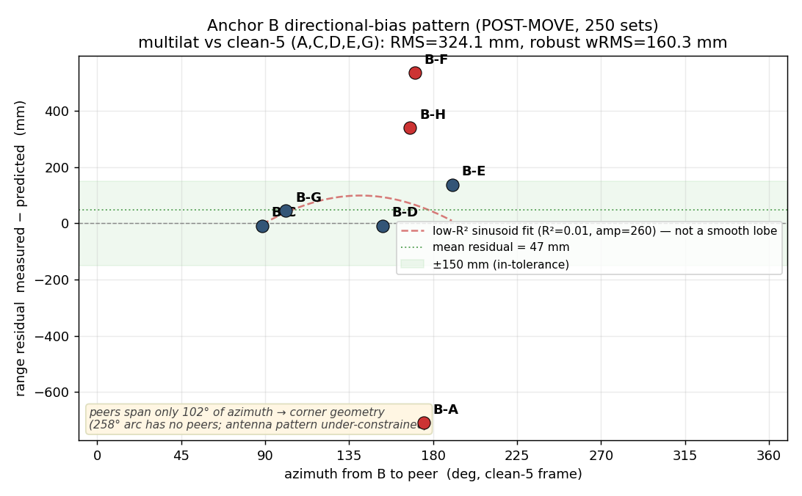
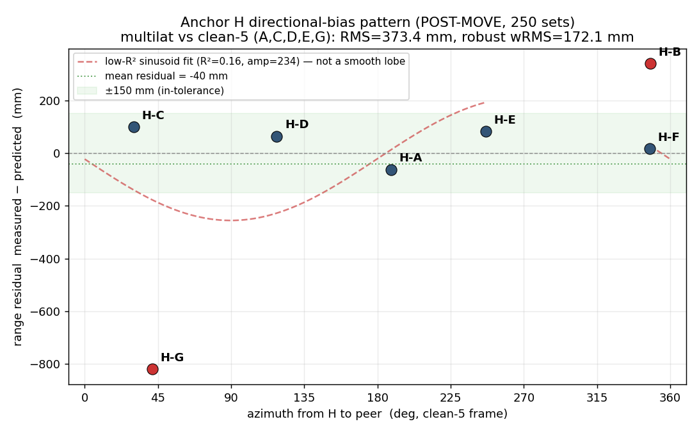

# AutoPos B/F/H Diagnostic — REDO after moving the B+F stand off the wall (2026-07-10)

**What changed:** the shared **B+F stand was pulled a bit further from the wall**. Both B and F
moved; A,C,D,E,G,H did not. This is exactly the *environment / near-field-reflector* test the
previous report recommended for B. I re-swept (250 sets, A–H) and re-ran the diagnostic against
the **5 untouched anchors A,C,D,E,G** (B and F can't be assumed stable across the move, so they
are excluded from the reference).

## Bottom line

| anchor | before move (RMS vs clean-5) | after move | verdict |
|---|---:|---:|---|
| **F** | 183.8 mm | **33.9 mm** | ✅ **FIXED** — back to core-tier |
| **B** | 552.1 mm | **324.1 mm** | ⚠️ **halved & now localizable, but not fixed** |
| **H** | 346.8 mm | 373.4 mm | ➖ **unchanged** (not on the stand) |

**The wall was a real, major error source.** Moving the stand off it **completely fixed F**
(which had been silently drifting worse all day) and **cut B's error nearly in half** and made B
*localizable again* (it could not be triangulated at all before). **B still has a large residual
fault** (B-A ≈ −710 mm, now also noisy) → keep it off the wall, but B still needs a module
swap-test/replace. **H is untouched by this and still bad.**

---

## 1. Sweep (Task 1)
- `raw/sweep_postmove/` — 250 sets/round, **A–H all success**, H promoted first try, rig
  auto-restored to responder 8/8. (Pre-move baseline preserved at `raw/sweep/`.)
- Sweep warnings: low matrix quality on **F** (rounds B,C), D (round E), E (round A) — minor,
  and the F warning is consistent with F's link to A being a bit noisy in the new spot (below).

## 2. Full solve (Task 2)
Production **v4-io** solve on the post-move data → `layout_full8.json`. Inter-anchor pair RMS
**125.5 mm** (was 144.5 pre-move) — improved, still carried by B and H.

---

## 3. Did the move help? (before → after, vs the 5 untouched anchors)

### Anchor F — **fixed**
- RMS **183.8 → 33.9 mm**. F is now **core-tier** (untouched core self-consistency = 25.8 mm).
- F had been *degrading all day*: **35 → 74 → 184 mm** (overnight → midday → evening) — i.e. the
  longer the stand sat against the wall, the worse F got. The move reset it to clean.
- Post-move, F's only out-of-tolerance link is **F-B (+535 mm)** — and B is the bad anchor, so
  that's B's fault, not F's. Every F→{A,C,D,E,G} link is within ±55 mm. **F has rejoined the
  trustworthy core** (a clean-6 A,C,D,E,F,G solve self-checks at 25.1 mm, F included).
- One watch-item: **F-A is a bit noisy** in the new position (MAD 150 mm, TX/RX asym 215 mm),
  which drives some chunk-to-chunk position wobble. Median is clean; worth a glance at the F↔A
  line-of-sight but not blocking.

### Anchor B — **much better, still faulty**
- RMS **552.1 → 324.1 mm** (−41 %). Worst link still **B-A** but its magnitude dropped
  **−1155 → −710 mm**.
- **B became localizable again.** Pre-move B was *ill-conditioned* — its ranges fit two
  contradictory positions (best one physically impossible, z≈3.35 m). Post-move B resolves to a
  **single basin** at a near-physical position (z≈1.09 m), robust wRMS 160 mm. Removing the wall
  reflection removed the ambiguity.
- **But a large residual remains and B-A went noisy.** B-A is still −710 mm off *and* its MAD
  jumped **20 → 242 mm** (precise-but-biased against the wall → biased-and-unstable off it). All
  other links to untouched anchors are small (C −9, D −8, E +137, G +45). This persistent, now-
  jittery B-A points to a **residual module/antenna fault** (the stepped-on antenna), separate
  from the wall reflection that was just removed.



### Rigid-stand check
B-F median **1689.5 → 1615.5 mm** (Δ −74 mm, MAD 20 mm). Approximately rigid — consistent with
the stand moving mostly as one piece (the 74 mm is within B's own residual error).

---

## 4. Anchor H — unchanged (Task 4)
H is not on the moved stand, and it shows: RMS **346.8 → 373.4 mm** (marginally worse), worst
link still **H-G (−738 → −820 mm)** to a clean anchor. H's position still **does not triangulate
to a physical point** (best basin z≈−1.7 m, below the floor — true under both clean-5 and clean-6
references, so it's real, not a reference artifact), and it stays basin-ambiguous. Within the
session H is rock-stable (chunk spread 10 mm); its volatility is between sessions. TX/RX
symmetric (≤120 mm) → not an antenna-delay fault; link-specific (sinusoid R²=0.16).



---

## 5. Comparison table (Task 6) — per-anchor RMS vs the 5 untouched anchors (A,C,D,E,G)

| anchor | overnight | field | **pre-move** | **post-move** | worst link (post) | recommendation |
|---|---:|---:|---:|---:|---|---|
| A | 14.5 | 8.9 | 8.3 | 32.8 | A-C −50 | OK (core) |
| **B** | 483.5 | 539.2 | **552.1** | **324.1** | B-A −710 | keep off wall; **SWAP-TEST → REPLACE** |
| C | 14.1 | 8.6 | 8.0 | 31.4 | C-A −50 | OK (core) |
| D | 6.1 | 3.5 | 3.7 | 14.8 | D-C +18 | OK (core) |
| E | 10.0 | 6.2 | 5.3 | 21.1 | E-C +31 | OK (core) |
| **F** | 35.4 | 73.8 | **183.8** | **33.9** | F-B +535 (=bad B) | ✅ **OK — resolved by the move** |
| G | 11.2 | 6.8 | 6.2 | 24.9 | G-A +38 | OK (core) |
| **H** | 311.8 | 227.4 | **346.8** | **373.4** | H-G −820 | **SWAP-TEST** (move didn't touch H) |
| untouched core RMS | 11.6 | 7.1 | 6.5 | **25.8** | — | — |

**Collateral of touching the rig:** the untouched core loosened **6.5 → 25.8 mm** and H nudged
slightly worse — moving the stand disturbed the rest of the setup a little (the rig's known
touch-sensitivity). Everything is still in-tier; no new breakage.

---

## 6. Recommendations (Task 5, updated)

- **F → OK / RESOLVED.** The off-wall move fixed it. Keep the stand where it is. F is back in the
  clean core (use A,C,D,E,F,G again for downstream layout). Glance at the F↔A path (mild noise).
- **B → KEEP OFF WALL, then SWAP-TEST → REPLACE.** The wall was a major near-field reflector for
  B (halving the error and restoring localizability proves it). Do **not** push it back. The
  residual is a real fault: B-A ≈ −710 mm and now noisy (MAD 242) → **swap the B module to a
  known-good mount**; given the stepped-on-antenna history and the persistent, jittery B-A, expect
  to **REPLACE it** with a spare DWM1001C.
- **H → SWAP-TEST (unchanged).** This move didn't (and shouldn't) affect H. It remains
  un-triangulable with a dominant H-G error → isolate module vs mount by relocating it.

**Headline for the rig:** wall proximity was corrupting *both* anchors on that stand — badly for
B, silently-and-growing for F. Keeping that stand off the wall is a real win. B and H still need
individual module swap-tests.

## 7. Files
```
logs/autopos_diagnostic_20260710/
├── DIAGNOSTIC_REPORT.md            (this file)
├── layout_full8.json              (v4-io 8-anchor solve, POST-MOVE)
├── diagnostic_summary.json        (all numbers: move_comparison + per-anchor B/F/H + table)
├── figures/{B,F,H}_directional_bias.png
├── raw/
│   ├── sweep_postmove/            (current 250-set A–H sweep) + sweep_postmove.console.log
│   ├── sweep/                     (pre-move baseline, kept for the before/after comparison)
│   └── pairs_all.csv              (post-move flattened pairs)
└── code/                          (build_pairs.py, run_v4io_solve.py, diagnostic.py, run_report.py)
```
